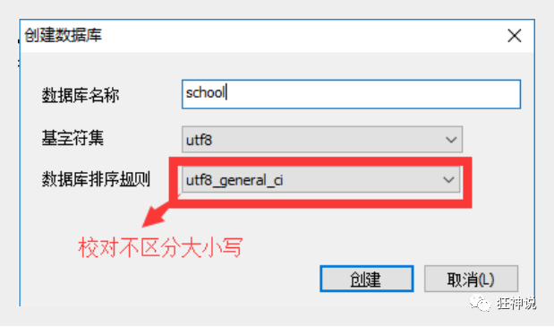
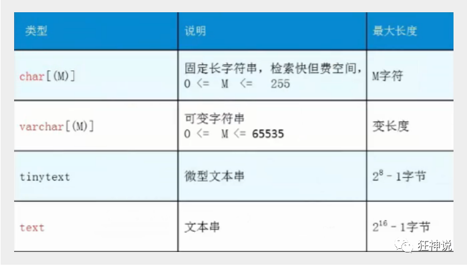
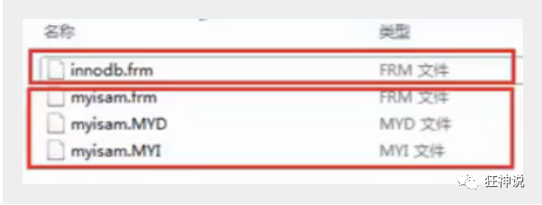
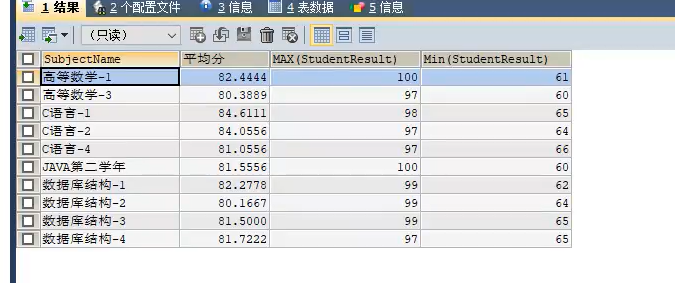
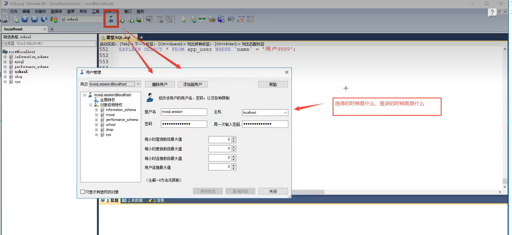

#  连接数据库

打开MySQL命令窗口

在DOS命令行窗口进入 安装目录\mysql\bin

可设置环境变量，设置了环境变量，可以在任意目录打开！

**连接数据库语句 : mysql -h 服务器主机地址 -u 用户名 -p 用户密码**

注意 : -p后面不能加空格,否则会被当做密码的内容,导致登录失败 !

几个基本的数据库操作命令 :

**mysql不区分大小写**

```mysql
update user set password=password('123456')where user='root'; 修改密码
flush privileges; 刷新数据库

mysql -uroot -p1234:  链接数据库  
------------

-- 所有的语句都使用;结尾

show databases; --显示所有数据库
use dbname；--打开某个数据库

show tables; --显示数据库mysql中所有的表
describe user; --显示表mysql数据库中user表的列信息

create database name; --创建数据库
use databasename; --选择数据库

exit; --退出Mysql
? 命令关键词 : 寻求帮助
-- 表示注释
```


# 数据库操作

### 结构化查询语句分类


> 命令行操作数据库

#### 数据库的操作

**创建数据库 :  create database [if not exists] 数据库名;**

**删除数据库 :   drop database [if exists] 数据库名;**

**查看所有数据库 : show databases;             --多了一个s**

2、输入 `show global variables like 'port';`   查看端口号

**使用数据库 : use 数据库名;**

> 对比工具操作数据库

**学习方法：**

- 对照SQLyog工具自动生成的语句学习
- 固定语法中的单词需要记忆
- 


-----------


### 创建数据表

属于DDL的一种，语法 :

```mysql
create table [if not exists] `表名`(
   '字段名1' 列类型 [属性][索引][注释],
   '字段名2' 列类型 [属性][索引][注释],
  #...
   '字段名n' 列类型 [属性][索引][注释]
)[表类型][表字符集][注释];
```

**说明 :** 反引号用于区别MySQL保留字与普通字符而引入的 (键盘esc下面的键).


### 数据值和列类型

 列类型 : 规定数据库中该列存放的数据类型

> 数值类型


> 字符串类型



> 日期和时间型数值类型


> NULL值

- 理解为 "没有值" 或 "未知值"
- 不要用NULL进行算术运算 , 结果仍为NULL


--------


### 数据字段属性(重点)

==重点对列的操作==


---------

**UnSigned**

- 无符号的

- **声明该数据列不允许负数 .**

  ---------------


**ZEROFILL**

- 0填充的

- 不足位数的用0来填充 , 如int(3),5则为005

  ------------------------------

  

**自增 Auto_InCrement**

- 自动增长的 , 每添加一条数据 , 自动在上一个记录数上加 1(默认)

- 通常用于设置**主键** , 且为整数类型

- 可定义起始值和步长

- - 当前表设置步长(AUTO_INCREMENT=100) : 只影响当前表
  - SET @@auto_increment_increment=5 ; 影响所有使用自增的表(全局)

- ------------


**非空  NULL 和 NOT NULL**

- 默认为NULL , 即没有插入该列的数值

- **如果设置为NOT NULL , 则该列必须有值**   (勾上就是not NULL)

  ----------------


**默认 DEFAULT**

- 默认的
- 用于设置默认值
- 例如,性别字段,默认为"男" , 否则为 "女" ; 若无指定该列的值 , 则默认值为"男"的值


### ==案例:==

格式:

```mysql
create table [if not exists] `表名`(
   '字段名1' 列类型 [属性][索引][注释],
   '字段名2' 列类型 [属性][索引][注释],
  #...
   '字段名n' 列类型 [属性][索引][注释]
)[表类型][表字符集设置][注释];
```

------------

**为null必须是默认值**

**不为空必须设置默认值**

-------

```mysql
-- 目标 : 创建一个school数据库
-- 创建学生表(列,字段)
-- 学号int 登录密码varchar(20) 姓名,性别varchar(2),出生日期(datatime),家庭住址,email
-- 创建表之前 , 一定要先选择数据库

--  名字 类型 属性 说明  (每个语句都有,)
CREATE TABLE IF NOT EXISTS `student` (
`id` int(4) NOT NULL AUTO_INCREMENT COMMENT '学号',
`name` varchar(30) NOT NULL DEFAULT '匿名' COMMENT '姓名',
`pwd` varchar(20) NOT NULL DEFAULT '123456' COMMENT '密码',
`sex` varchar(2) NOT NULL DEFAULT '男' COMMENT '性别',
`birthday` datetime DEFAULT NULL COMMENT '生日',
`address` varchar(100) DEFAULT NULL COMMENT '地址',
`email` varchar(50) DEFAULT NULL COMMENT '邮箱',
PRIMARY KEY (`id`)
) ENGINE=InnoDB DEFAULT CHARSET=utf8     --主键一般一个表只有一个   
```


```mysql
**创建数据库 :  create database [if not exists] 数据库名;**   // 主要是 exists 

删除数据库 : drop database if exists 数据库名;
删除表: drop table if exists 表名;

**查看所有数据库 : show databases;             --多了一个s**

**使用数据库 : use 数据库名;**   // 可以加可以不加;

-- 查看数据库的定义
SHOW CREATE DATABASE `school`;
-- 查看数据表的定义
SHOW CREATE TABLE `student`;

-- 显示表结构(显示表一些内容)
DESC student;  -- 设置严格检查模式(不能容错了)SET sql_mode='STRICT_TRANS_TABLES';
```

扩展: 


------------


### 数据表的类型

> 设置数据表的类型

```mysql
CREATE TABLE 表名(
   -- 省略一些代码
   -- Mysql注释
   -- 1. # 单行注释
   -- 2. /*...*/ 多行注释
)ENGINE = MyISAM (or InnoDB)

-- 查看mysql所支持的引擎类型 (表类型)
SHOW ENGINES;
```

MySQL的数据表的类型 : **MyISAM** , **InnoDB** , HEAP , BOB , CSV等...

常见的 MyISAM 与 InnoDB 类型：


经验 ( 适用场合 )  :

- 适用 MyISAM : 节约空间及相应速度
- 适用 InnoDB : 安全性 , 事务处理及多用户操作数据表


> 数据表的存储位置

- MySQL数据表以文件方式存放在磁盘中

- - 包括表文件 , 数据文件 , 以及数据库的选项文件
  - 位置 : Mysql安装目录\data\下存放数据表 . 目录名对应数据库名 , 该目录下文件名对应数据表 .

- 注意 :

- - \* . frm -- 表结构定义文件

  - \* . MYD -- 数据文件 ( data )

  - \* . MYI -- 索引文件 ( index )

  - InnoDB类型数据表只有一个 *.frm文件 , 以及上一级目录的ibdata1文件

  - MyISAM类型数据表对应三个文件 :

    

> 设置数据表字符集

我们可为数据库,数据表,数据列设定不同的字符集，设定方法 :

- 创建时通过命令来设置 , 如 : **CREATE TABLE 表名()CHARSET = utf8;**
- 如无设定 , 则根据MySQL数据库配置文件 my.ini 中的参数设定


### 修改数据库   alter table 表名  ....

> 修改表 ( ALTER TABLE )

修改表名 :ALTER TABLE 旧表名 **RENAME AS** 新表名


添加字段 : ALTER TABLE 表名 **ADD **字段名 列属性[属性]


修改字段 :

- ALTER TABLE 表名 **MODIFY** 字段名 列类型[属性]              ----修改约束(属性)

- ALTER TABLE 表名 **CHANGE** 旧字段名 新字段名 列属性[属性]   ---- 重命名

  

删除字段 :  ALTER TABLE 表名 DROP 字段名


上述了解即可

-------------------


> 删除数据表

语法：**DROP TABLE [IF EXISTS] 表名**

- IF EXISTS为可选 , 判断是否存在该数据表

- 如删除不存在的数据表会抛出错误

  ```mysql
  DROP TABLE IF EXISTS `demo1`;
  ```

  

> 其他

```mysql
1. 可用反引号（`）为标识符（库名、表名、字段名、索引、别名）包裹，以避免与关键字重名！中文也可以作为标识符！

2. 每个库目录存在一个保存当前数据库的选项文件db.opt。

3. 注释：
  单行注释 # 注释内容
  多行注释 /* 注释内容 */
  单行注释 -- 注释内容       (标准SQL注释风格，要求双破折号后加一空格符（空格、TAB、换行等）)
   
4. 模式通配符：
  _   任意单个字符
  %   任意多个字符，甚至包括零字符
  单引号需要进行转义 \'
   
5. CMD命令行内的语句结束符可以为 ";", "\G", "\g"，仅影响显示结果。其他地方还是用分号结束。delimiter 可修改当前对话的语句结束符。

6. SQL对大小写不敏感 （关键字）

7. 清除已有语句：\c
```


 #  总结

## 1. 创建

###   **1.1创建数据库 : **

语法:  create database if not exists `数据库名`;         **(exists)**

### 1.2 **创建表 :  **

语法:  create table if not exists `表名`

ps:  为null必须是设置成默认值,     不为空必须设置一个默认值

```mysql
--格式:
create table if not exists `表名`(
    
   '字段名1' 列类型 [属性][索引][注释],
   '字段名2' 列类型 [属性][索引][注释],
    #...
   '字段名n' 列类型 [属性][索引][注释]
   
) [表类型][表字符集设置][注释];
```

例子:

~~~mysql
create table if not exists user(
id int(11) auto_increment comment "序号",
username varchar(20) not null default "匿名" comment "姓名",
password varchar(20) not null default "",
registerTime int(11) not null default 0,
primary key(id)
) engine=innodb default charset=utf8;
--主键一般一个表只有一个   
~~~


```mysql
-- 目标 : 创建一个school数据库
-- 创建学生表(列,字段)
-- 学号int 登录密码varchar(20) 姓名,性别varchar(2),出生日期(datatime),家庭住址,email
-- 创建表之前 , 一定要先选择数据库

--  名字 类型 属性 说明  (每个语句都有,)
CREATE TABLE IF NOT EXISTS `student` (
`id` int(4) NOT NULL AUTO_INCREMENT COMMENT "学号",
`name` varchar(30) NOT NULL DEFAULT "匿名" COMMENT "姓名",
`pwd` varchar(20) NOT NULL DEFAULT "123456" COMMENT "密码",
`sex` varchar(2) NOT NULL DEFAULT "男" COMMENT "性别",
`birthday` datetime DEFAULT NULL COMMENT "生日",
`address` varchar(100) DEFAULT NULL COMMENT "地址",
`email` varchar(50) DEFAULT NULL COMMENT "邮箱",
PRIMARY KEY (`id`)    
) ENGINE=InnoDB DEFAULT CHARSET=utf8;   
--主键一般一个表只有一个   
```

### 1.3 **创建字段 :**

语法:  alter table  `表名` add  `字段名`  该字段的属性

## 2. 删除

### 2.1  数据库 :

语法:   drop database if exists `数据库名`;

### 2.2 删除表 :

语法:    drop table if exists `表名`;

### 2.3 删除字段 :

语法:    alter table 表名  drop  `字段名`				

## 3.使用数据库

**使用数据库 : **   语法:  use `数据库名`;     

## **4.查看**

**查看:**

​			-- 查看所有数据库 

​						  show databases;             **(databases)**

​			-- 查看数据库的定义
​						show create -`数据库名`;

​			-- 查看数据表的定义
​						show create  table  ` 表名 `;

​			--显示表结构(显示表有那些字段)
​					 	desc  `表名`;         

## **5. 修改**

### 5.1 修改表名 : 

语法:   alter table 旧表名 rename as 新表名;

### 5.2 修改字段 :

​		1. 修改字段属性:    alter table  表名  modify  字段名    该字段修改后的属性         

​      2. 修改字段名:      alter table   表名  change  旧字段名  新字段名 旧字段的属性


## 6. **对表数据的操作**

+ #

  + **插入:**   insert into 表名 (字段1,字段2,字段3,...) values('值1'), ('值2', ('值3')

    ps:  ' 字段1,字段2...' 该部分可省略 , 但添加的值务必与表结构,数据列,顺序相对应,且数量一致 .

    ```mysql
    插入多条数据
    insert into 表名
    (字段1,字段2,字段3)
    values				
    (值1,值2,值3),
    (值1,值2,值3),
    (值1,值2,值3),
    (值1,值2,值3);
    ```

    例子:

    ```mysql
    insert into user
    (username, password, registerTime)
    values
    ("admin", "12345678",1583847118),
    ("hello", "123456",1583847298);
    ```

    

    
  
  + **修改:**   update 表名 set 字段名=新值 where  筛选条件;

    例子:

    ```mysql
    update user set username="world" where password="123456";
    ```
  
    

  + + 例子:

    + ```mysql
      使用 if 判断，当 sex 为 m 的时候更改为 f，否则就更改为 m（f 改为 m），使用 if(sex="m","f","m") 就可以直接搞定了，实现 SQL 如下。
      
      # Write your MySQL query statement below
      
  
    update salary set sex=if(sex="m","f","m");
  
    
  
  + **删除表内数据 :** 
  
    1.  delete from  表名  [  WHERE 筛选条件  ] ;
  
       例子:
  
       ```mysql
       DELETE FROM `user` WHERE `id`=2;
       ```
  
    2. truncate  表名;
  
       例子:
  
       ```mysql
       TRUNCATE user
       ```
  
       ps: 
  
       ```mysql
       -- 使用TRUNCATE TABLE 重新设置AUTO_INCREMENT计数器
       -- 使用TRUNCATE TABLE不会对事务有影响 （事务后面会说）
       ```
  
       例子:
       
       删除重复[196. 删除重复的电子邮箱](https://leetcode.cn/problems/delete-duplicate-emails/description/)
       
       ```mysql
       DELETE p1 FROM Person p1,
           Person p2
       WHERE
           p1.Email = p2.Email AND p1.Id > p2.Id
       
       ```
       
       DELETE t1 FROM t1 LEFT JOIN t2 ON t1.id=t2.id WHERE t2.id IS NULL;
       
       这种DELETE方式很陌生，竟然和SELETE的写法类似。它涉及到t1和t2两张表，DELETE t1表示要删除t1的一些记录，具体删哪些，就看WHERE条件，满足就删；这里删的是t1表中，跟t2匹配不上的那些记录
       
       
  

## **7. 查询表数据**

**显示表内数据:**  select *  from `表名  `  (一般不用)

例子:  

```mysql
select * from user;
```


### **7.1  查询**

 select  [  distinct  ]  `字段名`  [ as  别名 ]  from `表名`

```mysql
SELECT [ALL(默认) | DISTINCT]
{* | table.* | [table.field1[as alias1][,table.field2[as alias2]][,...]]}
FROM table_name [as table_alias]
[left | right | inner join table_name2]  -- 联合查询
[WHERE ...]  -- 指定结果需满足的条件
[GROUP BY ...]  -- 指定结果按照哪几个字段来分组
[HAVING]  -- 过滤分组的记录必须满足的次要条件
[ORDER BY ...]  -- 指定查询记录按一个或多个条件排序
[LIMIT {[offset,]row_count | row_countOFFSET offset}];  -- 指定查询的记录从哪条至哪条
```

AS        起别名    目的: 方便看查询的结果

例子:

```mysql
select id as 序号, username as 名字 from user;
```


distinct  去重  只能针对末字段

例子:

```mysql
select distinct username from  user;
```


**where条件子句:**

==注意使用时要区分字符串还是数字==

作用:   有条件地从表中筛选数据


例子:   **id 为奇数** 的，结果请按等级 `rating` 排序

```c++
//也可以用位判断的方法
select *
from cinema
where id & 1   #判断奇数
and description <> 'boring'
order by rating DESC;
```

可以用 , MOD(x,y) 返回除法操作的余数MySQL 中判断奇数的 6 种方法：

mod(x, 2) = 1 ，如果余数是 1 就是奇数。
power(-1, x) = -1 ， 如果结果是 -1 就是奇数
x % 2 = 1 ，如果余数是 1 就是奇数。
x & 1 = 1 ，如果是 1 就是奇数
x regexp '[1, 3, 5, 7, 9]$' = 1 如果为 1 就是奇数
x>>1<<1 != x 如果右移一位在左移一位不等于原值，就是奇数测试

ps:  需要重新写明字段

如:

```mysql
select name from customer
where referee_id != 2 or referee_id is null;
```


### **7.2 模糊查询**

  select  [  distinct  ]  `字段名`  [ as  别名 ]  from `表名` where  `字段名`  运算符  限制条件


注意：

- 数值数据类型的记录之间才能进行算术运算 ;
- **相同数据类型的数据之间才能进行比较 ;**
- 空字符串不等于 null,  而是 " ".


**is NULL 空  和  is not null 不空 :**

ps:   证明了nuLL需要单独判断

```mysql
-- =============================================
-- is NULL 空  和  is not null 不空
-- =============================================
-- 不能直接写=NULL,这是错误的 , 用 is null   注意:空字符串不等于null

-- 查询出生日期没有填写的同学
SELECT studentname FROM student
WHERE BornDate IS NULL;

-- 查询出生日期填写的同学
SELECT studentname FROM student
WHERE BornDate IS NOT NULL;

-- 查询没有写家庭住址的同学(空字符串不等于null)
SELECT studentname FROM student
WHERE Address='' OR Address IS NULL;
```


**like :**

-- like结合使用的通配符 :  

+ %    (代表匹配任意长度的字符  相当于....) 
+  _     (代表匹配任意一个字符   相当于.)

```mysql
-- =============================================
-- LIKE
-- =============================================
-- like结合使用的通配符 :  % (代表0到任意个字符相当于....) 和  _(代表一个字符 相当于.)

-- 查询姓刘的同学的学号及姓名
SELECT studentno,studentname FROM student
WHERE studentname LIKE '刘%';

-- 查询姓刘的同学,后面只有一个字的
SELECT studentno,studentname FROM student
WHERE studentname LIKE '刘_';

-- 查询姓刘的同学,后面只有两个字的
SELECT studentno,studentname FROM student
WHERE studentname LIKE '刘__';

-- 查询姓名中含有 嘉 字的
SELECT studentno,studentname FROM student
WHERE studentname LIKE '%嘉%';

-- 查询姓名中含有特殊字符的需要使用转义符号 '\'
-- 自定义转义符关键字: ESCAPE ':'
```


**in 和 not in :** 

--和范围一起用

```mysql
-- =============================================
-- IN
-- =============================================
-- 范围查询

-- 查询学号为1000,1001,1002的学生姓名
SELECT studentno,studentname FROM student
WHERE studentno IN (1000,1001,1002);

-- 查询地址在北京,南京,河南洛阳的学生
SELECT studentno,studentname,address FROM student
WHERE address IN ('北京','南京','河南洛阳');
```


### 7.3 联表(连接)查询


例子:

```mysql
/*
连接查询
   如需要多张数据表的数据进行查询,则可通过连接运算符实现多个查询
   
内连接 inner join
   查询两个表中的结果集中的交集
外连接 outer join
   左外连接 left join
       (以左表作为基准,右边表来一一匹配,匹配不上的,返回左表的记录,右表以NULL填充)
   右外连接 right join
       (以右表作为基准,左边表来一一匹配,匹配不上的,返回右表的记录,左表以NULL填充)
       
等值连接和非等值连接

自连接
*/

-- 查询参加了考试的同学信息(学号,学生姓名,科目编号,分数)
SELECT * FROM student;   // 学生表
SELECT * FROM result;    // 成绩表


/*思路:
(1):分析需求,确定查询的列来源于两个类,student result,连接查询
(2):确定使用哪种连接查询? 确定交叉点on(内连接),   (两个表中那个数据是相同的)
*/

SELECT s.studentno,studentname,subjectno,StudentResult
FROM student s                          -- subjectno在student表里没有
INNER JOIN result r                      
ON r.studentno = s.studentno            -- 确定交叉

-- 右连接(也可实现)
SELECT s.studentno,studentname,subjectno,StudentResult
FROM student s
RIGHT JOIN result r
ON r.studentno = s.studentno

-- 等值连接
SELECT s.studentno,studentname,subjectno,StudentResult
FROM student s , result r
WHERE r.studentno = s.studentno         -- 等值查询

-- 左连接 (查询了所有同学,不考试的也会查出来)  // 满足一个条件的都会找出来
SELECT s.studentno,studentname,subjectno,StudentResult
FROM student s
LEFT JOIN result r
ON r.studentno = s.studentno

-- 查一下缺考的同学(左连接应用场景)
SELECT s.studentno,studentname,subjectno,StudentResult
FROM student s
LEFT JOIN result r
ON r.studentno = s.studentno
WHERE StudentResult IS NULL
```


### 7.4 排序和分页

**降序排序:**   

语法:  select  [  distinct  ]  `字段名`  [ as  别名 ]  from `表名` where  `字段名`  运算符  限制条件  order by  `字段名`   desc(不写默认升序)  

```mysql
/*============== 排序 ================
语法 : ORDER BY
   ORDER BY 语句用于根据指定的列对结果集进行排序。
   ORDER BY 语句默认按照ASC升序对记录进行排序。
   如果您希望按照降序对记录进行排序，可以使用 DESC 关键字。
   
*/

-- 查询 数据库结构-1 的所有考试结果(学号 学生姓名 科目名称 成绩)
-- 按成绩降序排序
SELECT s.studentno,studentname,subjectname,StudentResult
FROM student s
INNER JOIN result r
ON r.studentno = s.studentno
INNER JOIN `subject` sub
ON r.subjectno = sub.subjectno
WHERE subjectname='数据库结构-1'
ORDER BY StudentResult DESC         // 降序
```


**分页:**  

语法:  select  [  distinct  ]  `字段名`  [ as  别名 ]  from `表名` where  `字段名`  运算符  限制条件  order by  `字段名`   desc

limit   (页码 - 1)*单页显示条数,  单页显示条数

ps: `LIMIT` 语句也可以只使用一个参数，这个参数的含义是从结果的第一行开始返回的行数。所以 `LIMIT 1` 会返回第一行的记录。

```mysql
翻页原理: 40条 n = (page * 40)-40;
select * from student 
limit 0,40;
select * from student 
limit 40,40;
select * from student 
limit 80,40;
```

例子2:

```mysql
/*============== 分页 ================
语法 : SELECT * FROM table LIMIT [offset,] rows | rows OFFSET offset
好处 : (用户体验,网络传输,查询压力)

推导:
   第一页 : limit 0,5
   第二页 : limit 5,5
   第三页 : limit 10,5
   ......
   第N页 : limit (页码-1)*单页条数, 单页条数
   // 0 1 2 3  * 单页数
   [pageNo:页码, pageSize:单页面显示条数]
      起始值 , 单页面显示条数
      总页数 = 数据总数 - 页面大小
*/


-- 每页显示5条数据
SELECT s.studentno,studentname,subjectname,StudentResult
FROM student s
INNER JOIN result r
ON r.studentno = s.studentno
INNER JOIN `subject` sub
ON r.subjectno = sub.subjectno
WHERE subjectname='数据库结构-1'
ORDER BY StudentResult DESC , studentno
LIMIT 0,5                                       
```


###  **7.5 group by  分组**

**,    满足条件的分成一组,  然后再组内进行其他操作**


例子:

输入: 
Orders 表:
+--------------+-----------------+
| order_number | customer_number |
+--------------+-----------------+
| 1            | 1               |
| 2            | 2               |
| 3            | 3               |
| 4            | 3               |
+--------------+-----------------+
输出: 
+-----------------+
| customer_number |
+-----------------+
| 3               |
+-----------------+

```mysql
SELECT customer_number
FROM orders
GROUP BY customer_number
ORDER BY COUNT(*) DESC
LIMIT 1;
```


例子2:

输入: 
Courses table:
+---------+----------+
| student | class    |
+---------+----------+
| A       | Math     |
| B       | English  |
| C       | Math     |
| D       | Biology  |
| E       | Math     |
| F       | Computer |
| G       | Math     |
| H       | Math     |
| I       | Math     |
+---------+----------+
输出: 
+---------+ 
| class   | 
+---------+ 
| Math    | 
+---------+

```mysql
select class 
from Courses
group by class
having  COUNT(*) >= 5;   //分组 并且 找到>=5的
```


###  7.6 聚合函数(常用)

| 函数名称       | 描述                                                         |
| -------------- | ------------------------------------------------------------ |
| count( 主键/1) | 计算的记录总和数， 如 select count(1) 【不建议使用 *，效率低】 |
| sum()          | 返回数字字段或表达式列作统计，返回一列的总和。               |
| vag()          | 通常为数值字段或表达列作统计，返回一列的平均值               |
| max()          | 可以为数值字段，字符字段或表达式列作统计，返回最大的值。     |
| min()          | 可以为数值字段，字符字段或表达式列作统计，返回最小的值。     |


# ==DML语言(对表的数据操作)==

### 外键  FOREIGN KEY

> 外键概念

如果公共关键字在一个关系中是主关键字，那么这个公共关键字被称为另一个关系的外键。由此可见，外键表示了两个关系之间的相关联系。以另一个关系的外键作主关键字的表被称为**主表**，具有此外键的表被称为主表的**从表**。

在实际操作中，将一个表的值放入第二个表来表示关联，所使用的值是第一个表的主键值(在必要时可包括复合主键值)。此时，第二个表中保存这些值的属性称为外键(**foreign key**)。

**外键作用**

保持数据**一致性**，**完整性**，主要目的是控制存储在外键表中的数据,**约束**。**使两张表形成关联，外键只能引用外表中的列的值或使用空值。**


> 创建外键

建表时指定外键约束


```mysql
-- 创建外键的方式一 : 创建子表同时创建外键

-- 年级表 (id\年级名称)
CREATE TABLE `grade` (
`gradeid` INT(10) NOT NULL AUTO_INCREMENT COMMENT '年级ID',
`gradename` VARCHAR(50) NOT NULL COMMENT '年级名称',
PRIMARY KEY (`gradeid`)
) ENGINE=INNODB DEFAULT CHARSET=utf8

-- 学生信息表 (学号,姓名,性别,年级,手机,地址,出生日期,邮箱,身份证号)
CREATE TABLE `student` (
`studentno` INT(4) NOT NULL COMMENT '学号',
`studentname` VARCHAR(20) NOT NULL DEFAULT '匿名' COMMENT '姓名',
`sex` TINYINT(1) DEFAULT '1' COMMENT '性别',
`gradeid` INT(10) DEFAULT NULL COMMENT '年级',
`phoneNum` VARCHAR(50) NOT NULL COMMENT '手机',
`address` VARCHAR(255) DEFAULT NULL COMMENT '地址',
`borndate` DATETIME DEFAULT NULL COMMENT '生日',
`email` VARCHAR(50) DEFAULT NULL COMMENT '邮箱',
`idCard` VARCHAR(18) DEFAULT NULL COMMENT '身份证号',
PRIMARY KEY (`studentno`),
KEY `FK_gradeid` (`gradeid`),
CONSTRAINT `FK_gradeid` FOREIGN KEY (`gradeid`) REFERENCES `grade` (`gradeid`)
) ENGINE=INNODB DEFAULT CHARSET=utf8
```

建表后修改


```mysql
-- 创建外键方式二 : 创建子表完毕后,修改子表添加外键
ALTER TABLE `student` ADD CONSTRAINT `FK_gradeid` FOREIGN KEY (`gradeid`) REFERENCES `grade` (`gradeid`);

外键  引用 表(字段);
```

 


> 删除外键

操作：删除 grade 表，发现报错


**注意** :     删除具有主外键关系的表时 , 要先删子表 , 后删主表

```mysql
-- 删除外键
ALTER TABLE student DROP FOREIGN KEY FK_gradeid;
-- 发现执行完上面的,索引还在,所以还要删除索引
-- 注:这个索引是建立外键的时候默认生成的
ALTER TABLE student DROP INDEX FK_gradeid;
```

--------------------


### DML语言

**数据库意义** ： 数据存储、数据管理

**管理数据库数据方法：**

- 通过SQLyog等管理工具管理数据库数据
- 通过**DML语句**管理数据库数据

**DML语言**  ：数据操作语言

- 用于操作数据库对象中所包含的数据

- 包括 :

- - INSERT (添加数据语句)
  - UPDATE (更新数据语句)
  - DELETE (删除数据语句)


----------------


#### 添加数据

> INSERT命令   -- 默认添加到末尾

**语法：**

```mysql
INSERT INTO 表名 (字段1,字段2,字段3,...) VALUES('值1'), ('值2', ('值3')
```

****


**注意 :** 

- 字段或值之间用英文逗号隔开 .

- ' 字段1,字段2...' 该部分可省略 , 但添加的值务必与表结构,数据列,顺序相对应,且数量一致 .

  

- 可同时插入多条数据 , values 后用英文逗号隔开 .

  

```mysql
-- 使用语句如何增加语句?
-- 语法 : INSERT INTO 表名[(字段1,字段2,字段3,...)] VALUES('值1','值2','值3')
INSERT INTO grade(gradename) VALUES ('大一');

-- 主键自增,那能否省略呢?
INSERT INTO grade VALUES ('大二');

-- 查询:INSERT INTO grade VALUE ('大二')错误代码：1136
Column count doesn`t match value count at row 1

-- 结论:'字段1,字段2...'该部分可省略 , 但添加的值务必与表结构,数据列,顺序相对应,且数量一致.

-- 一次插入多条数据
INSERT INTO grade(gradename) VALUES ('大三'),('大四');
```

**练习题目** 

自己使用INSERT语句为课程表subject添加数据 . 使用到外键.

-------------


#### 修改数据

> update   命令  表名  set  原来的值 = 新值  限制


---

语法：

```mysql
UPDATE 表名 SET column_name=value[,column_name2=value2,...] [WHERE condition];
```

--------------


**注意 :** 

- column_name 为要更改的数据列
- value 为修改后的数据 , 可以为变量(如: 时间) , 具体指 , 表达式或者嵌套的SELECT结果
- condition 为筛选条件 , 如不指定则修改该表的所有列数据


==where条件子句==:

**可以简单的理解为 : 有条件地从表中筛选数据**

测试：

```mysql
-- 修改年级信息
UPDATE grade SET `gradename` = '高中' WHERE gradeid = 1;

UPDATE `pople` SET `zf`="sb" WHERE `id` = 2;
```


#### 删除数据内容

> DELETE命令   -- 删除表的数据


语法：

```mysql
DELETE FROM 表名 [WHERE condition];
```

注意：condition为筛选条件 , 如不指定则删除该表的所有列数据

```mysql
-- 删除最后一个数据
DELETE FROM grade WHERE gradeid = 5

DELETE FROM `pople` WHERE `id`=2;
```


> TRUNCATE命令     -- 删除表的数据

**作用：用于完全清空表数据 , 但表结构 , 索引 , 约束等不变 ;**


语法：

```mysql
TRUNCATE [TABLE] table_name;

-- 清空年级表
TRUNCATE grade
```

**注意：区别于DELETE命令**

- 相同 : 都能删除数据 , 不删除表结构 , 但TRUNCATE速度更快

- 不同 :

- - **使用TRUNCATE TABLE 重新设置AUTO_INCREMENT计数器**
  - 使用TRUNCATE TABLE不会对事务有影响 （事务后面会说）

----------------------


测试：

```mysql
-- 创建一个测试表
CREATE TABLE `test` (
`id` INT(4) NOT NULL AUTO_INCREMENT,
`coll` VARCHAR(20) NOT NULL,
PRIMARY KEY (`id`)
) ENGINE=INNODB DEFAULT CHARSET=utf8

-- 插入几个测试数据
INSERT INTO test(coll) VALUES('row1'),('row2'),('row3');

-- 删除表数据(不带where条件的delete)
DELETE FROM test;
-- 结论:如不指定Where则删除该表的所有列数据,自增当前值依然从原来基础上进行,会记录日志.

-- 删除表数据(truncate)
TRUNCATE TABLE test;
-- 结论:truncate删除数据,自增当前值会恢复到初始值重新开始;不会记录日志.

-- 同样使用DELETE清空不同引擎的数据库表数据.重启数据库服务后
-- InnoDB : 自增列从初始值重新开始 (因为是存储在内存中,断电即失)
-- MyISAM : 自增列依然从上一个自增数据基础上开始 (存在文件中,不会丢失)
```


#  ==DQL语言(查询)==

**DQL( Data Query Language 数据查询语言 )**

- 查询数据库数据 , 如**SELECT**语句
- 简单的单表查询或多表的复杂查询和嵌套查询
- **是数据库语言中最核心,最重要的语句**
- 使用频率最高的语句


## SELECT语法    select 字段 from 表名


> SELECT语法    select 字段 from 表名

```mysql
SELECT [ALL | DISTINCT]
{* | table.* | [table.field1[as alias1][,table.field2[as alias2]][,...]]}
FROM table_name [as table_alias]
  [left | right | inner join table_name2]  -- 联合查询
  [WHERE ...]  -- 指定结果需满足的条件
  [GROUP BY ...]  -- 指定结果按照哪几个字段来分组
  [HAVING]  -- 过滤分组的记录必须满足的次要条件
  [ORDER BY ...]  -- 指定查询记录按一个或多个条件排序
  [LIMIT {[offset,]row_count | row_countOFFSET offset}];
   -- 指定查询的记录从哪条至哪条
```

**注意 : [ ] 括号代表可选的 , { }括号代表必选得**


### 指定查询字段


```mysql
-- 查询表中所有的数据列结果 , 采用 **" \* "** 符号; 但是效率低，不推荐 .

-- 显示表信息
SELECT * FROM student;

-- 查询指定列(学号 , 姓名)
SELECT `studentno`,`studentname` FROM `student`;
```

### AS 子句作为别名   -- 方便看查询的结果

> AS 子句作为别名   -- 方便看查询的结果

有点像ALTER TABLE 表名 **CHANGE** 旧字段名 新字段名 列属性[属性]   ---- 重命名

作用：

- 可给数据列取一个新别名
- 可给表取一个新别名
- 可把经计算或总结的结果用另一个新名称来代替

```mysql
-- 这里是为列取别名(当然as关键词可以省略)
SELECT studentno AS 学号,studentname AS 姓名 FROM student;

-- 使用as可以给字段起别名  也可以为表取别名
SELECT studentno AS 学号,studentname AS 姓名 FROM student AS s;

-- 使用as,为查询结果取一个新名字
-- CONCAT()函数拼接字符串
SELECT CONCAT('姓名:',studentname) AS 新姓名 FROM student;
```


**起别名:**


---------

**CONCAT()函数拼接字符串**


-----------------


###  去重  DISTINCT关键字的使用

> 去重  DISTINCT关键字的使用      

表数据:


去重搜索后的数据:


distinct 作用 : 去掉SELECT查询返回的记录结果中重复的记录 ( 返回所有列的值都相同 ) , 只返回一条

```mysql
-- # 查看哪些同学参加了考试(学号) 去除重复项

SELECT * FROM result; -- 查看考试成绩
SELECT studentno FROM result; -- 查看哪些同学参加了考试

SELECT DISTINCT studentno FROM result; -- 了解:DISTINCT 去除重复项 , (默认是ALL)
```


### 使用表达式的列

> 使用表达式的列

**数据库中的表达式 : 一般由文本值 , 列值 , NULL , 函数和操作符等组成**

应用场景 :

- SELECT语句返回结果列中使用

- SELECT语句中的ORDER BY , HAVING等子句中使用

- DML语句中的 where 条件语句中使用表达式

  ```mysql
  -- selcet查询中可以使用表达式
  
  SELECT @@auto_increment_increment; -- 查询自增步长
  
  SELECT VERSION(); -- 查询版本号
  
  SELECT 100*3-1 AS 计算结果; -- 表达式
  
  -- 学员考试成绩集体提分一分查看
  SELECT studentno,StudentResult+1 AS '提分后' FROM result;
  ```

  例子:

  ```mysql
  -- 创建年级表
  drop table if exists `grade`;
  create table `grade`(
  	`gradeid` int(11) not null auto_increment comment '年级编号',
    `gradename` varchar(50) not null comment '年级名称',
      primary key (`gradeid`)
  ) engine=innodb auto_increment = 6 default charset = utf8;
  
  -- 创建科目表
  drop table if exists `subject`;
  create table `subject`(
  	`subjectno`int(11) not null auto_increment comment '课程编号',
      `subjectname` varchar(50) default null comment '课程名称',
      `classhour` int(4) default null comment '学时',
      `gradeid` int(4) default null comment '年级编号',
      primary key (`subjectno`)
  )engine = innodb auto_increment = 19 default charset = utf8;
  
  -- 创建成绩表
  drop table if exists `result`;
  create table `result`(
  	`studentno` int(4) not null comment '学号',
      `subjectno` int(4) not null comment '课程编号',
      `examdate` datetime not null comment '考试日期',
      `studentresult` int (4) not null comment '考试成绩',
      key `subjectno` (`subjectno`)
  )engine = innodb default charset = utf8;
  ```
  
  
  
- **避免SQL返回结果中包含 ' . ' , ' * ' 和括号等干扰开发语言程序.**


### ==where  条件语句在其中的作用==

作用：用于检索数据表中 符合条件 的记录

搜索条件可由一个或多个逻辑表达式组成 , 结果一般为真或假.

> 逻辑操作符

mysql 就尽量用 英文的


例子:   **id 为奇数** 的，结果请按等级 `rating` 排序

```c++
//也可以用位判断的方法
select *
from cinema
where id & 1 
and description <> 'boring'
order by rating DESC;
```

测试

```mysql
-- 满足条件的查询(where)
SELECT Studentno,StudentResult FROM result;

-- 查询考试成绩在95-100之间的
SELECT Studentno,StudentResult
FROM result
WHERE StudentResult>=95 AND StudentResult<=100;

-- AND也可以写成 &&
SELECT Studentno,StudentResult
FROM result
WHERE StudentResult>=95 && StudentResult<=100;

-----------------------------------------
-- 模糊查询(对应的词:精确查询)
SELECT Studentno,StudentResult
FROM result
WHERE StudentResult BETWEEN 95 AND 100;

-----------------------------------------
-- 除了1000号同学,要其他同学的成绩
SELECT studentno,studentresult
FROM result
WHERE studentno!=1000;

-- 使用NOT
SELECT studentno,studentresult
FROM result
WHERE NOT studentno=1000;
```


#### 模糊查询 ：比较操作符   (重要)

> 模糊查询 ：比较操作符   (重要)                   where 字段 link "限制条件"

**注意 :  a 一定是一个字段**


like  (来可)  和通配符一起用

in 和范围

**不能直接写=NULL , 这是代表错误的 , 用 is null  和 空字符串不等于 null**

```mysql
SELECT `id` FROM `pople` WHERE `zf` IS NULL; 
```

注意：

- 数值数据类型的记录之间才能进行算术运算 ;
- **相同数据类型的数据之间才能进行比较 ;**


测试：

```mysql
-- 模糊查询 常用比较符 : between and \ like \ in \ null

-- =============================================
-- LIKE
-- =============================================
-- like结合使用的通配符 :  % (代表0到任意个字符相当于....) 和  _(代表一个字符 相当于.)

-- 查询姓刘的同学的学号及姓名
SELECT studentno,studentname FROM student
WHERE studentname LIKE '刘%';

-- 查询姓刘的同学,后面只有一个字的
SELECT studentno,studentname FROM student
WHERE studentname LIKE '刘_';

-- 查询姓刘的同学,后面只有两个字的
SELECT studentno,studentname FROM student
WHERE studentname LIKE '刘__';

-- 查询姓名中含有 嘉 字的
SELECT studentno,studentname FROM student
WHERE studentname LIKE '%嘉%';

-- 查询姓名中含有特殊字符的需要使用转义符号 '\'
-- 自定义转义符关键字: ESCAPE ':'


-- =============================================
-- IN
-- =============================================
-- 范围查询

-- 查询学号为1000,1001,1002的学生姓名
SELECT studentno,studentname FROM student
WHERE studentno IN (1000,1001,1002);

-- 查询地址在北京,南京,河南洛阳的学生
SELECT studentno,studentname,address FROM student
WHERE address IN ('北京','南京','河南洛阳');


-- =============================================
-- is NULL 空  和  is not null 不空
-- =============================================
-- 不能直接写=NULL , 这是代表错误的 , 用 is null  和 空字符串不等于null

-- 查询出生日期没有填写的同学
SELECT studentname FROM student
WHERE BornDate IS NULL;

-- 查询出生日期填写的同学
SELECT studentname FROM student
WHERE BornDate IS NOT NULL;

-- 查询没有写家庭住址的同学(空字符串不等于null)
SELECT studentname FROM student
WHERE Address='' OR Address IS NULL;
```


### 联表(连接)查询

> JOIN 对比


**七种Join：**


测试

**result**


**student**


subject


```

-- 表:

create database if not exists `school`;
-- 创建一个school数据库
use `school`;-- 创建学生表
drop table if exists `student`;
create table `student`(
	`studentno` int(4) not null comment '学号',
    `loginpwd` varchar(20) default null,
    `studentname` varchar(20) default null comment '学生姓名',
    `sex` tinyint(1) default null comment '性别，0或1',
    `gradeid` int(11) default null comment '年级编号',
    `phone` varchar(50) not null comment '联系电话，允许为空',
    `address` varchar(255) not null comment '地址，允许为空',
    `borndate` datetime default null comment '出生时间',
    `email` varchar (50) not null comment '邮箱账号允许为空',
    `identitycard` varchar(18) default null comment '身份证号',
    primary key (`studentno`),
    unique key `identitycard`(`identitycard`),
    key `email` (`email`)
)engine=myisam default charset=utf8;

-- 创建年级表
drop table if exists `grade`;
create table `grade`(
  `gradeid` int(11) not null auto_increment comment '年级编号',
  `gradename` varchar(50) not null comment '年级名称',
    primary key (`gradeid`)
) engine=innodb auto_increment = 6 default charset = utf8;

-- 创建科目表
drop table if exists `subject`;
create table `subject`(
	`subjectno`int(11) not null auto_increment comment '课程编号',
    `subjectname` varchar(50) default null comment '课程名称',
    `classhour` int(4) default null comment '学时',
    `gradeid` int(4) default null comment '年级编号',
    primary key (`subjectno`)
)engine = innodb auto_increment = 19 default charset = utf8;

-- 创建成绩表
drop table if exists `result`;
create table `result`(
	`studentno` int(4) not null comment '学号',
    `subjectno` int(4) not null comment '课程编号',
    `examdate` datetime not null comment '考试日期',
    `studentresult` int (4) not null comment '考试成绩',
    key `subjectno` (`subjectno`)
)engine = innodb default charset = utf8;

```


```mysql
/*
连接查询
   如需要多张数据表的数据进行查询,则可通过连接运算符实现多个查询
   
内连接 inner join
   查询两个表中的结果集中的交集
外连接 outer join
   左外连接 left join
       (以左表作为基准,右边表来一一匹配,匹配不上的,返回左表的记录,右表以NULL填充)
   右外连接 right join
       (以右表作为基准,左边表来一一匹配,匹配不上的,返回右表的记录,左表以NULL填充)
       
等值连接和非等值连接

自连接
*/

-- 查询参加了考试的同学信息(学号,学生姓名,科目编号,分数)
SELECT * FROM student;   // 学生表
SELECT * FROM result;    // 成绩表


/*思路:
(1):分析需求,确定查询的列来源于两个类,student result,连接查询
(2):确定使用哪种连接查询? 确定交叉点on(内连接),   (两个表中那个数据是相同的)
*/
SELECT s.studentno,studentname,subjectno,StudentResult
FROM student s                          -- subjectno在student表里没有
INNER JOIN result r                      
ON r.studentno = s.studentno            -- 确定交叉

-- 右连接(也可实现)
SELECT s.studentno,studentname,subjectno,StudentResult
FROM student s
RIGHT JOIN result r
ON r.studentno = s.studentno

-- 等值连接
SELECT s.studentno,studentname,subjectno,StudentResult
FROM student s , result r
WHERE r.studentno = s.studentno         -- 等值查询

-- 左连接 (查询了所有同学,不考试的也会查出来)
SELECT s.studentno,studentname,subjectno,StudentResult
FROM student s
LEFT JOIN result r
ON r.studentno = s.studentno

-- 查一下缺考的同学(左连接应用场景)
SELECT s.studentno,studentname,subjectno,StudentResult
FROM student s
LEFT JOIN result r
ON r.studentno = s.studentno
WHERE StudentResult IS NULL
```


例子2:


```mysql
-- 三张表
-- 查询参加了考试的同学信息(学号,学生姓名,科目名,分数)
SELECT s.studentno,studentname,subjectname,StudentResult
FROM student s
INNER JOIN result r
ON r.studentno = s.studentno    
INNER JOIN `subject` sub             -- 得到字段subjectname
ON sub.subjectno = r.subjectno
```


右连接:


---------------


> 自连接


```mysql
/*
自连接
   数据表与自身进行连接

需求:从一个包含栏目ID , 栏目名称和父栏目ID的表中
    查询父栏目名称和其他子栏目名称
*/

-- 创建一个表
CREATE TABLE `category` (
`categoryid` INT(10) UNSIGNED NOT NULL AUTO_INCREMENT COMMENT '主题id',
`pid` INT(10) NOT NULL COMMENT '父id',
`categoryName` VARCHAR(50) NOT NULL COMMENT '主题名字',
PRIMARY KEY (`categoryid`)
) ENGINE=INNODB AUTO_INCREMENT=9 DEFAULT CHARSET=utf8

-- 插入数据
INSERT INTO `category` (`categoryid`, `pid`, `categoryName`)
VALUES('2','1','信息技术'),
('3','1','软件开发'),
('4','3','数据库'),
('5','1','美术设计'),
('6','3','web开发'),
('7','5','ps技术'),
('8','2','办公信息');

-- 编写SQL语句,将栏目的父子关系呈现出来 (父栏目名称,子栏目名称)
-- 核心思想:把一张表看成两张一模一样的表,然后将这两张表连接查询(自连接)
SELECT a.categoryName AS '父栏目',b.categoryName AS '子栏目'
FROM category AS a,category AS b
WHERE a.`categoryid`=b.`pid`


-- 表:

create database if not exists `school`;
-- 创建一个school数据库
use `school`;-- 创建学生表
drop table if exists `student`;
create table `student`(
	`studentno` int(4) not null comment '学号',
    `loginpwd` varchar(20) default null,
    `studentname` varchar(20) default null comment '学生姓名',
    `sex` tinyint(1) default null comment '性别，0或1',
    `gradeid` int(11) default null comment '年级编号',
    `phone` varchar(50) not null comment '联系电话，允许为空',
    `address` varchar(255) not null comment '地址，允许为空',
    `borndate` datetime default null comment '出生时间',
    `email` varchar (50) not null comment '邮箱账号允许为空',
    `identitycard` varchar(18) default null comment '身份证号',
    primary key (`studentno`),
    unique key `identitycard`(`identitycard`),
    key `email` (`email`)
)engine=myisam default charset=utf8;

-- 创建年级表
drop table if exists `grade`;
create table `grade`(
  `gradeid` int(11) not null auto_increment comment '年级编号',
  `gradename` varchar(50) not null comment '年级名称',
    primary key (`gradeid`)
) engine=innodb auto_increment = 6 default charset = utf8;

-- 创建科目表
drop table if exists `subject`;
create table `subject`(
	`subjectno`int(11) not null auto_increment comment '课程编号',
    `subjectname` varchar(50) default null comment '课程名称',
    `classhour` int(4) default null comment '学时',
    `gradeid` int(4) default null comment '年级编号',
    primary key (`subjectno`)
)engine = innodb auto_increment = 19 default charset = utf8;

-- 创建成绩表
drop table if exists `result`;
create table `result`(
	`studentno` int(4) not null comment '学号',
    `subjectno` int(4) not null comment '课程编号',
    `examdate` datetime not null comment '考试日期',
    `studentresult` int (4) not null comment '考试成绩',
    key `subjectno` (`subjectno`)
)engine = innodb default charset = utf8;


-- 思考题:查询参加了考试的同学信息(学号,学生姓名,科目名,分数)
SELECT s.studentno,studentname,subjectname,StudentResult
FROM student s
INNER JOIN result r
ON r.studentno = s.studentno
-- 再到成绩表里找'课程编号',
INNER JOIN `subject` sub
ON sub.subjectno = r.subjectno

-- 查询学员及所属的年级(学号,学生姓名,年级名)
SELECT studentno AS 学号,studentname AS 学生姓名,gradename AS 年级名称
FROM student s
INNER JOIN grade g
ON s.`GradeId` = g.`GradeID`

-- 查询科目及所属的年级(科目名称,年级名称)
SELECT subjectname AS 科目名称,gradename AS 年级名称
FROM SUBJECT sub
INNER JOIN grade g
ON sub.gradeid = g.gradeid

-- 查询 数据库结构-1 的所有考试结果(学号 学生姓名 科目名称 成绩)
SELECT s.studentno,studentname,subjectname,StudentResult
FROM student s
INNER JOIN result r
ON r.studentno = s.studentno
INNER JOIN `subject` sub
ON r.subjectno = sub.subjectno
WHERE subjectname='数据库结构-1'
```


### 排序和分页

==排序==
语法 : ORDER BY
   ORDER BY 语句用于根据指定的列对结果集进行排序。
   ORDER BY 语句默认按照ASC升序对记录进行排序。
   如果您希望按照降序对记录进行排序，可以使用 DESC 关键字。

==分页==

语法 : **limit (pageNo-1)*pageSzie, pageSzie**
好处 : (用户体验,网络传输,查询压力)

测试

```mysql
/*============== 排序 ================
语法 : ORDER BY
   ORDER BY 语句用于根据指定的列对结果集进行排序。
   ORDER BY 语句默认按照ASC升序对记录进行排序。
   如果您希望按照降序对记录进行排序，可以使用 DESC 关键字。
   
*/

-- 查询 数据库结构-1 的所有考试结果(学号 学生姓名 科目名称 成绩)
-- 按成绩降序排序
SELECT s.studentno,studentname,subjectname,StudentResult
FROM student s
INNER JOIN result r
ON r.studentno = s.studentno
INNER JOIN `subject` sub
ON r.subjectno = sub.subjectno
WHERE subjectname='数据库结构-1'
ORDER BY StudentResult DESC         // 降序


/*============== 分页 ================
语法 : SELECT * FROM table LIMIT [offset,] rows | rows OFFSET offset
好处 : (用户体验,网络传输,查询压力)

推导:
   第一页 : limit 0,5
   第二页 : limit 5,5
   第三页 : limit 10,5
   ......
   第N页 : limit (页码-1)*单页条数, 单页条数
   // 0 1 2 3  * 单页数
   [pageNo:页码, pageSize:单页面显示条数]
      起始值 , 单页面显示条数
      总页数 = 数据总数 - 页面大小
*/


-- 每页显示5条数据
SELECT s.studentno,studentname,subjectname,StudentResult
FROM student s
INNER JOIN result r
ON r.studentno = s.studentno
INNER JOIN `subject` sub
ON r.subjectno = sub.subjectno
WHERE subjectname='数据库结构-1'
ORDER BY StudentResult DESC , studentno
LIMIT 0,5                                       


-- 查询 JAVA第一学年 课程成绩前10名并且分数大于80的学生信息(学号,姓名,课程名,分数)
SELECT s.studentno,studentname,subjectname,StudentResult
FROM student s
INNER JOIN result r
ON r.studentno = s.studentno
INNER JOIN `subject` sub
ON r.subjectno = sub.subjectno
WHERE subjectname='JAVA第一学年'
ORDER BY StudentResult DESC
LIMIT 0,10
```


### 子查询

==子查询==
什么是子查询?
   在查询语句中的WHERE条件子句中,又嵌套了另一个查询语句
   嵌套查询可由多个子查询组成,求解的方式是由里及外;
   子查询返回的结果一般都是集合,故而建议使用IN关键字;

```mysql
/*============== 子查询 ================
什么是子查询?
   在查询语句中的WHERE条件子句中,又嵌套了另一个查询语句
   嵌套查询可由多个子查询组成,求解的方式是由里及外;
   子查询返回的结果一般都是集合,故而建议使用IN关键字;
*/

-- 查询 数据库结构-1 的所有考试结果(学号,科目编号,成绩),并且成绩降序排列
-- 方法一:使用连接查询
SELECT studentno,r.subjectno,StudentResult
FROM result r
INNER JOIN `subject` sub           -- 连接`subject`目的是拿到subjectno
ON r.`SubjectNo`=sub.`SubjectNo`
WHERE subjectname = '数据库结构-1'   -- 限制
ORDER BY studentresult DESC;        -- 排序


-- 方法二:使用子查询(执行顺序:由里及外)
SELECT studentno,subjectno,StudentResult
FROM result
WHERE subjectno=(                     -- 限制是从另一个表中查
   SELECT subjectno FROM `subject`
   WHERE subjectname = '数据库结构-1'
)
ORDER BY studentresult DESC;


-----------------------------------------------------

-- 查询课程为 高等数学-2 且分数不小于80分的学生的学号和姓名
-- 方法一:使用连接查询
SELECT s.studentno,studentname
FROM student s
INNER JOIN result r
ON s.`StudentNo` = r.`StudentNo`
INNER JOIN `subject` sub
ON sub.`SubjectNo` = r.`SubjectNo`
WHERE subjectname = '高等数学-2' AND StudentResult>=80

-- 方法二:使用连接查询+子查询
-- 分数不小于80分的学生的学号和姓名
SELECT r.studentno,studentname FROM student s
INNER JOIN result r ON s.`StudentNo`=r.`StudentNo`
WHERE StudentResult>=80

-- 在上面SQL基础上,添加需求:课程为 高等数学-2
SELECT r.studentno,studentname FROM student s
INNER JOIN result r ON s.`StudentNo`=r.`StudentNo`
WHERE StudentResult>=80 AND subjectno=(
   SELECT subjectno FROM `subject`
   WHERE subjectname = '高等数学-2'
)

-- 方法三:使用子查询
-- 分步写简单sql语句,然后将其嵌套起来
SELECT studentno,studentname FROM student WHERE studentno IN(
   SELECT studentno FROM result WHERE StudentResult>=80 AND subjectno=(
       SELECT subjectno FROM `subject` WHERE subjectname = '高等数学-2'
  )
)

/*
练习题目:
   查 C语言-1 的前5名学生的成绩信息(学号,姓名,分数)
   使用子查询,查询郭靖同学所在的年级名称
   */
```


###  常用函数

**数据函数**

```mysql
 SELECT ABS(-8);      /*绝对值*/
 SELECT CEILING(9.4); /*向上取整*/
 SELECT FLOOR(9.4);   /*向下取整*/
 SELECT RAND();  /*随机数,返回一个0-1之间的随机数*/
 SELECT SIGN(0); /*符号函数: 负数返回-1,正数返回1,0返回0*/
```

**字符串函数**

```mysql
 SELECT CHAR_LENGTH('狂神说坚持就能成功'); /*返回字符串包含的字符数*/
 SELECT CONCAT('我','爱','程序');  /*合并字符串,参数可以有多个*/
 SELECT INSERT('我爱编程helloworld',1,2,'超级热爱');  /*替换字符串,从某个位置开始替换某个长度*/
 
 SELECT LOWER('KuangShen'); /*小写*/
 SELECT UPPER('KuangShen'); /*大写*/
 SELECT LEFT('hello,world',5);   /*从左边截取*/
 SELECT RIGHT('hello,world',5);  /*从右边截取*/
 SELECT REPLACE('狂神说坚持就能成功','坚持','努力');  /*替换字符串*/
 
 SELECT SUBSTR('狂神说坚持就能成功',4,6); /*截取字符串,开始和长度*/
 SELECT REVERSE('狂神说坚持就能成功'); /*反转
 
 -- 查询姓周的同学,改成邹
 SELECT REPLACE(studentname,'周','邹') AS 新名字
 FROM student WHERE studentname LIKE '周%';
```

**日期和时间函数**

```mysql
 SELECT CURRENT_DATE();   /*获取当前日期*/
 SELECT NOW();   /*获取当前日期和时间*/
 
 SELECT CURDATE();   /*获取当前日期*/
 SELECT LOCALTIME();   /*获取当前日期和时间*/
 SELECT SYSDATE();   /*获取当前日期和时间*/
 
 -- 获取年月日,时分秒
 SELECT YEAR(NOW());
 SELECT MONTH(NOW());
 SELECT DAY(NOW());
 SELECT HOUR(NOW());
 SELECT MINUTE(NOW());
 SELECT SECOND(NOW());
```

**系统信息函数**

```mysql
 SELECT VERSION();  /*版本*/
 SELECT USER();     /*用户*/
```


###  聚合函数(常用)

| 函数名称 | 描述                                                         |
| -------- | ------------------------------------------------------------ |
| COUNT()  | 返回满足Select条件的记录总和数，如 select count(*) 【不建议使用 *，效率低】 |
| SUM()    | 返回数字字段或表达式列作统计，返回一列的总和。               |
| AVG()    | 通常为数值字段或表达列作统计，返回一列的平均值               |
| MAX()    | 可以为数值字段，字符字段或表达式列作统计，返回最大的值。     |
| MIN()    | 可以为数值字段，字符字段或表达式列作统计，返回最小的值。     |

ps: 不能包含用

 **查询**

```mysql
 /*COUNT:非空的*/
 SELECT COUNT(studentname) FROM student;
 SELECT COUNT(*) FROM student;
 
 SELECT COUNT(1) FROM student;   /*推荐*/
```

从含义上讲，count(1) 与 count(*) 都表示对全部数据行的查询。

+ count(字段) 会统计该字段在表中出现的次数，忽略字段为null 的情况。**即不统计字段为null 的记录。**
+ count(*) 包括了所有的列，相当于行数，在统计结果的时候，包含字段为null 的记录；

- count(1) 用1代表代码行，在统计结果的时候，包含字段为null 的记录 。

   很多人认为count(1)执行的效率会比count(*)高，原因是count(*)会存在全表扫描，而count(1)可以针对一个字段进行查询。其实不然，count(1)和count(*)都会对全表进行扫描，统计所有记录的条数，包括那些为null的记录，因此，它们的效率可以说是相差无几。而count(字段)则与前两者不同，它会统计该字段不为null的记录条数。

 下面它们之间的一些对比：

+  1）在表没有主键时，count(1)比count(*)快
+ 2）有主键时，主键作为计算条件，count(主键)效率最高；
+ 3）若表格只有一个字段，则count(*)效率较高。

---------------

**统计**

```mysql
 SELECT SUM(StudentResult) AS 总和 FROM result;
 SELECT AVG(StudentResult) AS 平均分 FROM result;
 SELECT MAX(StudentResult) AS 最高分 FROM result;
 SELECT MIN(StudentResult) AS 最低分 FROM result;
```

-----------

**题目：**

```MySQL
 -- 查询不同课程的平均分,最高分,最低分
 -- 前提:根据不同的课程进行分组
 
 SELECT subjectname,AVG(studentresult) AS 平均分,MAX(StudentResult) AS 最高分,MIN(StudentResult) AS 最低分
 FROM result AS r
 INNER JOIN `subject` AS s
 ON r.subjectno = s.subjectno
 GROUP BY r.subjectno             -- 通过什么课程编号字段分组
 HAVING 平均分>80;                --  要是放在分组后面的筛选条件
 
 /*
 where写在group by前面.
 要是放在分组后面的筛选
 要使用HAVING..
 因为having是从前面筛选的字段再筛选，而where是从数据表中的>字段直接进行的筛选的
 */
```



---------


###   md5加密

> MD5 加密

**一、MD5简介**

MD5即Message-Digest Algorithm 5（信息-摘要算法5），用于确保信息传输完整一致。是计算机广泛使用的杂凑算法之一（又译摘要算法、哈希算法），主流编程语言普遍已有MD5实现。将数据（如汉字）运算为另一固定长度值，是杂凑算法的基础原理，MD5的前身有MD2、MD3和MD4。

**二、实现数据加密**

新建一个表 testmd5

```mysql
 CREATE TABLE `testmd5` (
  `id` INT(4) NOT NULL,
  `name` VARCHAR(20) NOT NULL,
  `pwd` VARCHAR(50) NOT NULL,
  PRIMARY KEY (`id`)
 ) ENGINE=INNODB DEFAULT CHARSET=utf8
```

插入一些数据

```
 INSERT INTO testmd5 VALUES(1,'kuangshen','123456'),(2,'qinjiang','456789')
```

如果我们要对pwd这一列数据进行加密，语法是：

```mysql
 update testmd5 set pwd = md5(pwd);
```

如果单独对某个用户(如kuangshen)的密码加密：

```
 INSERT INTO testmd5 VALUES(3,'kuangshen2','123456')
 update testmd5 set pwd = md5(pwd) where name = 'kuangshen2';
```

**重点:** 

==用了就一直要加上==

插入新的数据自动加密

```mysql
 INSERT INTO testmd5 VALUES(4,'kuangshen3',md5('123456'));
```

查询登录用户信息（md5对比使用，查看用户输入加密后的密码进行比对）

```mysql
 SELECT * FROM testmd5 WHERE `name`='kuangshen' AND pwd=MD5('123456');
```

------


###    小结

```mysql
 -- ================ 内置函数 ================
 -- 数值函数
 abs(x)            -- 绝对值 abs(-10.9) = 10
 format(x, d)    -- 格式化千分位数值 format(1234567.456, 2) = 1,234,567.46
 ceil(x)            -- 向上取整 ceil(10.1) = 11
 floor(x)        -- 向下取整 floor (10.1) = 10
 round(x)        -- 四舍五入去整
 mod(m, n)        -- m%n m mod n 求余 10%3=1
 pi()            -- 获得圆周率
 pow(m, n)        -- m^n
 sqrt(x)            -- 算术平方根
 rand()            -- 随机数
 truncate(x, d)    -- 截取d位小数
 
 -- 时间日期函数
 now(), current_timestamp();     -- 当前日期时间
 current_date();                    -- 当前日期
 current_time();                    -- 当前时间
 date('yyyy-mm-dd hh:ii:ss');    -- 获取日期部分
 time('yyyy-mm-dd hh:ii:ss');    -- 获取时间部分
 date_format('yyyy-mm-dd hh:ii:ss', '%d %y %a %d %m %b %j');    -- 格式化时间
 unix_timestamp();                -- 获得unix时间戳
 from_unixtime();                -- 从时间戳获得时间
 
 -- 字符串函数
 length(string)            -- string长度，字节
 char_length(string)        -- string的字符个数
 substring(str, position [,length])        -- 从str的position开始,取length个字符
 replace(str ,search_str ,replace_str)    -- 在str中用replace_str替换search_str
 instr(string ,substring)    -- 返回substring首次在string中出现的位置
 concat(string [,...])    -- 连接字串
 charset(str)            -- 返回字串字符集
 lcase(string)            -- 转换成小写
 left(string, length)    -- 从string2中的左边起取length个字符
 load_file(file_name)    -- 从文件读取内容
 locate(substring, string [,start_position])    -- 同instr,但可指定开始位置
 lpad(string, length, pad)    -- 重复用pad加在string开头,直到字串长度为length
 ltrim(string)            -- 去除前端空格
 repeat(string, count)    -- 重复count次
 rpad(string, length, pad)    --在str后用pad补充,直到长度为length
 rtrim(string)            -- 去除后端空格
 strcmp(string1 ,string2)    -- 逐字符比较两字串大小
 
 -- 聚合函数
 count()
 sum();
 max();
 min();
 avg();
 group_concat()
 
 -- 其他常用函数
 md5();
 default();
```


#  事务

> 什么是事务

- 事务就是将一组SQL语句放在同一批次内去执行事务就是将一组SQL语句放在同一批次内去执行
- **如果一个SQL语句出错,则该批次内的所有SQL都将被取消执行**
- MySQL事务处理只支持InnoDB和BDB数据表类型


> 事务的ACID原则  百度 ACID

**原子性(Atomic)**

- 整个事务中的所有操作**，要么全部成功，要么全部不成功**，不可能停滞在中间某个环节。事务在执行过程中发生错误，会被回滚（ROLLBACK）到事务开始前的状态，就像这个事务从来没有执行过一样。

**一致性(Consist)**

+ 

- 一个事务可以封装状态改变（除非它是一个只读的）。事务必须始终保持系统处于一致的状态，不管在任何给定的时间并发事务有多少。**也就是说：如果事务是并发多个，系统也必须如同串行事务一样操作**。其主要特征是保护性和不变性(Preserving an Invariant)，以转账案例为例，假设有五个账户，每个账户余额是100元，那么五个账户总额是500元，如果在这个5个账户之间同时发生多个转账，无论并发多少个，比如在A与B账户之间转账5元，在C与D账户之间转账10元，在B与E之间转账15元，五个账户总额也应该还是500元，这就是保护性和不变性。

**隔离性(Isolated)**

+ **事务前后数据保持一致**

- **隔离状态执行事务，使它们好像是系统在给定时间内执行的唯一操作。**如果有两个事务，运行在相同的时间内，执行相同的功能，事务的隔离性将确保每一事务在系统中认为只有该事务在使用系统。这种属性有时称为串行化，为了防止事务操作间的混淆，必须串行化或序列化请求，使得在同一时间仅有一个请求用于同一数据。

**持久性(Durable)**

- 在事务完成以后，该事务对数据库所作的更改便持久的保存在数据库之中，并不会被回滚。

+ **事务一旦提交就不可逆转**


**隔离导致的问题: **


-------


## 基本语法

==注意:==

1. MySQL中默认是自动提交
2. 使用事务时应先关闭自动提交

> **基本语法**

```MySQL
-- 使用set语句来改变自动提交模式
SET autocommit = 0;   /*关闭*/
SET autocommit = 1;   /*开启(默认的)*/

-- 注意:
--- 1.MySQL中默认是自动提交
--- 2.使用事务时应先关闭自动提交

-- 开始一个事务,标记事务的起始点
START TRANSACTION              -- n.交易，买卖，业务；

-- 提交一个事务给数据库
COMMIT

-- 将事务回滚,数据回到本次事务的初始状态
ROLLBACK

-- 还原MySQL数据库的自动提交
SET autocommit =1;

-- 保存点
SAVEPOINT 保存点名称 -- 设置一个事务保存点
ROLLBACK TO SAVEPOINT 保存点名称 -- 回滚到保存点
RELEASE SAVEPOINT 保存点名称 -- 删除保存点

```


> 测试

```mysql
/*

A在线买一款价格为500元商品,网上银行转账.
A的银行卡余额为2000,然后给商家B支付500.
商家B一开始的银行卡余额为10000

创建数据库shop和创建表account并插入2条数据
*/

-- 创建数据库shop
CREATE DATABASE `shop` CHARACTER SET utf8 COLLATE utf8_general_ci;
USE `shop`;

-- 创建表account
CREATE TABLE `account` (
`id` INT(11) NOT NULL AUTO_INCREMENT,
`name` VARCHAR(32) NOT NULL,
`cash` DECIMAL(9,2) NOT NULL,
PRIMARY KEY (`id`)
) ENGINE=INNODB DEFAULT CHARSET=utf8

INSERT INTO account (`name`,`cash`)
VALUES('A',2000.00),('B',10000.00)

-- 事务操作
-- 转账实现
SET autocommit = 0; -- 关闭自动提交
START TRANSACTION;  -- 开始一个事务,标记事务的起始点

UPDATE account SET cash=cash-500 WHERE `name`='A';
UPDATE account SET cash=cash+500 WHERE `name`='B';

COMMIT; -- 提交事务  -- 一旦提交就持久化了
ROLLBACK; -- 回滚

SET autocommit = 1; -- 恢复自动提交
```


----------------


## 索引


> 索引的作用

- 提高查询速度
- 确保数据的唯一性
- 可以加速表和表之间的连接 , 实现表与表之间的参照完整性
- 使用分组和排序子句进行数据检索时 , 可以显著减少分组和排序的时间
- 全文检索字段进行搜索优化.

> 分类

- 主键索引 (Primary Key)

- 唯一索引 (Unique)

- 常规索引 (Index)

- 全文索引 (FullText)


### 主键索引

主键 : 某一个属性组能唯一标识一条记录

特点 :

- 最常见的索引类型
- 确保数据记录的**唯一性**
- 确定特定数据记录在数据库中的位置

### 唯一索引

作用 : 避免同一个表中某数据列中的值重复

与主键索引的区别

- 主键索引只能有一个
- **唯一索引可能有多个**

```mysql
CREATE TABLE `Grade`(
  `GradeID` INT(11) AUTO_INCREMENT PRIMARYKEY,
  `GradeName` VARCHAR(32) NOT NULL UNIQUE
   -- 或 UNIQUE KEY `GradeID` (`GradeID`)
)
```

### 常规索引

作用 : 快速定位特定数据

注意 :

- **index 和 key 关键字都可以设置常规索引**
- 应加在查询找条件的字段
- 不宜添加太多常规索引,影响数据的插入,删除和修改操作

```mysql
CREATE TABLE `result`(
   -- 省略一些代码
  INDEX/KEY `ind` (`studentNo`,`subjectNo`) -- 创建表时添加
)
-- 创建后添加
ALTER TABLE `result` ADD INDEX `ind`(`studentNo`,`subjectNo`);
```

### 全文索引

百度搜索：全文索引

**作用 : 快速定位特定数据**

注意 :

- 只能用于MyISAM类型的数据表
- 只能用于CHAR , VARCHAR , TEXT数据列类型
- **适合大型数据集**

----------------


**==索引的使用==**

```mysql
/*
#方法一：创建表时
  　　CREATE TABLE 表名 (
               字段名1 数据类型 [完整性约束条件…],
               字段名2 数据类型 [完整性约束条件…],
               
               [UNIQUE | FULLTEXT | SPATIAL ]   INDEX | KEY
               [索引名] (字段名[(长度)] [ASC |DESC])
               
               );


#方法二：CREATE在已存在的表上创建索引
       CREATE [UNIQUE | FULLTEXT | SPATIAL ] INDEX 索引名
                    ON 表名 (字段名[(长度)] [ASC |DESC]) ;


#方法三：ALTER TABLE在已存在的表上创建索引
       ALTER TABLE 表名 ADD [UNIQUE | FULLTEXT | SPATIAL ] INDEX
                            索引名 (字段名[(长度)] [ASC |DESC]) ;
                           

#显示索引信息: SHOW INDEX FROM student;
#删除索引：DROP INDEX 索引名 ON 表名字;
#删除主键索引: ALTER TABLE 表名 DROP PRIMARY KEY;
*/


/*增加全文索引*/
ALTER TABLE `school`.`student` ADD FULLTEXT INDEX `studentname` (`StudentName`);


/*使用全文索引*/
-- 全文搜索通过 MATCH() 函数完成。
-- 搜索字符串作为 against() 的参数被给定。搜索以忽略字母大小写的方式执行。对于表中的每个记录行，MATCH() 返回一个相关性值。即，在搜索字符串与记录行在 MATCH() 列表中指定的列的文本之间的相似性尺度。
EXPLAIN SELECT *FROM student WHERE MATCH(studentname) AGAINST('love');

/*
开始之前，先说一下全文索引的版本、存储引擎、数据类型的支持情况

MySQL 5.6 以前的版本，只有 MyISAM 存储引擎支持全文索引；
MySQL 5.6 及以后的版本，MyISAM 和 InnoDB 存储引擎均支持全文索引;
只有字段的数据类型为 char、varchar、text 及其系列才可以建全文索引。
测试或使用全文索引时，要先看一下自己的 MySQL 版本、存储引擎和数据类型是否支持全文索引。
*/
```


/*EXPLAIN : 分析SQL语句执行性能*/

```
EXPLAIN SELECT * FROM student WHERE studentno='1000';  -- 设置了全文索引
```


---------


### 拓展：测试索引

**建表app_user：**

```mysql
CREATE TABLE `app_user` (
`id` bigint(20) unsigned NOT NULL AUTO_INCREMENT,
`name` varchar(50) DEFAULT '' COMMENT '用户昵称',
`email` varchar(50) NOT NULL COMMENT '用户邮箱',
`phone` varchar(20) DEFAULT '' COMMENT '手机号',
`gender` tinyint(4) unsigned DEFAULT '0' COMMENT '性别（0:男；1：女）',
`password` varchar(100) NOT NULL COMMENT '密码',
`age` tinyint(4) DEFAULT '0' COMMENT '年龄',
`create_time` datetime DEFAULT CURRENT_TIMESTAMP,
`update_time` timestamp NULL DEFAULT CURRENT_TIMESTAMP ON UPDATE CURRENT_TIMESTAMP,
PRIMARY KEY (`id`)
    
) ENGINE=InnoDB DEFAULT CHARSET=utf8mb4 COMMENT='app用户表'
```

**批量插入数据：100w**

```mysql
DROP FUNCTION IF EXISTS mock_data;
DELIMITER $$
CREATE FUNCTION mock_data()
RETURNS INT
BEGIN
DECLARE num INT DEFAULT 1000000;
DECLARE i INT DEFAULT 0;
WHILE i < num DO
  INSERT INTO app_user(`name`, `email`, `phone`, `gender`, `password`, `age`)
   VALUES(CONCAT('用户', i), '24736743@qq.com', CONCAT('18', FLOOR(RAND()*(999999999-100000000)+100000000)),FLOOR(RAND()*2),UUID(), FLOOR(RAND()*100));
  SET i = i + 1;
END WHILE;
RETURN i;
END;
SELECT mock_data();
```

**索引效率测试**

创建索引

```;
CREATE INDEX idx_app_user_name ON app_user(name);
```

测试无索引 和  普通索引 :


### 索引准则

- **索引不是越多越好**
- **不要对经常变动的数据加索引**
- **小数据量的表建议不要加索引**   
- **索引一般应加在查找条件的字段**

> 索引的数据结构

```
-- 我们可以在创建上述索引的时候，为其指定索引类型，分两类
hash类型的索引：查询单条快，范围查询慢
btree类型的索引：b+树，层数越多，数据量指数级增长（我们就用它，因为innodb默认支持它）

-- 不同的存储引擎支持的索引类型也不一样
InnoDB 支持事务，支持行级别锁定，支持 B-tree、Full-text 等索引，不支持 Hash 索引；
MyISAM 不支持事务，支持表级别锁定，支持 B-tree、Full-text 等索引，不支持 Hash 索引；
Memory 不支持事务，支持表级别锁定，支持 B-tree、Hash 等索引，不支持 Full-text 索引；
NDB 支持事务，支持行级别锁定，支持 Hash 索引，不支持 B-tree、Full-text 等索引；
Archive 不支持事务，支持表级别锁定，不支持 B-tree、Hash、Full-text 等索引；
```


#  用户管理

## 基本操作

> 使用SQLyog 创建用户



---


> 使用sql命令操作

```mysql
/* 用户和权限管理 */ ------------------
用户信息表：mysql.user

-- 刷新权限
FLUSH PRIVILEGES      -- flush privileges

-- 创建(增加)用户 CREATE USER kuangshen IDENTIFIED BY '123456'
CREATE USER 用户名 IDENTIFIED BY [PASSWORD] 密码(字符串)
  - 必须拥有mysql数据库的全局CREATE USER权限，或拥有INSERT权限。
  - 只能创建用户，不能赋予权限。
  - 用户名，注意引号：如 'user_name'@'192.168.1.1'
  - 密码也需引号，纯数字密码也要加引号
  - 要在纯文本中指定密码，需忽略PASSWORD关键词。要把密码指定为由PASSWORD()函数返回的混编值，需包含关键字PASSWORD

-- 重命名用户 RENAME USER 原名字 TO 新名字
RENAME USER old_user TO new_user          -- readme 

-- 设置密码
SET PASSWORD = PASSWORD('密码')    -- 为当前用户设置密码
SET PASSWORD FOR 用户名 = PASSWORD('密码')    -- 为指定用户设置密码

-- 删除用户 DROP USER kuangshen2
DROP USER 用户名


----------------- 权限----------------------------

-- 分配权限/添加用户  -- grant 授权
GRANT 权限列表 ON 表名 TO 用户名 [IDENTIFIED BY [PASSWORD] 'password']  
  - all privileges 表示所有权限
  - *.* 表示所有库的所有表, 除了给别人授权.
  - 库名.表名 表示某库下面的某表

-- 查看权限   SHOW GRANTS FOR root@localhost;
SHOW GRANTS FOR 用户名
 -- 查看当前用户权限
SHOW GRANTS;
或 SHOW GRANTS FOR CURRENT_USER; 或 SHOW GRANTS FOR CURRENT_USER();

-- 撤消权限  -- revoke 撤销
REVOKE 权限列表 ON 表名 FROM 用户名
REVOKE ALL PRIVILEGES, GRANT OPTION FROM 用户名    -- 撤销所有权限
```

> 权限解释

```
-- 权限列表
ALL [PRIVILEGES]    -- 设置除GRANT OPTION之外的所有简单权限
ALTER    -- 允许使用ALTER TABLE
ALTER ROUTINE    -- 更改或取消已存储的子程序
CREATE    -- 允许使用CREATE TABLE
CREATE ROUTINE    -- 创建已存储的子程序
CREATE TEMPORARY TABLES        -- 允许使用CREATE TEMPORARY TABLE
CREATE USER        -- 允许使用CREATE USER, DROP USER, RENAME USER和REVOKE ALL PRIVILEGES。
CREATE VIEW        -- 允许使用CREATE VIEW
DELETE    -- 允许使用DELETE
DROP    -- 允许使用DROP TABLE
EXECUTE        -- 允许用户运行已存储的子程序
FILE    -- 允许使用SELECT...INTO OUTFILE和LOAD DATA INFILE
INDEX     -- 允许使用CREATE INDEX和DROP INDEX
INSERT    -- 允许使用INSERT
LOCK TABLES        -- 允许对您拥有SELECT权限的表使用LOCK TABLES
PROCESS     -- 允许使用SHOW FULL PROCESSLIST
REFERENCES    -- 未被实施
RELOAD    -- 允许使用FLUSH
REPLICATION CLIENT    -- 允许用户询问从属服务器或主服务器的地址
REPLICATION SLAVE    -- 用于复制型从属服务器（从主服务器中读取二进制日志事件）
SELECT    -- 允许使用SELECT
SHOW DATABASES    -- 显示所有数据库
SHOW VIEW    -- 允许使用SHOW CREATE VIEW
SHUTDOWN    -- 允许使用mysqladmin shutdown
SUPER    -- 允许使用CHANGE MASTER, KILL, PURGE MASTER LOGS和SET GLOBAL语句，mysqladmin debug命令；允许您连接（一次），即使已达到max_connections。
UPDATE    -- 允许使用UPDATE
USAGE    -- “无权限”的同义词
GRANT OPTION    -- 允许授予权限


/* 表维护 */

-- 分析和存储表的关键字分布
ANALYZE [LOCAL | NO_WRITE_TO_BINLOG] TABLE 表名 ...
-- 检查一个或多个表是否有错误
CHECK TABLE tbl_name [, tbl_name] ... [option] ...
option = {QUICK | FAST | MEDIUM | EXTENDED | CHANGED}
-- 整理数据文件的碎片
OPTIMIZE [LOCAL | NO_WRITE_TO_BINLOG] TABLE tbl_name [, tbl_name] ...
```


## MySQL备份

数据库备份必要性

- 保证重要数据不丢失
- 数据转移

MySQL数据库备份方法

- **数据库管理工具,如SQLyog**
  + 

- 直接拷贝数据库文件和相关配置文件

+  **命令行的方式 :  mysqldump备份工具**

作用 :

- 转储数据库
- 搜集数据库进行备份
- 将数据转移到另一个SQL服务器,不一定是MySQL服务器
- 别人要,给sql文件即可


-- 导出

```wls
1. 导出一张表 或者 多张表 -- mysqldump -uroot -p123456 school student result >D:/a.sql
　　mysqldump -u用户名 -p密码 库名 表1 (表2 表3) > 文件名(D:/a.sql)
　　
2. 导出所有表 -- mysqldump -uroot -p123456 school >D:/a.sql
　　mysqldump -u用户名 -p密码 库名 > 文件名(D:/a.sql)
　　
3. 导出一个库 -- mysqldump -uroot -p123456 -B school >D:/a.sql
　　mysqldump -u用户名 -p密码 -B 库名 > 文件名(D:/a.sql)

可以-w携带备份条件
```

-- 导入

```wls
1. 在登录mysql的情况下：-- source D:/a.sql       (推荐)
　　source 备份文件
　　
2. 在不登录的情况下
　　mysql -u用户名 -p密码 库名 < 备份文件
```


-------------------------


# 规范化数据库设计

### 为什么需要数据库设计

**当数据库比较复杂时我们需要设计数据库**

**糟糕的数据库设计 :** 

- 数据冗余,存储空间浪费
- 数据更新和插入的异常
- 程序性能差

**良好的数据库设计 :** 

- 节省数据的存储空间
- 能够保证数据的完整性
- 方便进行数据库应用系统的开发

 **软件项目开发周期中数据库设计 :**

- 需求分析阶段: 分析客户的业务和数据处理需求
- 概要设计阶段:设计数据库的E-R模型图 , 确认需求信息的正确和完整.


**设计数据库步骤**

- 收集信息
- - 与该系统有关人员进行交流 , 座谈 , 充分了解用户需求 , 理解数据库需要完成的任务.
- 标识实体[Entity]
- - 标识数据库要管理的关键对象或实体,实体一般是名词
- 标识每个实体需要存储的详细信息[Attribute]
- 标识实体之间的关系[Relationship]

-------


-------------


### 三大范式

**问题 : 为什么需要数据规范化?**

不合规范的表设计会导致的问题：

- 信息重复

- 更新异常

- 插入异常

- - 无法正确表示信息

- 删除异常

- - 丢失有效信息

> 三大范式

**第一范式 (1st NF)**

第一范式的目标是确保每列的原子性,如果每列都是不可再分的最小数据单元,则满足第一范式

**保证每一列不可再分**


**第二范式(2nd NF)**

第二范式（2NF）是在第一范式（1NF）的基础上建立起来的，即满足第二范式（2NF）必须先满足第一范式（1NF）。

第二范式要求**每个表只描述一件事情**

**一个订单可能有不同的产品，需要和产品号联合组成，所以产品价格这些都是关联订单的，但是订单总金额+时间只跟订单有关，跟产品无关**


**第三范式(3rd NF)**

**一对多关系中必须将多的一方分离到一张单独的表然后通过主键关联**

如果一个关系满足第二范式,并且除了主键以外的其他列都不传递依赖于主键列,则满足第三范式.

第三范式需要确保数据表中的每一列数据都和主键直接相关，而不能间接相关。


增删少，查询多。增删是一锤子买卖，查询会反复多次进行


**规范化 和  性能的关系**

需求>性能>表结构

为满足某种商业目标 , 数据库性能比规范化数据库更重要

在数据规范化的同时 , 要综合考虑数据库的性能

通过在给定的表中添加额外的字段,以大量减少需要从中搜索信息所需的时间

通过在给定的表中插入计算列,以方便查询

----------


[在vscode上使用MySQL - 知乎 (zhihu.com)](https://zhuanlan.zhihu.com/p/107726324)

[(28条消息) vscode 下使用mysql_antRain的博客-CSDN博客_mysql vscode](https://blog.csdn.net/qq_41146650/article/details/103202832)