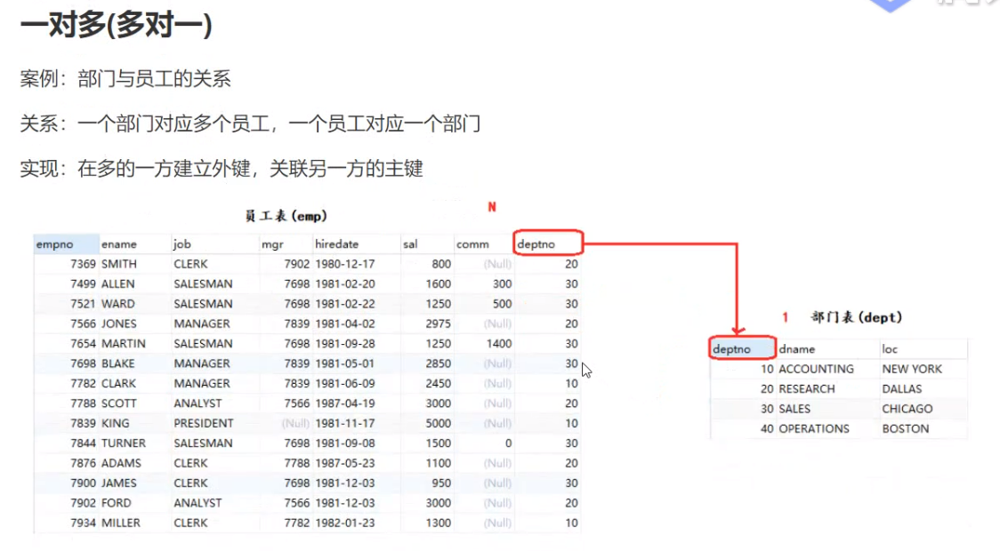
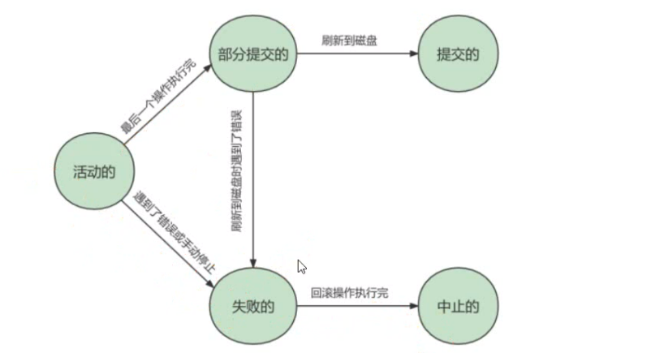

# SQL语句规范

+ SQL语句不区分大小写。但字符串常量区分大小写，**建议命令大写，表名库名小写**
+ SQL语句可单行或多行书写，以分号结尾
+ 用空格和缩进来提高语句的可读性
+ 汪释：有三种风格的汪释
  1. 单行注释可以用“#
  2. 单行注释第二种写法用“-- ”，“-"与注释之间是有空格的。
  3. 多行注释可以用/* */

# **1. 查看**

+ 查看所有数据库 

  ```mysql
  show databases;  
  ```

+ 查看该数据库的所有表/视图

  ```mysql
  show tables;
  ```

+ 查看创建数据库时使用的SOL语句

  ```mysql
  show create database `数据库名`;
  ```

- 查看创建表时使用的SOL语句

  ```mysql
  show create table `表名`;
  ```

- 查看创建视图时使用的SOL语句

  ```mysql
  show create view `视图名`;
  ```

- 查看数据库下面的所有表

  ```mysql
  SHOW TABLES FROM `数据库名`;
  ```

- 查看表/视图结构(显示表有那些字段)

  ```mysql
  desc  `表名`;     
  ```

- 查看视图的属性信息

  ```mysql
  SHOW TABLE STATUS LIKE `视图名`;
  ```

# 2.使用数据库

```mysql
语法:  use `数据库名`;   
# 查看当前使用的数据库
SELECT DATABASE();
```

#  3. 创建

##   **3.1创建数据库 **

```mysql
语法:  create database if not exists `数据库名`;  
```

## 3.2 **创建表 **

```mysql
语法:  create table if not exists `表名`;
```

**注意:   不为空尽量设置一个默认值保证插入任何时候都成功,**

```mysql
-- 普通方式:
create table if not exists `表名`
(
    
   '字段名1' 列类型 [属性][索引][注释],
   '字段名2' 列类型 [属性][索引][注释],
    #...
   '字段名n' 列类型 [属性][索引][注释]
   
) [表类型][表字符集设置][注释];
```

```mysql
-- 方式二:基于其他的表创建新表,注意除了主键约束其他的不会复制过来
 -- 单个表
CREATE TABLE myemp
AS
SELECT empno,ename,sal FROM test.emp；
SELECT * FROM myemp
 -- 多个表
CREATE TABLE myemp1
AS
SELECT e,empno,e.ename,d.deptno,d.dname
FROM test.emp e,test.dept d WHERE e.deptno=d.deptno;

-- 基于另一个表创建新表，但是只需要表结构，不需要数据
CREATE TABLE myemp2
AS
SELECT * FROM test.emp WHERE 1 = 2；
```

例子:

```mysql
create table if not exists user
(
    id int(11) auto_increment comment "序号",
    username varchar(20) not null default "匿名" comment "姓名",
    password varchar(20) not null default "",
    registerTime int(11) not null default 0,
    primary key(id)
) engine=innodb default charset=utf8;
--主键一般一个表只有一个  
```


## 3.3 **创建字段 **

```mysql
语法:  alter table  `表名` add  `字段名`  该字段的属性;
```

例子:

```mysql
-- 1,在最后添加字段
ALTER TABLE test ADD comm DECIMAL(10,2)
-- 2,在最前面添加字段 FIRST
ALTER TABLE test ADD deptno INT FIRST;
-- 3,在指定位置添加字段 AFTER
ALTER TABLE test add hiredate DATE AFTER ename;
```

##  3.4. 注释的使用

```mysql
# 注释
CREATE TABLE stu
id TNT COMMENT '学生编号',
name VARCHAR(10）COMMENT '学生姓名'
)COMMENT '学生表';

# 查看注释
SHOW CREATE TABLE stu
# 修改字段的注释
ALTER TABLE stu MODTFY id TNT COMMENT '学号'
# 修改表的注释
ALTER TABLE stu COMMENt '一班的学生表':
```

# 4. 删除

## 4.1  数据库 

```mysql
语法:  drop database if exists `数据库名`;
```

## 4.2 删除表

```mysql
语法:  drop table if exists `表名1`,表名2`, 表名n`;
```

## 4.3 删除字段

```mysql
语法:  alter table `表名` drop `字段名`;				
```

## 4.4 删除约束

详细看约束章节

## 4.5 删除视图

```mysql
语法:  DROP VIEW IF EXISTS 视图名称1[，视图名称2,视图名称3,..];
```


#  **5. 修改(alter table)**

## 5.1 修改表名

```mysql
-- 方式一：只能修改一个表的名
ALTER TABLE `旧表名` RENAME TO `新表名`;

-- 方式二：rename同时修改多个表名
RENAME TABLE `旧表名` TO `新表名`,`旧表名` TO `新表名`;
```

## 5.2 修改字段

 **修改字段的数据类型: **

```mysql
语法:   alter table `表名`  modify  `字段名`  `该字段修改后的属性`;         
```

**修改字段名:  **

```mysql
语法:   alter table `表名`  change  `旧字段名`  `新字段名` `旧字段的属性`;
```

**修改字段的顺序:**

```mysql
语法:   alter table `表名`  modify  `旧字段名`  `旧字段的属性` 位置;
```

例子

```mysql
-- 修改字段
-- 1,修改字段的数据类型
ALTER TABLE test MODIFY hiredate DATETIME;
-- 2,修改字段名称
ALTER TABLE test CHANGE salgrade sal DECTMAL(8,2)
-- 3,修改字段的顺序
-- 1,把字段放到第一个
ALTER TABLE test MODIFY sal DECIMAL(8,2）FIRST;
-- 2，把字段放到指定字段之后
ALTER TABLE test MODIFY sal DECIMAL(8,2）AFTER hiredate;
```

## 5.3 修改表的字符集

```mysql
SHOW CREATE TABLE db.memp;
ALTER TABLE db.memp CONVERT TO CHARACTER SET 'gbk';
ALTER TABLE db.memp CONVERT TO CHARACTER SET 'utf8mb4';
```


# 6. **操作表数据**

##  6.1 **插入数据(inset into)**

```mysql
语法:  insert into 表名 (字段1,字段2,字段3,...) values('值1'), ('值2', ('值3')
```

ps:  ' 字段1,字段2...' 该部分可省略 , 但添加的值务必与表结构,数据列,顺序相对应,且数量一致 .

```mysql
# 插入多条数据
insert into 表名
(字段1,字段2,字段3)
values				
(值1,值2,值3, ...),
(值1,值2,值3, ...),
(值1,值2,值3, ...),
(值1,值2,值3, ...);

# 插入单条数据
insert into 表名
字段1
values				
(值1,值2,值3, ...);

# 插入全部数据
insert into 表名
values				
(值1,值2,值3, ...);

#从另外一张表中，查询到然后插入
INSERT INTO myemp SELECT * FROM emp WHERE deptno=30;
INSERT INTO myemp(empno,ename, job,mgr ,hiredate,sal, comm, deptno）SELECT * FROM emp WHERE deptno=20
```

例子:

```mysql
insert into user
(username, password, registerTime)
values
("admin", "12345678",1583847118),
("hello", "123456",1583847298);
```


## 6.2 更新数据

```mysql
语法:  update 表名 set 字段名=新值 where  筛选条件;
```

例子:

```mysql
update user set username="world" where password="123456";
```


例子:

```mysql
使用 if 判断，当 sex 为 m 的时候更改为 f，否则就更改为 m（f 改为 m），使用 if(sex="m","f","m") 就可以直接搞定了，实现 SQL 如下。
update salary set sex=if(sex="m","f","m");
```

## 6.3 **删除数据(delete from) **

**方法1:**

```mysql
语法:  DELETE FROM 表名 [WHERE 子句]〔ORDER BY 子句][LIMIT 子句]
```

例子:

```mysql
DELETE FROM `user` WHERE `id`=2;
# 删除雇员编号为7369、7566、7788的员工
DELETE FROM myemp WHERE empno IN(7369,7566,7788);
# 删除公司工资最高的员工, 再包装一层
DELETE FROM myemp WHERE sal(
	SELECT maxsal FROM（SELECT MAX(sal）maxsal FROM myemp)temp
);
# 按部门编号降序排列，并删除前6条数据
DELETE FROM myemp ORDER BY deptno DESC LIMIT 3:
```

**方法2:**

```mysql
语法: truncate  表名;
```

例子:

```mysql
TRUNCATE user
```

ps: 

```mysql
-- 使用TRUNCATE TABLE 重新设置AUTO_INCREMENT计数器
-- 使用TRUNCATE TABLE不会对事务有影响 （事务后面会说）
```

例子:

删除重复[196. 删除重复的电子邮箱](https://leetcode.cn/problems/delete-duplicate-emails/description/)

```mysql
DELETE p1 FROM Person p1,
    Person p2
WHERE
    p1.Email = p2.Email AND p1.Id > p2.Id
```

DELETE t1 FROM t1 LEFT JOIN t2 ON t1.id=t2.id WHERE t2.id IS NULL;

这种DELETE方式很陌生，竟然和SELETE的写法类似。它涉及到t1和t2两张表，DELETE t1表示要删除t1的一些记录，具体删哪些，就看WHERE条件，满足就删；这里删的是t1表中，跟t2匹配不上的那些记录

# 7.查询表数据

##  7.1  基本语法

```mysql
语法: select  [distinct] `字段名` [ as 别名] from `表名`;
```

```mysql
SELECT [ALL(默认) | DISTINCT]
{* | table.* | [table.field1[as alias1][,table.field2[as alias2]][,...]]}
FROM table_name [as table_alias]
[left | right | inner join table_name2]  -- 联合查询
[WHERE ...]  -- 指定结果需满足的条件
[GROUP BY ...]  -- 指定结果按照哪几个字段来分组
[HAVING]  -- 过滤分组的记录必须满足的次要条件
[ORDER BY ...]  -- 指定查询记录按一个或多个条件排序
[LIMIT {[offset,]row_count | row_countOFFSET offset}];  -- 指定查询的记录从哪条至哪条
```

例子:

```mysql
select id as 序号, username as 名字 from user; # as 起别名 目的: 方便看查询的结果
```


例子:

```mysql
select distinct username from  user;  #去重, 只能针对末字段
```

例子:  

```mysql
select * from `user`;  #显示表内数据, 一般不用
```


例子:

```mysql
select ename as"姓名',sal AS'月薪', sa1*12 AS'年薪'FROM `emp`;  # 支持简单的四则计算
```


##  7.2 条件查询

作用:   有条件地从表中筛选数据

==注意使用时要区分字符串还是数字==

| 运算符      | 注释   |
| ----------- | ------ |
| +           | 加法   |
| -           | 减法   |
| *           | 乘法   |
| /           | 除法   |
| %  或 mod() | 取余数 |

| 操作符    | 说明     |
| --------- | -------- |
| =         | 等于     |
| <>  或 != | 不等于   |
| <         | 小于     |
| <=        | 小于等于 |
| >         | 大于     |
| >=        | 大于等于 |

| 逻辑运算符        | 功能 |
| ----------------- | ---- |
| and   或  &&      | 并且 |
| or     或    \|\| | 或者 |
| not   或   !      | 非   |

| 其他              | 功能               |
| ----------------- | ------------------ |
| between  n1 andn2 | 在指定的两个值之间 |
| is null           | 为空               |
| is not null       | 不为空             |
| in (值1,值2)      | 在多值中进行匹配   |

例子:   **id 为奇数** 的，结果请按等级 `rating` 排序

```c++
//也可以用位判断的方法
select *
from cinema
where id & 1   #判断奇数
and description <> 'boring'
order by rating DESC;
```

例子:

```mysql
select name from customer
where referee_id != 2 or referee_id is null;
```

## **7.3 模糊查询**

```mysql
语法: select  [  distinct  ]  `字段名`  [ as  别名 ]  from `表名` where  `字段名`  运算符  限制条件
```

| 运算符      | 语法               | 描述                                          |
| ----------- | ------------------ | --------------------------------------------- |
| is null     | a is nul           | 如果操作符为NUI,结果为真                      |
| is not null | a is not nul       | 如果操作符不为null，结果为真                  |
| between     | a between b and c  | 若a在b和c之间，则结果为真                     |
| like        | a like b           | SQL 匹配，如果a匹配b，则结果为真              |
| in          | a in (a1,a2,a3...… | 假设a在a1，或者a2.…其中的某一个值中，结果为真 |

注意：

- **数值数据类型的记录之间才能进行算术运算 ;**
- **相同数据类型的数据之间才能进行比较 ;**
- **空字符串不是 null,  而是 " ".**

**is NULL 空  和  is not null 不空 :**

```mysql
-- =============================================
-- is NULL 空  和  is not null 不空
-- =============================================
-- 不能直接写=NULL,这是错误的 , 用 is null   注意:空字符串不等于null

-- 查询出生日期没有填写的同学
SELECT studentname FROM student
WHERE BornDate IS NULL;

-- 查询出生日期填写的同学
SELECT studentname FROM student
WHERE BornDate IS NOT NULL;

-- 查询没有写家庭住址的同学(空字符串不等于null)
SELECT studentname FROM student
WHERE Address='' OR Address IS NULL;
```

**like :**

–like结合使用的通配符 :  

+ %    (代表匹配任意长度的字符  相当于....) 
+ _     (代表匹配任意一个字符   相当于.)

```mysql
-- =============================================
-- LIKE
-- =============================================
-- like结合使用的通配符 :  % (代表0到任意个字符相当于....) 和  _(代表一个字符 相当于.)

-- 查询姓刘的同学的学号及姓名
SELECT studentno,studentname FROM student
WHERE studentname LIKE '刘%';

-- 查询姓刘的同学,后面只有一个字的
SELECT studentno,studentname FROM student
WHERE studentname LIKE '刘_';

-- 查询姓刘的同学,后面只有两个字的
SELECT studentno,studentname FROM student
WHERE studentname LIKE '刘__';

-- 查询姓名中含有 嘉 字的
SELECT studentno,studentname FROM student
WHERE studentname LIKE '%嘉%';

-- 查询姓名中含有特殊字符的需要使用转义符号 '\'
-- 自定义转义符关键字: ESCAPE ':'
```

**in 和 not in :** 

--和范围一起用

```mysql
-- =============================================
-- IN
-- =============================================
-- 范围查询

-- 查询学号为1000,1001,1002的学生姓名
SELECT studentno,studentname FROM student
WHERE studentno IN (1000,1001,1002);

-- 查询地址在北京,南京,河南洛阳的学生
SELECT studentno,studentname,address FROM student
WHERE address IN ('北京','南京','河南洛阳');
```

## 7.4 聚合查询

```mysql
语法:  SELECT 聚合函数 FROM 表名 [WHERE条件]
```

 **聚合函数(常用)**

| 函数名称       | 描述                                                         |
| -------------- | ------------------------------------------------------------ |
| count( 主键/1) | 计算的记录总和数， 如 select count(1) 【不建议使用 *，效率低】 |
| sum()          | 返回数字字段或表达式列作统计，返回一列的总和。               |
| vag()          | 通常为数值字段或表达列作统计，返回一列的平均值               |
| max()          | 可以为数值字段，字符字段或表达式列作统计，返回最大的值。     |
| min()          | 可以为数值字段，字符字段或表达式列作统计，返回最小的值。     |

**注意:**

+ 其中 COUNT函数可用于任何数据类型，而SUM、AVG函数都只能对数值类型做计算，MAX和MIN可用于数值、字符串或是日期时间数据类型。
+ having里可以使用聚合语句

例子:

```mysql
#1. 统计企业员工数量
SELECT COUNT(*）FROM emp 
SELECT COUNT(mgr） FROM emp
#2. 统计该企业员工的平均作
SELECT AVG(sal) FROM emps
#3. 查询该企业员工的最高工资
SELECT MAX(sa1）FROM emps
#4. 查询该企业员工的最低工份
SELECT MIN(sal)FROM emp:
```

## 7.5 分组查询

```mysql
语法:  SELECT 分组字段/聚合函数 FROM 表名 [WHERE条件] GROUP BY 分组字段 [HAVING分组后条件];
```

**注意:**

+ **满足条件的分成一组,  然后在用having组内进行其他操作**

+ 如果没有group by语句,那么在select子句之中只允许出现统计函数，其他任何字段都不允许出现

  ```mysql
  #错误语句
  SELECT ename,COUNTCjob）FROM emp;
  #正确语句
  SELECT COUNT(job）FROM emp;
  ```

+ 如果有group by语句，那么select子句中只允许出现group by子句中出现的字段

  ```mysql
  #错误的语句
  SELECT ename,COUNT(job) FROM emp GROUP BY job
  #正确的语句
  SELECT job,COUNT(job）FROM emp GROUP BY job;
  ```

例子:

```mysql
# 显示不同职位薪资少于1500的人数,并且大于2个人
SELECT job,COUNT(*）FROM emp WHERE sal<1588 GROUP BY job HAVING CoUNT(*)>2:
                 
# 分组并且显示每个组的数量                 
SELECT job,COUNT(*）FROM emp GROUP BY job:    
```

例子:

```mysql
# 显示非销售人员(salesman)工作名称以及从事同一工作的员工的月工资的总和，并且要满足从事同一工资合计大于等于5000
# 1,显示非销售人员（salesman)工作名称
SELECT job FROM emp WHERE job!='salesman'
# 2,再对工作进行分组，统计各个职位的总工资
SELECT job,SUM(sal）FROM emp WHERE job!='salesman'GROUP BY job HAVING SUM(sal)>=5000:
```

**WHERE和HAVING区别:**

+ WHERE：是在分组之前使用(可以没有GROUP BY)，不允许使用统计函数

+ HAVING：是在分组之后使用(必须结合GROUP BY)，允许使用统计函数

  

##  7.6 排序查询

```mysql
语法: SELECT 字段名 FROM 表名 ORDER BY 排序字段名 [ASC|DESC];
```

语法说明:

+ 排序子段名：表示需要排序的字段名称，多个字段时用逗号隔开
+ ASC | DESC：ASC表示字段按升序排序；DESC表示字段按降序排序。其中ASC为默认值

特点:

+ **ORDER BY子句一般放到查询语句的最后面来做**,并且允许使用函数,  **LIMIT字句除外**
+ 当排序的字段中存在空值时，ORDER BY会将该空值作为最小值来对待
+ ORDER BY指定多个字段进行排序时，MySQL会按照字段的顺序从左到右依次进行排序

**注意：**

+ 在对多个字段进行排序时，排序的第一个字段必须有相同的值，才会对第二个字段进行排序。如果第一个字段数据中所有的值都是唯一的，MySQL将不再对第二个字段进行排序

例子:

```mysql
# 1.根据姓名对员工进行排序(升序
SELECT * FROM emp ORDER BY ename ASC;
# 2,查询入职时间大于1981年6月6日的员工信息，并按照入职时间升序排列
SELECT * FROM emp WHERE hiredate>'1981-6-6' ORDER BY hiredate ASC:
# 3.根据工作职位，进行光予排列，职位相同的情况下，用根据人职时间峰予排列
SELECT* FROM emp ORDER BY job ASC,hiredate DESC:
# 4.查询工资不在1000到2008之间的员工的姓名和工资，工资按降序排列
SELECT ename,sal FROM emp WHERE sal NOT BETWEEN 100o AND 2008 ORDER BY sal DESC
# 5.按工作职位进行分组，查看每个工作职位的人数，工作职位按升序排列
SELECT j0b,COUNT(*)
FROM emp
GROUP BY job
ORDER BY job ASC:
# 6. 分组并且按照每个组的数量降序排序
SELECT customer_number
FROM orders
GROUP BY customer_number
ORDER BY count(*)  DESC
LIMIT 0,1;   #显示一条数据
```

## 7.7 分页查询

```mysql
语法: SELECT 字段名 FROM 表名 LIMIT 索引*pageSzie, pageSzie
```

特点

+ 起始索引从0开始，起始索引=(查询页码-1)*每页显示记录数
+ 如果查询的是第一页教据,起始索引可以省略,直接简写为LIMIT 10
+ 好处 : (用户体验,网络传输,查询压力)

例子:

```mysql
-- 1.查询第一页员工数据，每页展示10条记录
SELECT * FROM emp LIMIT 0,10
-- 起始索引从0开始，起始索引=（查询页码-1）*每页显示记录数
-- 香询第二页，每一页显示10条记录
--（2-1)*10
SELECT * FROM emp LIMIT 10,10
-- 2.查询工资大于1500的员工数据，按工资升序排列，并分页，每页展示5条数据
SELECT * FROM emp WHERE sa1>1500 ORDER BY LIMIT 0,5

-- 3.查询 第一学年课程成绩前10名并且分数大于80的学生信息(学号,姓名,课程名,分数)
SELECT s.studentno,studentname,subjectname,StudentResult
FROM student s
INNER JOIN result r
ON r.studentno = s.studentno
INNER JOIN `subject` sub
ON r.subjectno = sub.subjectno
WHERE subjectname='第一学年'
ORDER BY StudentResult DESC
LIMIT 0,10
```

# 8. 函数

## **8.1 数据函数**

```mysql
SELECT ABS(-8);      /*绝对值*/
SELECT CEIL(9.4); /*向上取整*/
SELECT FLOOR(9.4);   /*向下取整*/
SELECT RAND();  /*随机数,返回一个0-1之间的随机数*/
SELECT SIGN(0); /*符号函数: 负数返回-1,正数返回1,0返回0*/
#round
SELECT ROUND(3.698),#保留整数，四舍五入
ROUND(3.698,2), #指定保留几位小数
ROUND(789,-3)    #对整数取整，-n就是把数字的几位变成0
#truncate
SELECT TRUNCATE(3.698,) #截取，不会四舍五入
TRUNCATE(789,-2);
```

例子:

```mysql
# 生成一个六了数字的附机验证码
SELECT LPAD(TRUNCATE(RAND(）* 1800000,0),6,'0')
```

## 8.2 **字符串函数**

```mysql
 SELECT CHAR_LENGTH('11111就能成功'); /*返回字符串包含的字符数*/
 SELECT INSERT('我爱编程helloworld','我');  /*查找,返回索引位置*/
 
 SELECT CONCAT('我','爱','程序');  /*合并字符串,参数可以有多个*/
 SELECT LOWER('KuangShen'); /*小写*/
 SELECT UPPER('KuangShen'); /*大写*/
 SELECT LEFT('hello,world',5);   /*从左边截取*/
 SELECT RIGHT('hello,world',5);  /*从右边截取*/
 SELECT REPLACE('11111就能成功','坚持','努力');  /*替换字符串*/
 SELECT LPAD('HELLO',10,"*")   /*不足10位填充字符串*/
 SELECT RPAD('HELLO',10,'*')
 
 SELECT SUBSTR('11111成功',4,6); /*截取字符串,开始和长度*/
 SELECT REVERSE('1112223 成功'); /*反转*/
 SELECT LENGTH('1112223 成功')   /*长度*/
```

例子:

```mysql
# 查询姓周的同学,改成邹
SELECT REPLACE(studentname,'周','邹') AS 新名字
FROM student WHERE studentname LIKE '周%';
#查询员工姓名长度为5的员工信息
SELECT * FROM emp WHERE LENGTH(ename)=5:
#查看所有员工信息，凡是不显示姓名的前三个字母
SELECT ename 原始姓名,SUBSTR(ename,4）FROM emp；
#只显示后面三个字符
SELECT ename 原始姓名, SUBSTR(ename,-3）FROM emp;
# 把员工姓名首字母大写 
SELECT CONCAT(UPPER(LEFT(ename,1)),LOWER(SUBSTR(ename,2))）FROM emp;
# 查找姓名以jam开头的员工
SELECT * FROM emp WHERE SUBSTR(ename,1,3)='jam';
```

## 8.3 **日期和时间函数**

```mysql
 SELECT CURRENT_DATE();   /*获取当前日期*/
 SELECT NOW();            /*获取当前日期和时间*/
 
 SELECT CURDATE();  	 /*获取当前日期*/
 SELECT LOCALTIME();   /*获取当前日期和时间*/
 SELECT SYSDATE();   /*获取当前日期和时间*/
 
 -- 获取年月日,时分秒
 SELECT YEAR(NOW());
 SELECT MONTH(NOW());
 SELECT DAY(NOW());
 SELECT HOUR(NOW());
 SELECT MINUTE(NOW());
 SELECT SECOND(NOW());
 
SELECT DAYOFWEEK(CURDATE());#获取指定日期是星期几,1星期日 2星期一
SELECT DAYOFYEAR(CURDATE());#获取指定旧期是本年的第几天
SELECT OUARTER(CURDATE()); #获取指定日期是本年的第几个季度

# 将指定的时间转为秒
SELECT TTME TO SEC("1:00:00");
# 将秒数转为时间
SELECT SEC_TO_TIME(3690);
#计算时间加/减上某个时间，结果是哪个时间
SELECT ADDTTME（CURTTME(),'5:00:00');
SELECT SUBTTME(CURTIME(),'5:30:20');

#计算日期加/减n天后的日期
SELECT ADDDATE(CURDATE(),2);
SELECT SUBDATE(CURDATE(),1):

#格式化显示日期或时间
SELECT DATE FORMAT(CURDATE(),'%Y-%m-%d')
SELECT TTME FORMAT(CURTIME(),'%h:%i:%s')
```

## 8.4 条件判断语句

| 函数             | 作用                                             |
| :--------------- | ------------------------------------------------ |
| IF(expr, v1, v2) | 如果表达式expr成立，返回结果v1；否则，返回结果v2 |
| IF NULL(v1,v2)   | 如果v1的值不为NULL，则返回v1，否则返回v2         |
| CASE             | 相当于switch语句, 分支(详见下面)                 |

+ **if(expr, v1, v2)**

  ```mysql
  SELECT IF(1>0,'true','false');
  ->rue
  ```

+ **if nulll(v1,v2)**

  ```mysql
  SELECT IF NULL(NULL,'maye');
  ->maye
  ```

  例子:

  ```mysql
  # emp表中，佣金为nu11的员工，而且为nu11则显示不是销售
  SELECT ename,sal,IF(comm,'销售','不是销售'）FROM emp
  ```

+ **case**

  语法1:

  ```mysql
  CASE
  	WHEN expr1 THEN V1
  	WHEN Texpr2 THEN V2
  	ELSE nv
  END;
  ```

  语法2:

  ```mysql
  CASE expr1
  	WHEN e1 THEN V1
  	WHEN e1 THEN V2
  	ELSE nv
  END;
  ```

  例子:

  ```mysql
  SELECT ename,sal,comm
  CASE sal
      WHEN 800 THEN "最底层的员工"
      WHEN 3000 THEN "最中等"
      WHEN 5000 THEN "最大老板"
      ELSE "其他"
  END 
  FROM emp:
  ```

  

## 8.5 其他函数

###  8.5.1 **系统信息函数**

  ```mysql
 SELECT VERSION();  /*版本*/
 SELECT USER();     /*用户*/
  ```

### 8.5.2 加密函数

| 函数     | 作用                                                         |
| -------- | ------------------------------------------------------------ |
| MD5(str) | 对字符串str进行散列，可以用于一些普通的不需要解密的数据加密，如密码 |
| sha1     | 对字符串str进行散列，可以用于一些普通的不需要解密的数据加密，如密码，比MD5更安全 |

  例子:

  插入新的数据自动加密

  ```mysql
 INSERT INTO testmd5 VALUES(4,'kuangshen3',md5('123456'));
  ```

  查询登录用户信息（md5对比使用，查看用户输入加密后的密码进行比对）

  ```mysql
 SELECT * FROM testmd5 WHERE `name`='kuangshen' AND pwd=md5('123456');
  ```

------

### 8.5.3**进制转换函数**

| 函数                      | 作用                                |
| ------------------------- | :---------------------------------- |
| BIN(X)                    | 返回x的二进制                       |
| HEX(X)                    | 返回x的十六进制                     |
| OCT(X)                    | 返回x的八进制                       |
| CONV(x,from base,to_base) | 将from_base进制的x，转成to_base进制 |

例子

```mysql
SELECT BIN(10),HEX(10),OCT(10),CONV(16,16,10):
->1010 A 12 22
```

### 8.5.4**IP地址转换函数**

```mysql
# iP地址转换
# 把点分十进制的ip转为数字
SELECT INET_ATON('127.0.0.1')
# 把数字转成点分十进制字符串
SELECT INET_NTOA(2130706433)
```

# 9. 多表查询

## 9.1多表关系




苗卡尔积和正确的多表查询

## 9.2 等值连接和不等值连接

 **等值连接**

```mysql
# 等值连接
SELECT*
FROM emp e,dept d
WHERE e.deptno=d.deptno; # 连接条件使用的是=,所以这个叫做等值连接

# 方法2: 使用USING来关联相同的字段
SELECT * FROM emp 
JOIN dept
USING(deptno)
```

**不等值连接**

```mysql
# 不等值连接案例：查询每个员工的薪资等级
SELECT *
FROM emp e,salgrade S
WHERE e.sal BETWEEN s.losal AND s.hisal;  # 员工的薪资在某个区间


#查询所有员工emp的信息以及部门dept信息和薪资等级salgrade
SELECT e.ename,d.dname,d.1oc
CASE s/;;;;;;;;;;'''''''''''''''''.grade
	WHEN 1 THEN "A"
	WHEN 2 THEN "B"
	WHEN 3 THEN "C"
	WHEN 4 THEN "D"
	WHEN 5 THEN "E"
END AS "最高等级"
FROM emp e, dept d, salgrade s
WHERE e.deptno=d.depton AND e.sal  BETWEEN s.losal AND s.hisal;
```

## 9.3 内连接和外连接

连接查询 :  如需要多张数据表的数据进行查询,则可通过连接运算符实现多个查询

+ 内连接 inner join
  查询两个表中的结果集中的交集
+ 外连接 outer join
  + 左外连接 left join
        (以左表作为基准,右边表来一一匹配,匹配不上的,返回左表的记录,右表以NULL填充
  + 右外连接 right join
        (以右表作为基准,左边表来一一匹配,匹配不上的,返回右表的记录,左表以NULL填充

| 操作       | 描述                                       |
| :--------- | :----------------------------------------- |
| Inner join | 如果表中至少有一个匹配，就返回行           |
| left join  | 会从左表中返回所有的值，即使右表中没有匹配 |
| right join | 会从右表中返回所有的值，即使左表中没有匹配 |

```mysql
# 内连接, 连按条件不成立的时候，为NULL或匹配不到数据的时候，左表数据不显示
#1，隐式内连接
SELECT * FROM
emp,dept
WHERE emp.deptno=dept. deptno;
#2，显式内连接
SELECT * FROM emp 
INNER JOIN dept
ON emp.deptno=dept.deptno;
#3. 使用USING来关联相同的字段
SELECT * FROM emp 
JOIN dept
USING(deptno)

#外连楼连接条件不成立的时候，表中的数据照样显示, 可以显示左表不存在的
#左外连接左表中的数据显示
SELECT* FROM emp 
LEFT JOIN dept
ON emp.deptno=dept.deptno;
#右外连接右表中的数据显示
SELECT * FROM emp 
RIGHT JOIN dept
ON emp.deptno=dept.deptno;
#全外连接两个表中的数据都显示MvSOL中不支持全外连校
SELECT*FROM
emp FULL JOIN dept
ON emp.deptno=dept.deptno
```

### 9.3.1 七种JOIN操作


**上图实现:**

```mysql
#1. 中间的内连接
SELECT * FROM emp 
INNER JOIN dept
ON emp.deptno=dept.deptno;

#2. 左上左外连接
SELECT * FROM emp 
LEFT JOIN dept
ON emp.deptno=dept.deptno;

#3. 石上右外连接
SELECT * FROM emp 
RIGHT JOIN dept
ON emp.deptno=dept.deptno;

#4. 左中图在左外连接的基础上，去掉满足连接条件的记录
SELECT* FROM emp 
LEFT JOIN dept
ON emp.deptno=dept.deptnc
WHERE emp.deptno IS NULL; #只要不满足条件的，连接条件不匹配或者为NULL

#5. 右中图在右外连接的基础上，去掉满足连接条件的记录
SELECT * FROM emp 
RIGHT JOIN dept
ON emp .deptno=dept.deptnc
WHERE emp.deptno IS NULL; #只要不满足条件的，连接条件不匹配或者为NULL

#6. 左下图 用左上图和右中图来实现全外连接
SELECT * FROM emp 
LEFT JOIN dept
ON emp.deptno=dept.deptno
UNION
SELECT * FROM emp 
RIGHT JOIN dept
ON emp .deptno=dept.deptnc
WHERE emp.deptno IS NULL;

#7. 右下图 用左中图和右中图
SELECT* FROM emp 
LEFT JOIN dept
ON emp.deptno=dept.deptnc
WHERE emp.deptno IS NULL    #只要不满足条件的，连接条件不匹配或者为NULL
UNION
SELECT * FROM emp 
RIGHT JOIN dept
ON emp .deptno=dept.deptnc
WHERE emp.deptno IS NULL;     #只要不满足条件的，连接条件不匹配或者为NULL
```

**例子: **

```mysql
-- 查询参加了考试的同学信息(学号,学生姓名,科目编号,分数)
SELECT * FROM student;   // 学生表
SELECT * FROM result;    // 成绩表


/*思路:
(1):分析需求,确定查询的列来源于两个类,student result,连接查询
(2):确定使用哪种连接查询? 确定交叉点on(内连接),   (两个表中那个数据是相同的)
*/

SELECT s.studentno,studentname,subjectno,StudentResult
FROM student s                          -- subjectno在student表里没有
INNER JOIN result r                      
ON r.studentno = s.studentno            -- 确定交叉

-- 右连接(也可实现)
SELECT s.studentno,studentname,subjectno,StudentResult
FROM student s
RIGHT JOIN result r
ON r.studentno = s.studentno

-- 等值连接
SELECT s.studentno,studentname,subjectno,StudentResult
FROM student s , result r
WHERE r.studentno = s.studentno         -- 等值查询

-- 左连接 (查询了所有同学,不考试的也会查出来)  // 满足一个条件的都会找出来
SELECT s.studentno,studentname,subjectno,StudentResult
FROM student s
LEFT JOIN result r
ON r.studentno = s.studentno

-- 查一下缺考的同学(左连接应用场景)
SELECT s.studentno,studentname,subjectno,StudentResult
FROM student s
LEFT JOIN result r
ON r.studentno = s.studentno
WHERE StudentResult IS NULL
```

## 9.4 自连接和集合运算

### 9.4.1 自连接

**核心：一张表拆为两张一样的表即可**

例子:

```mysql
-- 创建一个表
CREATE TABLE `category` (
`categoryid` INT(10) UNSIGNED NOT NULL AUTO_INCREMENT COMMENT '主题id',
`pid` INT(10) NOT NULL COMMENT '父id',
`categoryName` VARCHAR(50) NOT NULL COMMENT '主题名字',
PRIMARY KEY (`categoryid`)
) ENGINE=INNODB AUTO_INCREMENT=9 DEFAULT CHARSET=utf8

-- 插入数据goods
INSERT INTO `category` 
(`categoryid`, `pid`, `categoryName`)
VALUES
('2','1','信息技术'),
('3','1','软件开发'),
('4','3','数据库'),
('5','1','美术设计'),
('6','3','web开发'),
('7','5','ps技术'),
('8','2','办公信息');

# 自连接
SELECT a.categoryName AS '父栏目',b.categoryName AS '子栏目'
FROM category AS a,category AS b
WHERE a.`categoryid`=b.`pid`
```

运行结果:

```
父栏目      子栏目
软件开发	数据库
软件开发	web开发
美术设计	ps技术
信息技术	办公信息
```

### 9.4.2 集合运算

**UNION DISTINCT**

+ 去重

**UNON ALL**

+ UNION不会会删除重复行

+ 相同的行在结果中可能出现多次

要求
(1) **输入的查询不能包含ORDER BY字句,可以为整个集合运算结果选择性地增加一个ORDER BY语句**
(2) **两个查询必须包含相同的列数**
(3)相应列必须具有兼容的数据类型。兼容个的数据类型：优先级较低的数据类型必须能隐式地转换为较高级的数
据类型。比如输入的查询1的第一列为int类型，输入的查询2的第一列为float类型，则较低的数据类型int类型可以
隐式地转换为较高级float类型。如果输入的查询1的第一列为char类型，输入的查询2的第一列为datetime类型
则会提示转换失败：从字符串转换日期和/或时间时，转换失败
(4)集合运算结果中列名由输入的查询1决定，如果要为结果分配结果列，应该在输入的查询1中分配相应的别名
(5)集合运算时，对行进行比较时，集合运算认为两个NULL相等:

```mysql
# 集合运算MySOL只支持并集运算
# A={A,B,C} B={C,D,E}
# UNION DISTINCT C={A,B,C,D,E}
SELECT * FROM emp；#15条记录
SELECT * FROM emp WHERE emp.deptno=10; #3条记录
#求并集去重
SELECT* FROM emp
UNION DISTINCT   # 去重
SELECT* FROM emp 
WHERE emp.deptno=10:  
#求并集补去重
SELECT* FROM emp
UNION ALL  
SELECT* FROM emp 
WHERE emp.deptno=10:  
ORDER BY ename
```

# 10.  子查询

在查询语句中的WHERE条件子句中,又嵌套了另一个查询语句嵌套查询可由多个子查询组成,求解的方式是由里及外;

**子查询规则**

+ 子查询必须放到()中
+ 子查询一般放在运算符的右边，可读性比较强
+ 子查询可以出现在几乎所有的select语句中(SELCT FROM WHERE ORDER BY HAVING)

**按子查询返回的结果分类: **

1. 标量查询：返回一个标量(一个值）单行单列
2. 行子查询：返回的足单行多列
3. 列予查询：返回的是多行单列
4. 表子查询：返回的是一个表

**按于查询和主查询之间是否有条件关联分类:**

1. 相关子查询：两个查询之间有一定的条件关联（相互联系)
2. 不相关子查询：两个查询之间没有条件关联(项目独立)

**如何处理使用子查询:**

1. 子查询出现在**WHERE**子句中：此时子查询返回的结果一般都是单列单行、单行多列、多行单列
2. 子查询出现在**HAVING**子句中：此时子查询返回的都是单行单列数据，同时为了使用统计函数操作
3. 子查询出现在**FROM**子句中：此时子查询返回的结果图一般都是多行多列，可以按照一张数据表(临时表)的形
   式操作

例子:

```mysql
# 查询公司之中工资最低的员工信息
#SELECT*FROM emp WHERE sa1=  #显示不行
# 1.查询公司中工资最低是多少 800
SELECT MIN(sa1）FROM emp;  #800
SELECT * FROM emp WHERE sa1=800;
           
#使用子查询
SELECT * FROM emp WHERE sal=(SELECT MTN(sal）FROM emp):           
```

## 10.1  标量子查询

```mysql
# 标量子查询
-- 1，查询出基本工资比ALLEN低的全部员工信息
-- 子查询语句的书写方式: 从外往内写 从内往外写
SELECT * FROM emp WHERE sal<(SELECT sal FROM emp WHERE ename="ALLEN"）

-- 2，查询基本工资高于公司平均工资的全部员工信息
SELECT * FROM emp WHERE sal<(SELECT AVG(sal）FROM emp）

-- 3，查询出与ALLEN从事同一工作，并且基本工资高于员工编号为7521的全部员工信息
SELECT * FROM emp
WHERE job=(SELECT job FROM emp WHERE ename='ALLEN'
AND sal>(SELECT sal FROM emp WHERE empno=7521);
```

## 10.2 单行子查询

```mysql
# 单行子查询
-- 1，查询与SCOTT从事统一工作且工资相同的员工信息
# 用标量子查询
SELECT * FROM emp
WIHERE job=(SELECT job FROM emp WHERE ename='SCOTT'
AND sal=(SELECT sal FROM emp WHERE ename='SCOTT');
# 用单行子查询           
SELECT * FROM emp WHERE（job,sal)=(SELECT job,sal FROM emp WHERE ename='SCOTT');

-- 2，查询与员工编号为7566从事同一工作且领导相同的全部员工信息
SELECT * FROM emp 
WHERE (job, mgr)=(SELECT job,mgr FROM emp WHERE empno=7566);

-- 3，查询与ALLEN从事同一工作且在同一年雇佣的全部员工信息(包含ALLENX)
SELECT * FROM emp 
WHERE (job,DATE_FORMAT(hiredate,'%Y'))=(SELECT job,DATE_FORMAT(hiredate,"%Y"）FROM emp WHERE ename='ALLEN'）;
```

## 10.3 列子查询(多行子查询)

子查询**返回的是多行单列的数据**，就是一列数据。多行子查询也称为**集合比较子查询**.

在使用多行子查询需要使用多行比较操作符

| 操作符 | 含义                                                         |
| ------ | ------------------------------------------------------------ |
| IN()   | 等于列表中的任意一个                                         |
| ANY()  | 需要和单行比较操作符一起使用(>、<、=、<>...，与子查询结果中任何一个值比较，一个成立 |
| ALL()  | 需要和单行比较操作符一起使用(>、<、=、<>...)，和子查询返回的所有值比较，同时成立 |
| SOME   | 实际上是ANY的别名，作用相同，一般用ANY                       |

**总结:**

```
IN    判断是否在集合内

=ANY   判断是否在集合内(和IN一样)
>ANY  大于集合中值最小的那一个
<ANY  小于集合中值最大的那一个
<>ANY 与集合中任意一个不等

=ALL  与集合中锈个值都相等
>ALL  比集合中最大的哪个值还大
<ALL  比集合中最小的那个值还小
<>ALL 与集合中每个都不相等的
```

例子:

```mysql
# 列子查询
-- 1，查询出与每个部门中最低工资相同的员工信息
SELECT * FROM emp WHERE sal=()
SELECT MIN(sal）FROM emp GRPUP BY den;
#
SELECT * FROM emp 
WHERE sal IN(SELECT MIN(sal) FROM emp GROUP BY deptno HAVING deptno IS NOT NULL);

-- 2，查询工资比任何管理工资都要都要高的员工信息
SELECT * FROM emp WHERE sa1=(SELECT sal FROM emp WHERE job= 'MANAGER'）; #管理工资有好几种,所有这里比不了
#
SELECT * FROM emp WHERE sa1 > ANY(SELECT sal FROM emp WHERE job= 'MANAGER'）;
```

## 10.4 表子查询

例子:

```mysql
-- 1，在emp表中，得到与10号部门任何一个员工入职年份和领导相同的员工信息
SELECT * FROM emp 
WHERE（DATE_FORMAT(hiredate,'%Y'),mgr）IN（SELECT DATE_FORMAT(hiredate,'%Y'),mgr FROM emp WHERE deptno=10);

-- 2. 查询出每个部门的编号、名称、位置、部门人数、平均工资
-- dept:编号、名称、位置
-- emp：部门人数、平均工资
SELECT d.deptno,d.dname,d.loc,temp.count ,temp.avgsal
FROM dept d,(SELECT deptno,COUNT（deptno）count,ROUND(AVG(sal),2) avgsal FROM emp GROUP BY deptno) temp
WHERE d.deptno=temp.deptno

-- 3，查询出所有在'SALES'部门工作的员工编号、姓名、基本工资、奖金、职位、雇佣日期、部门的最高和最低工资
-- 需要的数据表
-- emp: 员工编号、姓名、基本工资、奖金、职位、雇佣日期
-- emp：部门的最高和最低工资   # 所有必须用自连接
SELECT e.emppo,e.sal,e.comm,e.job,e.hiredate,temp.minsal,temp.maxsal
FROM emp e,(SELECT deptno,MIN(sal）minsal,MAX(sal）maxsal FROM emp GROUP BY deptno)temp
WHERE e.deptno=(SELECT deptno FROM dept WHERE dname='SALES'）
AND e.deptno=temp.deptno；
                
-- 4.查询出比「ALLEN’或「CLARK’薪资多的所有员工的编号、姓名、基本工资、部门名称、领导姓名、部门人数
-- 需要的数据表
-- emp:“ALLEN’或 'CLARKP' 薪资员工的编号、姓名、基本工资、部门名称
-- dept:部门名称
-- emp:me 领导姓名
-- emp:分组查询部门人数
SELECT e.empno,e.ename,e.sal,d.dname ,me.ename 领导, temp.count
FROM emp e,dept d,emp me,(SELECT deptno,COUNT(deptno) count FROM emp GROUP BY deptno）temp
WHERE e.sal >ANY(SELECT sal FROM emp WHERE ename IN（'ALLEN','CLARK'))
AND e.ename NOT IN('ALLEN','CLARK'）
AND e.deptno=d.deptno
AND e.mgr=me.empno
AND e.deptno=temp.deptno;    
                 

--  5. 列出公司各个部门的经理(假设每个部门只有一个经理，job为「MANAGER’)的姓名、薪资、部门名称、部门人数、部门平均工资
-- 需要的数据表
-- emp：经理的姓名，薪资
-- dept：部门名称
-- emp：部门人数，部门平均工资            
SELECT e.ename,e.sal,d.dname ,temp.avgsal
FROM emp e,dept d,(SELECT deptno,AVG(sal）avgsal FROM emp GROUP BY deptno)temp
WHERE job='MANAGER'
AND e.deptno=d.deptno
AND e.deptno=temp.deptno;                
                   
                                                      
-- 6，查询出所有薪资高干公司平均薪资的员工编号、姓名、基本工资、职位、雇佣日期、所在部门名称、部门位置、上级领导姓名、工资等级、部数、平均工资、平均服务年限。
-- emp:员工编号、姓名、基本工资、职位、雇佣日期
-- dept：所在部门名称、部门位置
-- emp：上级领导姓名
-- salgrade:工资等级
-- emp:部门人数、平均工资、平均服务年限 
SELECT e.empno,e.ename,e.sal,e.job,e.hiredate,d.dname,d.loc,me.ename领导,s.grade, temp. count,temp.avgsal,temp.`工作时间
FROM emp e,dept d,emp me, salgrade s,(
	SELECT deptno,COUNT(deptno）count,AVG(sal）avgsal,ROUND(AVG(TIMESTAMPDIFF(MONTH,hiredate,      CURDATE())/12),2）工作时间
 	FROM emp
 	GROUP BY deptno)temp
WHERE e.deptno=d.deptno
AND e.mgr=me.empno
AND e.sal BETWEEN s.losal AND s.hisal
AND e.deptno=temp.deptno;                  
```

## 10.5 HAVING子句中的子香询

```mysql
#1. 查询部门编号、员工人数、平均工资，并且要求这些部门的平均工资高于公司平均薪资
SELECT e,deptno,COUNT(deptno）cnt, AVG(sa1）avgsal
FROM emp e
GROUP BY e.deptno
HAVING avgsal>=(SELECT AVG(sal）FRON emp） #要求这些部门的平均工资高于公司平均薪资
AND deptno IS NOT NULL; 
                           
                           
# 查询出所有部门中平均工资最高的部门名及平均工资
-- 需要的表
-- emp：工资
-- dept：部门名称    
#得到部门名称和平均工资
SELECT d.dname,AVG(sal)
FROM emp e,dept d
WHERE e.deptno=d.deptno
GROUP BY d.dname
# 得到每个部门最高工资
SELECT AVG(sal)）FROM emp
GROUP BY deptno 
# 最终                          
SELECT d.dname,ROUND(AVG(sal),2) avgsal
FROM emp e,dept d
WHERE e,deptno=d.deptno
GROUP BY d.dname
HAVING avgsal>=
(
    SELECT MAX(temp.asal)
    FROM（SELECT AVG(sal）asal FRON emp WHERE deptno IS NOT NULL GROUP BY deptno) temp
);
```


## 10.6 SELECT子句中的子查间

```mysql
# 子查询在SELECT子句中的应用
#查询出公司每个部门的编号、名称、位置、部门人数、平均工资
-- 多表联合查询
SELECT d.deptno,d.dname,d.1oc,COUNT(e.deptno）cnt,ROUND(AVG(e.sal),2）avgsa1
FROM emp e RIGHT J0IN dept d
ON e.deptno=d.deptno
GROUP BY d.deptno,d.dname,d.loc:
                                                       
-- FROM子句中使用子查询, 表子查询
SELECT d.deptno,d.dname,d.loc,temp.cnt,temp.avgsal
FROM dept d,
(
    SELECT e.deptno,COUNT(e.deptno）cnt,AVG(e.sal） avgsal
    FROM emp e
    GROUP BY e.deptno
)AS temp
WHERE d.deptno=temp.deptno;
    
-- SELECT子句中使用子查询(关联子查询）
SELECT d.deptno,d.dname,d.1oc
(
    SELECT COUNT(deptno）
    FROM emp WHERE deptno=d.deptno
）,
(
    SELECT AVG(sa1)
    FROM emp WHERE deptno=d.deptno
)#平均工资
FROM dept;
```

## 10.7 相关子查询

```mysql
# 不相关子香询案例
-- 查询公司中，比scott薪资多的员工
SELECT *
FROM emp WHERE sal>
（
SELECT sal FROM emp WHERE ename='ScOTT'  #固定死了
);

#相关子查询
-- 0,查询员工中工资大于公司平均工资的员工的部门编号、姓名、薪资
SELECT e.depno, e.ename, e.sal
FROM emp e
WHERE e.sal>(SELECT AVG(sal) FROM emp);

-- 1,查询员工中工资大于本部门平均工资的员工的部门编号、姓名、薪资
SELECT e.depno, e.ename, e.sal
FROM emp e
WHERE e.sal>(
    SELECT AVG(sal) FROM emp
    WHERE deptno = e.deptno
	);

-- 2,查询员工的编号、薪资，按部门名称排序
SELECT e.empno,,e.sal
FROM emp e
ORDER BY(
    SELECT  d.dname
    FROM dept d
    WHERE d.deptno=e.deptno
);
```

## 10.8 WITH语句

**作用:   方便理解, 创建临时表**

例子:

```mysql
#WTTH语句
-- 1，查询每个部门的编号、名称、位置、部门平均工资、人数
-- 多表联合查询
SELECT d.deptno,d.dname,d.1oc,AVG(e.sal）avgsal,COUNT(e.deptno）cnt
FROM dept d JOIN empe
ON d.deptno=e.deptno
GROUP BY e,deptno;
                                                     
-- 表子查询
SELECT d.deptno,d.dname,d.loc,temp.avgsal,temp.cnt
FROM dept d JOIN(
    SELECT e.deptno,AVG(e.sal）avgsal,COUNT(e.deptno）cnt
    FROM emp e
    GROUP BY e.deptnc
    ）temp
ON d.deptno=temp.deptno;
 
-- with
WITH
    temp AS
    (
        SELECT e.deptno,AVG(e.sal）avgsal,COUNT(e.deptno）cnt
        FROM emp e
        GROUP BY e,deptno
    )
                        
SELECT d.deptno,d.dname,d.loc,t.avgsal,t.cnt
FROM dept d JOIN temp t
ON d.deptno=t.deptno;
                            
-- 2，查询每个部门工资最高的员工编号、姓名、职位、雇佣日期、工资、部门编号、部门名称，显示的结果按照部门编号进行排序

-- 相关子查询
SELECT e.empno,e.ename,e.job,e.hiredate,e.sal,d.deptno,d.dname
FROM emp e JOIN dept d
ON e.deptno=d.deptno
wHERE e.sal=(SELECT MAX(sal）FROM emp WHERE deptno=e.deptno)

-- 表子查询
SELECT e.empno,e.ename,e.job,e.hiredate,e.sal,d.deptno,d.dname
FROM emp e JOIN dept d
ON e.deptno=d.deptno JOIN (SELECT deptno,MAX(sal）maxsal FROM emp GROUP BY deptno）AS temp
ON e.deptno=temp.deptno AND e.sal=temp.maxsal;
                                             
-- WITH
WITH
	temp AS
    (
         SELECT deptno,MAX(sal）maxsal FROM emp GROUP BY deptno
    )
        
SELECT e.empno,e.ename,e.job,e.hiredate,e.sal,d.deptno,d.dname
FROM emp e
JOIN dept d ON e.deptno=d.deptno
JOIN temp t ON e.deptno=t.deptno AND e.sal=t.maxsal;
```

## 10.9 EXISTS/NOT EXISTS语句

在SQL中提供了一个exixts结构用于判断子查询是否有教据返回。如果子查询中有教据返回 gxists结构返回true，否则返回false

例子:

```mysql
-- 1，查询公司管理者的编号、姓名、工作、部门编号
SELECT e.empno,e.ename,e.job,e.deptno
FROM emp e JOIN emp mgr
ON e.empno = mgr.mgr

-- 使用EXISTS
SELECT e.empno,e.ename,e.job,e.deptno
FROM emp e
WHERE EXISTS(SELECT *FROM emp WHERE e.empno=mgr);

-- 2，查询部门表中，不存在于员工表中的部门信息
SELECT DISTINCT d.deptno,d.dname,d.loc
FROM emp e RIGHT JOIN dept d
ON e.deptno=d.deptno
WHERE e.deptno IS NULL;

-- 使用EXISTS
SELECT d.deptno,d.dname,d.loc
FROM dept d
WHERE NOT EXISTS(SELECT deptno FROM emp WHERE deptno=d.deptno);
```

# 11. 约束

## 11.1 约束(Constraint)概念

**为什么需要约束**

对于已经创建好的表，虽然字段的数据类型决定了所能存储的数据类型，但是表中所存储的数据是否合法并没有进行检查。在具体使用MySQL软件时，如果想针对表中的数据做一些完整性检查操作，可以通过表的约束来完成。

数据完整性（Data Intergrity）是指数据的精确性（Accuracy）和可靠性（Reliability）。他是防止数据库中存在不符合语义规定的数据和防止因错误信息的输入输出造成无效操作或错误信息而提出来的。

为了保证数据的完整性，SQL规范以约束的方式对表数据进行额外的条件限制，主要从以下四个方面考虑:

+ 实体完整性（Entity lntegrity）如：同一张表中，不能存在两条完全相同无法区分的记录

+ 域完整性（Domain Integrity）如：年龄范围0-120，性别范围“男/女

+ 引用完整性（Referential Integrity）如：员工所在部门，必须要在部门表中存在

+ 用户自定义完整性（User-defined Integrity）如：用户名唯一、密码不能为空等

**什么是约束**

  **约束是表级的强制规定。**
  可以在创建表时规定约束（通过CREATE TABLE语句），或者在表创建之后通过ALTERT ABLE语句规定约束。

**约束分类**

1. 根据约束的字段分类
   单列约束
   多列约束
2. 根据约束的作用范围分类
   列级约束
   表级约束
3. 根据约束的作用分类
   NOT NULL非空约束
   UNIQUE 唯一约束
   PRIMARAY KEY主键约束
   AUTO INCREMENT自增长
   FOREIGN KEY外键约束
   CHECK 检查约束
   DEFAULT 默认约束

**创建约束**

1. 在创建表时添加约束    CREATE TABLE
2. 创建表之后添加约束   ALTER TABLE

## 11.2. 非空约束(NK)

当数据库表中的某个字段上的内容不希望设置为NULL时，则可以使用NK约束进行设置。**即NK约束在创建数据库表时为某些字段加上“NOT NULL"约束条件，**保证所有记录中该字段都有值。如果用户插入的记录中，该字段为空值，则数据库管理系统会报错

**特点:** 

+ 默认情况下，所有类型的值都可以是NULL
+ 一个表可以有很多字段指定非空约束
+ 空串""不等于NULL，0也不等于NULL，NULL也不等于NULL

```mysql
# 非空约束
-- 1，创建表的时候添加约束
CREATE TABLE IF NOT EXISTS student
(
    id INT NOT NULL,
    name VARCHAR(10) NOT NULL,   #非空约束
    score DECIMAL(4,1)
);

INSERT INTO student(id,name,score) VALUES(1,'maye',59.5);
INSERT INTO student(id,score) VALUES(1,59.5);    #报错,name不为空也没有设置默认值

INSERT INTO student(id,name,score）VALUES(2,NULL,59.5); # 报错因为name不能为null
                    
-- 2，表创建完成之后，添加约束
UPDATE student SET score=90 WHERE id=2;
ALTER TABLE student MODIFY score DECIMAL（4,1）NOT NULL;
 
-- 删除非空约束
ALTER TABLE student MODIFY score DECIMAL(4,1）NULL;
ALTER TABLE student MODIFY name VARCHAR(10)；
```


## 11.3.  唯一约束(UK)

当数据库表中的某个字段上的内容不允许重复时，则可以使用UK约束进行设置。即UK约束在创建数据库表时为某些字段加上"UNIQUE"约束条件，保证所有记录中该字段上的值不重复。如果用户插入的记录中，该字段上的值与其他记录里该字段上的值重复，则数据库管理系统会报错

**特点: **

+ 同一个表可以有多个唯一约束
+ 唯一约束允许值为NULL
+ 在创建唯一约束的时候，如果不给唯一约束命名，那么约束名就和字段名相同
+ 删除唯一约束
  + 添加唯一约束的列上会自动创建唯一索引
  + 删除唯一约束只能通过删除唯一索引的方式删除
  + 删除时需要指定唯一索引名，唯一索引名和唯一约束名相同

```mysql
# 唯一约束
-- 1，创建表时添加约束
CREATE TABLE IF NOT EXISTS emp
(
    empno INT UNIQUE, #列级约束
    ename VARCHAR(10）NOT NULL，
    sal DECIMAL(7,1),
    #表级约束
    CONSTRATNT uk emp sal UNIOUE KEY(sal)
);
    
INSERT INTO emp(empno,ename,sal）VALUES(1234,'myae',3990);
INSERT INTO emp(empno,ename,sal）VALUES(1234,'tom',250e);   #报错因为已经有了1234
                
 -- 2，通过ALTER TABLE添加约束
ALTER TABLE emp MODIFY ename VARCHAR(10）UNIQUE;
                                     
-- 3. 删除唯一约束
ALTER TABLE emp DROP INDEX ename;
```

##  11.4. 主键约束(PK)

当想用数据库表中的某个字段来唯一标识所有记录时，则可以使用PK约束进行设置。即PK约束在创建数据库表时为某些字段加上"PRIMARY KEY"约束条件，则该字段可以唯一地标示所有记录。
在数据库表中之所以设置主键，是为了便于数据库管理系统快速地查找到表中的记录。在具体设置主键约束时，必须要满足主键字段的值是唯一、非空的。由于主键可以是单一字段，也可以是多个字段，因此分为单字段主键和多字段主键。

**特点:**

+ 主键约束相当于惟一约剌非空约束
+ **不允许重复和NULL值**
+ 主键约束对应着表中的一列或者多列复合主键
+ 如果是多列组合的复合主键约束,那么这些列都不允许为NULL值，并且组合的值不允许重复
+ MySQL的主键名总是PRIMARY，就算自己命名了主键约束名也没用
+ ·当创建主键约束时，系统默认会在所在的列或组合上建立对应的主键索引（能够根据主键查询的，就根据主键查询，效率更高），如果删除主键约束，主键约
+ 束对应的索引就自动删除了
+ 需要注意一点的是，不要修改主键字段的值。因为主键是数据记录的唯一标识，如果修改了主键的值，就有可能会破坏数据的完整性

```mysql
#主键约束
CREATE TABLE IS NOT EXISTS test
(
	id int PRIMARY KEY,   # 列极约束
	name VARCHAR(10),   
	email VARCHAR(20)
);

CREATE TABLE IF NOT EXISTS test
(
	id INT,
	name VARCHAR(10), 
	email VARCHAR(20),
	
	# 表级约束
	CONSTRAINT pk_test_id PRIMARY KEY(id)
);
```

## 11.5 设置字段值自动增加(AUTO_INCREMENT)

AUTOLINCREMENT是MySQL唯一扩展的完整性约束，当为数据库表中插入新记录时，字段上的值会自动生成唯一的ID。在具体设置AUTOLINCREMENT约束时，一个数据库表中只能有一个字段使用该约束，该字段的数据类型必须是整数类型。由于设置AUTO_INCREMENT约束后的字段会生成唯一的ID，所以该字段也经常会设置成PK主键

特点:

+ 一个表最多只能有一个自增长列
+ 当需要产生唯一标识符或者顺序值时，可设置自增长
+ 自增长列约束的列必须是键列(主键列，唯一键列)
+ 自增约束的列的数据类型必须是整数类型
+ 如果自增列制定了0或NULL，会在当前最大值的基础上自增；如果自增列手动指定了具体值，直接使用具体值。

```mysql
# 自增长约束
CREATE TABLE if NOT EXISTS test2
(
	id INT PRIMARY KEY auto_increment,
	name VARCHAR(10),
	email VARCHAR(20)
);

INSERT INTO test2(name, email) VALUES("z", "z@qq.com"),("v", "v.@qq.com");
# 如果插入的时候，给有自增约束的列添加8或者NULL，会自动的自增
INSERT INTO test2(id,name,email）VALUES(0,'zay','zay@163.com');
INSERT INTO test2(id,name,email）VALUES(null,'zay','zay@163.com');
                  

-- 删除一条数据, 增长数不会改变
DELETE FROM test2 WHERE id=3:                  
            
-- 删除自增约束
ALTER TABLE test2 MODIFY id INT;
    
-- 添加自增长
ALTER TABLE test2 MODIFY id TNT AUTO INCREMENT;
```

## 11.6 外键约束(FOREIGN KEY)

**{强制} 不得使用外键与级联，一切外键概念必须在应用层解决**

前面介绍的完整性约束都是在单表中进行设置，而外键约束则保证多个表(通常为两个表）之间的参照完整性，即
构建于两个表的两个字段之间的参照关系.

设置外键约束的两个表之间会具有父子关系，即子表中某个字段的取值范围由父表所决定。例如，表示一种部门和
雇员关系，即每个部门有多个雇员。首先应该有两个表：部门表和雇员表，然后雇员表中有一个表示部门编号的字
段deptno，其依赖于部门表的主键，这样字段deptno就是雇员表的外键，通过该字段部门表和雇员表建立了关
系。
对于两个具有关联关系的表而言，相关联字段中主键所在的表就是主表（父表），外键所在的表就是从表（子
表）。
在具体设置FK约束时，设置FK约束的字段必须依赖于数据库中已经存在的父表的主键，同时外键可以为NULL。


**特点: **

+ 从表的外键列必须引用(参考)主表的主键或唯一约束的列：因为参考的值必须是唯一的
+ 在创建外键约束时，如果不给外键约束命名，默认名不是列名，而是自动产生一个外键名，如
  emp11_ibfk_1，也可以指定外键约束
+ **创建表时必须先创建主表，再创建从表**
+ **删除表是必须先删除从表(或先删除外键约束)，再删除主表**
+ 当主表的记录被从表参照时，主表的记录将不允许删除，如果要删除数据，需要先删除从表中依赖该字段的记
  录，然后才可以删除主表中的记录
+ 当创建外键约束时，系统默认会在所在的列上建立对应的普通索引；删除外键约束之后，必须手动删除对应
  的索引

###  11.6.1  基本操作

references 参考  foreign 外国的

```mysql
CREATE DATABASE db_t;
USE db_t;
# 外键约束

-- 创建主表
CREATE TABLE if NOT EXISTS dept
(
	deptno INT PRIMARY KEY,
	dname VARCHAR(10) NOT NULL COMMENT "部门名称",
	loc VARCHAR(20) COMMENT "部门位置"
);

-- 创建从表
CREATE TABLE if NOT EXISTS emp
(
	empno INT PRIMARY KEY,
	ename VARCHAR(10) COMMENT "名字",
	deptno INT COMMENT "部门编号",
	CONSTRAINT fk_emp_deptno FOREIGN KEY(deptno) REFERENCES dept(deptno)
);

show TABLEs;

# 操作表，查看外键约束的作用
# 插入数据
-- 必须先给主表插入记录
INSERT INTO dept(deptno,dname,loc) VALUES(10,'C','美国');  # 先插入主表数据
INSERT INTO emp(empno,ename,deptno) VALUES(1234,'小路',10);  # 再插入从表数据
INSERT INTO emp(empno,ename,deptno) VALUES(2232,'虾虎',10);

INSERT INTO dept(deptno,dname,loc) VALUE(20,'go','美国');   # 先插入主表数据
INSERT INTO emp(empno,ename,deptno) VALUES(22,'路的',20);  # 再插入从表数据
INSERT INTO emp(empno,ename,deptno) VALUES(5656,'虎胡',20);

# 删除数据
-- 必须先删除从表中的有参考的记录
DELETE FROM emp WHERE deptno=20;    #删除20部门
DELETE FROM dept WHERE deptno=20;

# 更新数据
-- 必须先删除从表中的有参考的记录
DELETE FROM emp WHERE deptno=10;
UPDATE dept SET deptno=60 WHERE deptno=10;  #把10号部门的编号改为60

# 删除外键约束
ALTER TABLE emp DROP FOREIGN KEY fk_emp_deptno;

# 删除外键创建时自动创建的索引
SHOW INDEX FROM emp;
ALTER TABLE emp DROP INDEX fk_emp_deptno;

# 添加外键约束
ALTER TABLE emp ADD CONSTRAINT fk_empl_deptno FOREIGN KEY(deptno) REFERENCES dept(deptno);

SELECT * FROM dept;
SELECT * FROM emp;
```

### 11.6.2 级联操作

当我们需要删除部门表(主表)信息时，必须先删除员工表(从表)中关联的数据，很麻烦!!!
这时候我们就可以用到级联操作：级联操作指的就是，当你操作主表时，自动的操作从表

两种级联操作:

+ 级联删除：当删除主表数据是时自动删除从表中相关数据

+ 级联更新：当王表外键约束子段(一般是王键)更新时，目动更新从表的数据

 定义从表的外键时指定的ON UPDATE/ON DELETE子句, InnoDB支持5种方式，分列如下:

+ CASCADE 级联方式
  在主表上update/delete记录时，同步update/delete掉从表的匹配记录
+ SET NULL设置为NULL
  在主表上update/delete记录时，将从表上匹配记录的列为NULL
+ NO ACTION不允许更新和删除
  如果从表中有匹配的记录，则不允许对主表的关联字段更新
+ RESTRICT限制
  同NO ACTION
+ SET DEFAULT

cascade n.级联

```mysql
# 级连操作
-- 创建主表
CREATE TABLE if NOT EXISTS dept2
(
	deptno INT PRIMARY KEY,
	dname VARCHAR(10) NOT NULL COMMENT "部门名称",
	loc VARCHAR(20) COMMENT "部门位置"
);

-- 创建从表
CREATE TABLE if NOT EXISTS emp2
(
	empno INT PRIMARY KEY,
	ename VARCHAR(10) COMMENT "名字",
	deptno INT COMMENT "部门编号",
	CONSTRAINT fk_emp2_deptno FOREIGN KEY(deptno) REFERENCES dept(deptno)
);


# 删除外键约束
ALTER TABLE emp2 DROP FOREIGN KEY fk_emp2_deptno;
# 添加外键约束
-- 1,主表更新或者删除的时候，从表的相关记录也会更新或删除
ALTER TABLE emp2 ADD CONSTRAINT fk_emp2_deptno FOREIGN KEY(deptno) REFERENCES dept2(deptno)
ON UPDATE CASCADE ON DELETE CASCADE;

INSERT INTO dept2(deptno,dname,loc) VALUES(10,'C','美国');  # 先插入主表数据
INSERT INTO emp2(empno,ename,deptno) VALUES(1234,'小路',10);  # 再插入从表数据
INSERT INTO emp2(empno,ename,deptno) VALUES(2232,'虾虎',10);

INSERT INTO dept2(deptno,dname,loc) VALUE(20,'go','美国');   # 先插入主表数据
INSERT INTO emp2(empno,ename,deptno) VALUES(22,'路的',20);  # 再插入从表数据
INSERT INTO emp2(empno,ename,deptno) VALUES(5656,'虎胡',20);

# 更新数据
UPDATE dept2 SET deptno=60 WHERE deptno=10;

-- 2,主表更新或者删除的时候，从表的相关记录的外键字段会自动设置为nu11
ALTER TABLE emp2 ADD CONSTRAINT fk_emp2_deptno FOREIGN KEY(deptno) REFERENCES dept2(deptno)
ON UPDATE SET NULL ON DELETE SET NULL;

UPDATE dept2 SET deptno=60 WHERE deptno=10;
UPDATE emp2 SET deptno=60 WHERE deptno IS NULL;
DELETE FROM dept2 WHERE deptno=60;

SELECT * FROM dept2;
SELECT * FROM emp2;
```

**开发场景: **
**Ques 1:如果两个表之间有关系(一对一，一对多)，比如员工表和部门表（一对多），他们之间是否一定要建立**
**外键约束**
Answer：不是

**Ques 2：建不建外键约束有什么区别:**
Answer: 

+ 建立外键约束，你的操作（创建表、删除表，添加、修改、删除数据）会受到限制
  	例如：在员工表中不可能添加一个员工信息，如果他的部门的编号在部门表找不到
+ 不建立外键约束，你的操作（创建表、删除表，添加、修改、删除数据）不会受到限制，但也要保证数据的引
  用完整性，只能依靠程序员的自觉或者在访问的时候进行限定。
  	例如：在员工表中，可以添加一个员工信息，即使他的部门不在部门表中

**Ques 3：那么建不建外键约束和查询有没有关系?**
Answer：没有

##  11.7 默认值约束和检查约束

### 11.7.1 检查约束（Check)

检查某个字段的值是否符合XX要求，一般指的是值的范围

```mysql
CREATE DATABASE if NOT EXISTS db_maye;
USE db_maye;

# 检查约束
CREATE TABLE stu
(
	id INT PRIMARY KEY auto_increment,
	name VARCHAR(10) NOT NULL,
	age TINYINT CHECK(age BETWEEN 0 AND 150)  #0 150  # 列约束
);

#推荐用表约束
CREATE TABLE stu2
(
	id INT PRIMARY KEY auto_increment,
	name VARCHAR(10) NOT NULL,
	age TINYINT,
	sex VARCHAR(2),
	
	# 表约束
	CONSTRAINT chk_stu2_age CHECK(age BETWEEN 0 AND 150),  #0 150  
	CONSTRAINT chk_stu2_sex CHECK(sex IN('男', '女')) 
);


INSERT INTO stu(name, age) VALUES('maye', 100);
INSERT INTO stu(name, age)VALUES('ss', 177);    # 不执行

#再增加一个字段
ALTER TABLE stu ADD sex VARCHAR(2) CHECK(sex IN('男', '女'));
INSERT INTO stu(name, sex) VALUES('dd','男');

# 删除检查约束
ALTER TABLE stu2 DROP CHECK chk_stu2_age;
# 添加检查约束
ALTER TABLE stu2 ADD CONSTRAINT chk_stu2_age CHECK(age BETWEEN 0 AND 150);
```

### 11.7.1 默认值约束 (Default)

作用:  设置插入默认值

```mysql
# 默认约束
CREATE TABLE memp
(
    empno INT PRIMARY KEY AUTO_INCREMENT,
    sal DECIMAL(10,2) DEFAULT 200 # 默认约束
);

# 删除默认约束
ALTER TABLE memp MODIFY sal DECIMAL(10,2);
# 添加默认约束
ALTER TABLE memp MODIFY sal DECIMAL(10,2) DEFAULT 2009；
```

# 12. 数据类型

**在实际工作中，系统故障产生的成本远远超过增加几个字段存储空间所产生的成本。因此, 先确保数据不会超过取值范围，在这个前提下，再去考虑如何节省存储空间。**

## 12.1 整数类型

| 类型名称      | 说明                                      | 存储需求                |
| ------------- | ----------------------------------------- | ----------------------- |
| TINYINT       | -128〜127                                 | 0 〜255                 |
| SMALLINT      | -32768〜32767                             | 0〜65535                |
| MEDIUMINT     | -8388608〜8388607                         | 0〜16777215             |
| INT (INTEGER) | -2147483648〜2147483647                   | 0〜4294967295           |
| BIGINT        | -9223372036854775808〜9223372036854775807 | 0〜18446744073709551615 |

TINYINT:         一般用于枚举类型，比如系统设定取值范围很小且固定的场景
SMALLINT：    可以用于较小范围的统计数据，比如统计工厂的固定资产库存数量等
MEDIUMINT：  用于较大整数的计算，比如车站每日的客流量等。
INT(INTEGER)：取值范围足够大，一般情况下不用考虑超限问题，用的最多，比如商品编号。
BIGINT：只有当你处理特别巨大的整数时才会用到，比如双十一的交易量、大型门户网站点击量、证券公司衍生
产品持仓等

## 12.2 浮点数和定点数类型

| 类型名称            | 说明               | 存储需求   |
| ------------------- | ------------------ | ---------- |
| FLOAT               | 单精度浮点数       | 4 个字节   |
| DOUBLE              | 双精度浮点数       | 8 个字节   |
| DECIMAL (M, D)，DEC | 压缩的“严格”定点数 | M+2 个字节 |

==当小数部分越界, 四舍五入判断整数部分是否越界,越界则报错==

**对比:**

+ 浮点数相对于定点数的有点是在长度一定的情况下，浮点类型取值范围大，但是不精确，适用于需要取值
  范围大，又可以容忍微小误差的科学计算场景。

+ 定点数类型取值范围相对小，但是精准，没有误差，设置对于精度要求极高的场景(比如设计金额计算的
  场景

### 12.2.1 **浮点数(FLOAT和DOUBLE)**

MySQL8.0.17开始，FLOAT(M,D)和DOUBLE(M,D)用法在官方文档中已经明确不推荐使用了，将来可能会
被移除；另外关于浮点类型FLOAT和DOUBLE的UNSIGNED也不推荐使用了，将来也可能被移除

**FLOAT和DOUBLE不管是否显示设置了精度(M,D)，MySQL有自己的处理方案**

+ 如果存储时，整数部分超出了范围，则直接报错
+ 如果存储时，小数点部分超出范围，就分一下情况
  + 若四舍五入后，整数部分没有超出范围，就可以存储。如在FLOAT(5,2)列插入999.009，近似结果是
    999.01.
  + 若四舍五入后，整数部分超出范围，则直接报错。如在FLOAT(5,2)列插入999.995和-999.995都会报
    错。

### 12.2.2  定点数(DECIMAL)

DECIMAL(M,D)。精度高, 其中M称为精度，表示总共的位数；D称为标度，表示小数的位数。0<=M<=65，0<=D<=30，D<M。**例如：定义为DECIMAL(5,2)，表示该列的取值范围是[-999.99，999.99]**

## 12.3 日期/时间类型

| 类型名称  | 日期格式            | 日期范围                                          | 存储需求 |
| --------- | ------------------- | ------------------------------------------------- | -------- |
| YEAR      | YYYY                | 1901 ~ 2155                                       | 1 个字节 |
| TIME      | HH:MM:SS            | -838:59:59 ~ 838:59:59                            | 3 个字节 |
| DATE      | YYYY-MM-DD          | 1000-01-01 ~ 9999-12-3                            | 3 个字节 |
| DATETIME  | YYYY-MM-DD HH:MM:SS | 1000-01-01 00:00:00 ~ 9999-12-31 23:59:59         | 8 个字节 |
| TIMESTAMP | YYYY-MM-DD HH:MM:SS | 1980-01-01 00:00:01 UTC ~ 2040-01-19 03:14:07 UTC | 4 个字节 |

**YEAR类型**
YEAR类型是一个单字节类型，用于表示年，在存储时只需要1个字节。可以使用各种格式指定YEAR，如下所示

+ 以4位字符串或者4位数字格式表示YEAR，范围为'1901'～'2155'。输入格式为YYY"或者YYY，例如，输入'2010'或2010，插入数据库的值均为 2010。

+ 以2位字符串格式表示的YEAR，范围为'00'到'99'。'00'～'69'和'70'～'99'范围的值分别被转换为2000～2069和1970～1999范围的YEAR值。"0'与"00'的作用相同。插入超过取值范围的值将被转换为 2000。

从MySQL5.5.27开始，2位格式的YEAR已经不推荐使用。YEAR默认格式就是“YYYY"，没必要写成YEAR(4)。y

建议使用字符串的格式 插入数据

```mysql
#YEAR类型
CREATE TABLE test_year
(
    f YEAR
);

INSERT INTO test_year(f) VALUES('2155')；
```

 **DATE类型**
DATE类型用于仅需要日期值时，没有时间部分

```mysql
#DATE类型
CREATE TABLE test date1
(
    f DATE
);

# 下列都是正确的语法
INSERT INTO test_date1 VALUES('2022-04-16'),('20220416'),(20220416);
INSERT INTO test_date1 VALUES('22-04-16'),('220416'),
('69-04-16'),('698416'）,
('78-84-16'),('790416'),
('99-84-16'),('990416');
INSERT INTO test_datel VALUES(220416),(698416),(790416),(998416);
INSERT INTO test_date1 VALUES(CURRENT_DATE()), (NOW() );
```

**THME类型**

TIME类型用于只需要时间信息的值

==推荐插入格式:  '2 10:35:30'  表示 2天10小时35分30秒==

```mysql
#TIME类型
CREATE TABLE test_time1
(
	f TIME
);
INSERT INTO test_time1
VALUES('10:35:30'),('2 10:35:30'),（'10:35'),('2 10:35'),('1 35'),('36');

INSERT INTO test_time1 VALUES('103530'),(103530),(1035);
INSERT INTO test_time1 VALUES(NOW()),(CURRENT_TIME());
```

**DATETIME类型**

==推荐插入格式:  '2022-04-16 18:50:30'==

```mysql
#DATET工ME类型
CREATE TABLE test_datetime
(
	d DATETIME
);
    
INSERT INTO test_datetime1 VALUES('2022-04-16 18:50:30'),('26228416185930');
INSERT INTO test_datetime1 VALUES('99-04-16 18:59:30'),（'999416185930'),
('22-04-09 18:50:30'),("220416185038");
INSERT INTO test_datetime1 VALUES(20220202080900);
INSERT INTO test_datetime1 VALUES(CURRENT_TIMESTAMP(),(NOW());
```

**TIMESTAMP类型**

TIMESTAMP与DATETIME除了存储字节和支持的范围不同外，还有一个最大的区别是:

+ DATETIME在存储日期数据时，按实际输入的格式存储，即输入什么就存储什么，与时区无关
+ 而TIMESTAMP值的存储是以UTC（世界标准时间）格式保存的，存储时对当前时区进行转换，检索时再转换回当前时区。即查询时，根据当前时区的不同，显示的时间值是不同的

```mysql
#TIMESTAMP类型
CREATE TABLE test_timestamp
(
	ts TIMESTAMP
);

INSERT INTO test timestamp VALUES('1999-01-01 01:02:03'),('19990101010203'）
('99-01-01 01:02:03'),('990181018203');
INSERT INTO test_timestamp VALUES('2022@01@02011022@33'):
INSERT INTO test_timestamp VALUES(CURRENT_TIMESTAMP()),(NOw());
```

**应用**
1,在创建新记录和修改现有记录的时候都对这个数据列刷新

```mysql
TIMESTAMP DEFAULT CURRENT_TIMESTAMP ON UPDATE CURRENT_TIMESTAMP
```

2.在创建新记录的时候把这个字段设置为当前时间，但以后修改时，不再刷新它:

```mysql
TIMESTAMP DEFAULT CURRENT_TIMESTAMP
```

3.在创建新记录的时候把这个字段设置为0，以后修改时刷新它:

```mysql
TIMESTAMP ON UPDATE CURRENT_TIMESTAMP
```

4.在创建新记录的时候把这个字段设置为给定值，以后修改时刷新它

```mysql
TIMESTAMP DEFAULT 'yyyy-mm-dd hh:mm:ss' ON UPDATE CURRENT_TIMESTAMP
```

例子:

```mysql
CREATE TABLE t_users
(
	id INT PRIMARY KEY auto_increment,
	createtime TIMESTAMP DEFAULT CURRENT_TIMESTAMP, #默认为插入时间
	lastlogitime TIMESTAMP DEFAULT CURRENT_TIMESTAMP ON UPDATE CURRENT_TIMESTAMP, #用户最后登录的时间
	is_online TINYINT DEFAULT 0
);

INSERT INTO t_users(is_online) VALUES(1);

# 数据更新之后，lastlogintime会自动更新
UPDATE t_users SET is_online=9 WHERE id= 1;

SELECT * FROM t_users;
```

```
createtime           lastlogitime
2023-02-07 20:44:10	 2023-02-07 20:45:30
```

## 12.4 字符串类型 

| 类型名称   | 说明                                         | 存储需求                                                   |
| ---------- | -------------------------------------------- | ---------------------------------------------------------- |
| CHAR(M)    | 固定字符串                                   | M 字节，1<=M<=255    63个中文                              |
| VARCHAR(M) | 可变字符串                                   | L+1字节，在此，L< = M 和 1<=M<=255                         |
| TINYTEXT   | 微型文本串                                   | L+1字节，在此，L<2^8                                       |
| TEXT       | 文本串                                       | L+2字节，在此，L<2^16                                      |
| MEDIUMTEXT | 中等文本                                     | L+3字节，在此，L<2^24                                      |
| LONGTEXT   | 大文本                                       | L+4字节，在此，L<2^32                                      |
| ENUM       | 枚举类型，只能有一个枚举字符串值             | 1或2个字节，取决于枚举值的数目 (最大值为65535)             |
| SET        | 一个设置，字符串对象可以有零个或 多个SET成员 | 1、2、3、4或8个字节，取决于集合 成员的数量（最多64个成员） |

其中一个汉字占字节数:

```
GBK编码，一个汉字占两个字节。
UTF-16编码，通常汉字占两个字节，CJKV扩展B区、扩展C区、扩展D区中的汉字占四个字节
UTF-8编码是变长编码，通常汉字占三个字节，扩展B区以后的汉字占四个字节。
```

例子

**ENUM**

```mysql
CREATE TABLE test enum
(
	gender ENUM('男','女','unknown'）
);
    
INSERT INTO test_enum VALUES('男');
INSERT INTO test_enum VALUES('保密'); #报错
```

**SET**

```mysql
CREATE TABLE test_set
(
	hobby SET('吃饭'，'睡觉','写Bug')
);

# 重复插入时，会自动删除重复数据
INSERT INTO test_set VALUES('吃饭,睡觉,吃饭');
# 插入的值在set中不存在时，会报错
INSERT INTO test set VALUES('吃饭,睡觉，花钱'）
                            
SELECT*FROM test_set；
```

## 12.5 二进制类型

**主要存储一些二进制数据，比如可以存储图片、音频、视频等二进制数据**

| 类型名称       | 说明                 | 存储需求               |
| -------------- | -------------------- | ---------------------- |
| BIT(M)         | 位字段类型           | 大约 (M+7)/8 字节      |
| BINARY(M)      | 固定长度二进制字符串 | M 字节                 |
| VARBINARY (M)  | 可变长度二进制字符串 | M+1 字节               |
| TINYBLOB (M)   | 非常小的BLOB         | L+1 字节，在此，L<2^8  |
| BLOB (M)       | 小 BLOB              | L+2 字节，在此，L<2^16 |
| MEDIUMBLOB (M) | 中等大小的BLOB       | L+3 字节，在此，L<2^24 |
| LONGBLOB (M)   | 非常大的BLOB         | L+4 字节，在此，L<2^32 |

例子:

```mysql
CREATE TABLE test bit
(
    f1 BIT,
    f2 BIT(4)
);

INSERT INTO test bit(f1）VALUES(0);   #0
INSERT INTO test bit(f1）VALUES(1);   #1
INSERT INTO test bit(f1）VALUES(2);   #10 #报错

INSERT INTO test bit(f2) VALUES(15); #1111
INSERT INTO testbit(f2) VALUES(16);  #10000 #报错

```

# 13. 视图

## 13.1 视图概要

使用视图的原因: 

+ 视图一方面可以帮我们使用表的一部分而不是整个表，另一万面也可以针对不同的用户顶置不同的查间视图。比如，针对公司的销售人员，我们只想给他看部分数据，而某些特殊的数据，比如采购价格，则不会提供给他。再比如，员工薪资是个敏感字段，那么只给某个级别以上的人员开放，其他人的查询视图中则不捷供这个字段

1.2视图的理解

+ 视图是一种虚拟表，本身是不具有数据的，占用很少的内存空间，它是SQL 中的一个重要概念
+ 视图建立在已有表的基础上，视图赖以建立的这些表称为基表


+ 视图的创建和删陈只影响视图本身，不影响对应的基表。但是当对视图中的数据进行增加、删除和修改操作时，基表中的数据会相应变化
+ 向视图提供数据内容的语句为SELECT语句，可以将视图理解为存储起来的SELECT语句
+ 视图，是向用户提供基表数据的另一种表现形式。通常情况下，小型项目的数据库可以不使用视图，但是在大型项目中，以及数据表比较复杂的情况下，视图的价值就凸显出来了，它可以帮助我们把经常查询的结果集放到虚拟表中，提升使用效率。理解和使用起来都非常方便。

```mysql
# 1.1 创建视图
-- 创建视图v_emp1,显示员工姓名
CREATE VIEW v_emp1
AS
SELECT ename FROM emps;

SELECT * FROM v_emp1;

-- 在查询语句里面取别名
CREATE VIEW v_emp1_1
AS
SELECT ename 姓名
FROM emps;

-- 在视图的名字后面指定字段名
CREATE VIEW v emp1_2(姓名)
AS
SELECT ename
FROM emps;

# 1.2基于多表创建视图
-- 创建视图v _emp_dept,显示部门编号，部门名称以及部门人数
CREATE VIEW V emp dept(deptno, dname,dperson
AS
SELECT d.deptno,d.dname ,COUNT(d.deptno
FROM depts d JOIN emps e
ON d.deptno=e.deptno
GROUP BY d.deptno,d.dname;

SELECT * FROM v_emp_dept:

# 1.3基于视图创建视咨
-- 创建视图，显示部门编号、平均薪资、部门人数
CREATE VIEW v_sal_person
AS
SELECT v1.deptno,V1,avgsal,v2.dperson
FROM V dept avgsal v1 JOIN V emp dept v2
ON v1.deptno = v2.deptno;

SELECT * FROM v_sal_person
```

## 13.2 视图可更新和不可更新情况

**要使视图可更新，视图中的行和基基本表中的行之间必须存在一对一的关系**

```mysql
# 更新(插入,更新，删除)视图
SELECT * FROM emps;
DESC empsj
-- 插入,如果没有指定的字段，并且字段没有默认值，则插入失败
INSERT INTO v_emp1(ename, job,sa1）VALUES('老汪','老师',5000)

-- 更新
UPDATE V emp1 SET sa1=8000 WHERE ename='WARD';
-- 删除
DELETE FROM v_emp1 WHERE ename='WARD';      
```

##  13.3 视图的删除和修改

**修改视图**

```mysql
# 视图的修改与删阶
-- 方法1,  通过加上or replace 去修改，如果视图不存在则创建，存在则修改
CREATE OR REPLACE VIEW v_emp1
AS
SELECT ename,job,sal
FROM emps
WHERE deptno=20;

-- 方法2,  通过alter语句修改
ALTER VIEW v_emp1
AS
SELECT ename, job, sal
FROM emps
WHERE deptno=10;

```

**删除视图**
删除视图只是删除视图的定义, 不会删除基表的数据

```mysql
DROP VIEW IF EXISTS 视图名称;
DROP VIEW IF EXISTS 视图名称1，视图名称2,视图名称3,..;
```

说明：基于视图a、b创建了新的视图c，如果将视图a或者视图b删除，会导致视图c的查询失败。这样的视图c需要手动删除或修改，否则影响使用。

# 14. 存储过程与函数

## 14.1 概要

存储过程(Stroed Procedure)，它的思想很简单，他就是一组经过预先编译的SQL语句的封装
存储过程预先存储在MySQL服务器上，需要执行的时候，客户端只需要向服务器发出调用存储过程的命令，服务器就可以把预先存储好的这一系列SQL语句全部执行

**优点**

1. 简化操作，提高了SQL语句的重用性，减少了开发程序员的压力, 减少操作过程中的失误，提高效率
2. 减少网络传输量(客户端不需要把所有的SQL语句通过网络发送给服务器
3. 减少了SQL语句暴露在网上的分线，也提高了数据查询的安全性
4. 存储过程可以一次编译多次使用
5. 可以减少开发工作量。将代码封装成模块
6. 存储过程的安全性强。我们在设定存储过程的时候可
7. 可以减少网络传输量。因为代码封装到存储过程中
8. 良好的封装性。在进行相对复杂的数据库操作时

**缺点**
1、可移植性差,不同数据库语法不一样
2、调试困难
3、存储过程的版本管理很困难
4、它不适合高并发的场景

**语法分析**

```mysql
CREATE PROCEDURE [IF NOT EXISTS] 存储过程名 ([IN[OUT|INOUT 参数名 参数类型,...])
[characteristics ...]
BEGIN
	存储过程体
END
```

存储过程名不能与已经存在的存储过程名重名。推荐存储过程名命名为procedure_xxx或者 proc_xxx。
**参数分类**
存储过程的参数可以是IN、OUT、INOUT

- IN表示传入参数
- OUT表示传出参数
- INOUT表示即可以传入也可以传出
- 也可以不写参数
- 也可以多多个不同类型的参教

**charcateristics可选参数为:**

```mysql
LANGUAGE SQL
[NOT] DETERMINISTTTC
{CONTAINS SOL | NO SOL | READS SOL DATA | MODIFTES SOL DATA }
SQL CECURITY {DEFINER | INVOKER}
COMMENT'string"
```

+ LANGUAGE SQL：说明存储过程执行体是由SQL语句组成的，当前系统支持的语言为SQL。
+ [NOT]DETERMINISTIC：指明存储过程执行的结果是否确定。DETERMIINISTIC表示结果是确定的。每次执行存储过程时，相同的输入会得到相同的输出。NOT DETERMINISTIC表示结果是不确定的，相同的输入可能得到不同的输出。如果没有指定任意一个值，默认为NOT DETERMINISTIC。
+ {CONTAINS SOL | NO SOL | READS SOL DATA | MODIFTES SOL DATA }：指明子程序使用SQL语句的限制
  + CONTAINS SQL表示当前仔储过程的子程序包含SQL语句，但是开不包含读与数据的SQL语句
  + NO SQL表示当前存储过程的子程序中不包含任何SQL语句
  + READS SQL DATA       表示当前存储过程的子程序中包含读数据的SQL语句
  + MODIFIES SQL DATA  表示当前存储过程的子程序中包含写数据的SQL语句
  + 默认情况下，系统会指定为CONTAINS SQL
+ SQL CECURITY {DEFINER | INVOKER}：执行当前存储过程的权限，即指明哪些用户能够执行当前存储过程
  + DEFINER表示只有当前存储过程的创建者或者定义者才能执行当前存储过程,
  + INVOKER表示拥有当前存储过程的访问权限的用户能够执行当前存储过程

**存储过程体中可以有多条SQL语句，如果仅仅一条SQL语句，则可以省略BEGIN和END**
编写存储过程并个是一件简单的事情，可能存储过程中需要复杂的SQL语句。

```mysql
BEGIN ... END，中间包含了多个语句，每个语句都以（;）号为结束符
DECLARE，DECLARE用来声明变量，使用的位置在于 BEGIN..，END语句中间，而且需要在其他语句使用之前进行变量的声明
SET，赋值语句，用于对变量进行赋值
SELECT.. TNTO，把从数据表中查询的结果存放到变量中，也就是为变量赋值。
```

**需要设置新的结束标记**

```mysql
DELIMITER 新的结束标记
```

因为MySQL默认的语句结束符号为分号;。为了避免与存储过程中SQL语句结束符相冲突，需要使DELIMITER改变存储过程的结束符
比如：“DELIMITER //”语句的作用是将MySQL的结束符设置为//，并以“END //”结束存储过程。存储过程定义完毕之后再使用“DELIMITER”恢复默认结束符。DELIMITER也可以指定其他符号作为结束符
如果使用的是Navicat 工具，那么在编写存储过程的时候，Navicat会自动设置DELIMITER为其他符号，我们不需要再进行 DELIMITER的操作。
当使用DELIMITER命令时，应该避免使用反斜杠（N）字符，因为反斜线是MySQL的转义字符

```mysql
DELIMITER $
CREATE PROCEDURE 存储过程名(IN | OUT | INOUT 参数名 参数类型,...)
[characteristics ...]
BEGIN
    sq1语句1;
    sq1语句2;
ENDS $
DELIMITER ;
```

## 14.2 存储过程创建和调用

```mysql
SELECT * FROM emps;
-- emps表:
-- 22	路的	20
-- 5656	虎胡	20
-- 1234	小路	10
-- 2232	虾虎	10

-- 1,创建存储过程proc_show_emps()，必须要执行一次. 查看 emps表的所有数据

CREATE PROCEDURE proc_show_emps()
BEGIN
	SELECT * FROM emps;
END;


# 调用存储过程 使用CALL
CALL proc_show_emps();


-- 2，创建存储过程proc_someone_dept()，查看“emps”表的某个员工的编号，并用IN参数empname输入员工姓名
CREATE PROCEDURE proc_someone_dept(IN empname VARCHAR(10))
BEGIN
	SELECT empno 编号 FROM emps WHERE ename=empname;
END;


-- 调用方式1
CALL proc_someone_dept('路的');
-- 调用方式2
SET @dempname = '路的';  # 设置变量
CALL proc_someone_dept(@dempname);

-- 3,创建存储过程proc_emps_mindept()，查看“emps”表的最低编号。并将最低薪资通过OUT参数fms”
CREATE PROCEDURE proc_emps_mindept(OUT ms SMALLINT)
BEGIN
SELECT MIN(empno) INTO ms FROM emps;
END;

-- 定义一个变量
SET @mindept=0;
CALL proc_emps_mindept(@mindept);
SELECT @mindept;


-- 4,创建存储过程proc_emps_mindept2()，查看“emps”表的某个员工的编号，并用IN参数empname传入员工姓名，用OUT参数empsal传出员工编号。
CREATE PROCEDURE proc_emps_mindept2(IN empname VARCHAR(10), OUT eno SMALLINT)
BEGIN
	SELECT empno INTO eno FROM emps WHERE ename=empname;
END;

SET @eno := 0;  #:=表示赋值
CALL proc_emps_mindept2("路的", @eno);
SELECT @eno;

-- 这个不能测试
-- 5,创建存储过程proc_show_mgr_name()， 查询某个员工领导的姓名，并用INOUT参数“empname”输入员工姓名，直接输出领导的姓名。
CREATE PROCEDURE proc_show_mgr_name（INOUT empname VARCHAR(10)）
BEGIN
	SELECT ename INTO empname FROM emps WHERE empno=
	(
		SELECT mgr 领导编号 FROM emps WHERE ename=empname
	);
END;

SET @name ='WARD';
CALL proc_show_mgr_name(@name);
SELECT aname;
```

## 14.3 存储函数创建和调用

```mysql
CREATE FUNCTION  函数名（参数名参数类型,...)
RETURNS 返回值类型
[characteristics...]
BEGIN
	函数体#函数体中肯定有 RETURN语句
END
```

使用:

```mysql
# 函数  注意返回值只能是一个
-- 1，创建存储函数，名称为fun hiredate()，参数定义为空，该函数查询WARD的入职日期，并返回，数据类型为日期类型
CREATE FUNCTION fun_hiredate(
RETURNS DATE
DETERMINISTIC
CONTAINS SQL
READS SQL DATA
BEGIN
	RETURN（SELECT hiredateFROM emps WHERE ename='WARD';
END;
    
SELECT fun_hiredate();
    
    

-- 2,创建存储函数，名称为fun_getsal()，参数传入empno，该函数查询empno的sal，并返回，数据类型为SMALLINT
SET GLOBAL log_bin_trust_function_creators = 1;

CREATE FUNCTION fun_getsal(eno INT)
RETURNS SMALLINT
#不写特征，通过log_bin_trust_function_creators变量来信任创建者
BEGIN
	RETURN（SELECT sal FROM emps WHERE empno = eno);
END;

SELECT fun_getsa1(520);
    
```

注意:
若在创建存储函数中报错"you might want to use the less safe log_bin_trust_function_creators variable"，有两种处
理方法:

+ 方式1：加上必要的函数特性"[NOT] DETERMINISTIC"和“{CONTAINS SQL|NO SQL」READS SQL DATA」MODIFIES SQL DATAY

+ 方式2:

  ```mysql
  SET GLOBAL log_bin_trust_function_creators = 1;
  ```

存储函数可以放在查询语句中使用，存储过程不行。反之，存储过程的功能更加强大，包括能够执行对表的操作（比如创建表删除表等）和事务操作，这些功能是存储函数不具备的

## 14.4 查看、修改、删除存储过程和函数

**查看**

```mysql
#查看、修改、删除存储过程和函数
-- 存储过程：proc_emps _minsal
-- 函数：fun_getsal1
-- 1，使用SHOW CREATE语句省看存储过程和函数的创建信息
SHOW CREATE PROCEDURE proc_emps_minsal;
SHOW CREATE FUNCTION fun_getsa11;
-- 2.使用SHOW STATUS 语句查看存储过程和函数的状态信息
SHOw PROCEDURE STATUS LIKE 'proc_emps%';
SHOW FUNCTION STATUS LIKE 'fun_ getsal1';
-- 3.从information schema.Routines表中查看存储过程和函数的信息
SELECT * FROM information schema.Routines
WHERE ROUTINE_NAME='proc_emps minsal";
```

**修改**

```mysql
-- 修改存储过程或函数, 和修改字段操作差不多
ALTER PROCEDURE proc_emps_minsal COMMENT'查询最低工资'
```

**删除**

```mysql
DROP {PROCEDURE | FUNCTION} [IF EXISTS]  存储过程或函数的名
```

例子:

```mysql
DROP PROCEDURE getsal;
DROP FUNCTION getsal;
```

# 15. 变量、分支结构、循环结构以及游标

## 15.1 变量

在MySQL数据库的存储过程和函数中，可以使用变量来存储查询或计算的中间结果数据，或者输出最终的结果数据

### 15.1.1 系统变量—GLOBAL与SESSION

**系统变量分类: **

变量由系统定义，不是用户定义，属于服务器层面。启动MySQL服务，生成MySQL服务实例期间，MySQL将为MySQL服务器内存中的系统变量赋值，这些系统变量定义了当前MySQL服务实例的属性、特征。这些系统变量的值要么是编译MySQL时参数的默认值，要么是配置文件（例如my.ini等）中的参数值。大家可以在官网Server System Yariables中查看MySQL文档的系统变量

系统变量分为全局系统变量（需要添加globa1关键字）以及会话系统变量（需要添加p[''关键字），有时也把全局系统变量简称为全局变量，有时也把会话系统变量称为local变量:如果不写默认是会话级别。静态变量（在 MySQL服务实例运行期间它们的值不能使用set动态修改）属于特殊的全局系统变量

每一个MySQL客户机成功连接MySQL服务器后，都会产生与之对应的会话。会话期间，MySQL服务实例会在MySQL服务器内存中生成与该会话对应的会话系统变量，这些会话系统变量的初始值是全局系统变量值的复制。如下图:


```mysql
# 系统变量查看
-- 系统全局变量
SHOW GLOBAL VARIABLES;  #617
SHOW CLOSE VARIABLES LIKE 'admin%';
-- 系统会话变量
SHOW SESSION VARIABLES;  #640
SHOW VARIABLES; #如果不指定是全局还是会话，则默认为会话变量

-- 查看指定的系统变量
-- 1,查看指定的全局变量
SELECT @@global.max_connections; #查看全局的最大连接数 151
-- 2,查看指定的会话变量
SELECT@@session.character_set_client; #utf8mb4
SELECT@@character_set_client; #utf8mb4


# 修改系统变量
-- 有些时候，数据库管理员需要修改系MySQL服务实例的属性、特征。具体方法

-- 1，设置全局变量全局变量会在所有会话中生效，但是不能跨重启
SET @@global.max_connections=161;

-- 2，设置会话变量会在局部生效
SET @@session.character_set_client = 'gbk';

```

### 15.1.2  自定义变量—会话变量与局部变量

用户变量是用户自己定义的，作为MySQL编码规范，MySQL中的用户变量以一个"@”开头。根据作用范围不同，又分为会话用户变量和局部变量。

- **自定义会话用户变量**：作用域和会话变量一样，**只对当前连接会话有效**
- **局部变量：只在BEGIN和END语句块中有效。**局部变量只能在存储过程和函数中使用

注意：在MySQL 5.0以前的版本中是大小写敏感的，因此要注意（在MySQL 5.0以后已经不区分大小写了）。

**#1，自定义会话变量**

```mysql
#1，自定义会话变量
-- 方式一
SET @n1 = 2;
SET @n2 = 3;
SET @s =@n1+@n2;
-- 查看变量的值
SELECT @s;

-- 方式二
SELECT @smith_sal := sal FROM emp WHERE ename=' SMITH'; #会直接显示出结果
SELECT @smith_sal;

SELECT sal INTO @smith_sal1 FROM emp WHERE ename ='SMITH'；#不会直接显示结果，必须手动去查询变量的值
SELECT @smith_sal1；

-- 方式三
CREATE PROCEDURE proc_test()
BEGIN   
    # 会议变量
    SET @num1=6;
    SET @num2=4;
END;
```

**#2, 局部变量**

```mysql
#2,局部变量
CREATE PROCEDURE proc_test()
BEGIN
    #定义局部变量
    DECLARE num1 INT;
    DECLARE num2 INT DEFAULT 2;
    DECLARE sum INT;
    
    #使用局部变量
    SET num1=6;
    SET num2=4;
    SET sum = num1+num2;
    
    #查看变量的值
    SELECT sum, num1, num2;
END;

CALL porc_test();
```

**例子**

```mysql
#案例
-- 1，声明局部变量，并分别赋值为emps表中empno为7369的ename和sal。
CREATE PROCEDURE pro_setValue()
BEGIN	
    #定义变量
    DECLARE emp_name VARCHAR(30);
    DECLARE emp_sal INT DEFAULT 0;
    #赋值
    SELECT ename,sal INTO emp name,emp sal FROM emp WHERE empno = 7369
    # 查看变量的值
    SELECT emp_name,emp_sal
END;

CALL pro_setValue();
```

```mysql
-- 2,声明两个变量，求和并打印 （分别使用会话用户变量、局部变量的方式实现
-- 2.1会话用户变量
SET @a = 13;
SET @b:= 2;
SELECT @a+@b;


-- 2.2局部变量
CREATE PROCEDURE proc_add()
BEGIN 
	DECLARE n,m INT DEFAULT 0;
	SET n = 10;
	SET m = 90;
	
	SELECT n + m;

END;

CALL proc_add();
```

```mysql
--  3,创建存储过程diff_sal”查询某员工和他领导的薪资差距，并用IN参数eno接收员工编号，用OUT参数dif sal输出薪资差距结果
CREATE PROCEDURE diff_sal(IN eno INT,OUT d_sal INT）
BEGIN
	#分析过程：1,得到员工的工资2，得到员工的领导编号3，得到领导的薪资4，求薪资的差距
    DECLARE emp_sal INT;
    DECLARE mgr_no,mgr_sal INT;
    SELECT sal INTO emp_sal FROM emp WHERE empno = eno;
    SELECT mgr INTO mgr_no FROM emp WHERE empno = eno;
    SELECT sal INTO mgr_sal FROM emp WHERE empno = mgr_no;
    SET d_sal = mgr_sal - emp_sal;
END;
                          
CALL diff_sal(7369,@diff);
SELECT @diff;                         
```

## 15.2 异常处理机制

**1. 定义条件**

```mysql
#  1，定义条件
-- DECLARE错误名称CONDITION FOR错误码(或错误条件）
-- 定义“Field Not Be NULL”错误名与MySQL中违反非空约束的错误类型是“ERROR 1048 (23000)”对应。
DECLARE field not be nu11 CONDITION FOR 1048;

DECLARE field_not be_null CONDITION FOR SQLSTATE'23090'; #sqlstate_value
```

**2. 定义处理程序**

可以为SQL执行过程中发生的某种类型的错误定义特殊的处理程序。定义处理程序时，使用DECLARE语句的语法:

```mysql
DECLARE 处理方式 HANDLER FOR 错误类型处理语句;
```

+ **处理方式：处理方式有3个取值: CONTINUE、EXIT、UNDO。**
  + CONTINUE：表示遇到错误不处理，继续执行。

  + EXIT：表示遇到错误马上退出

  + UNDO：表示遇到错误后撤回之前的操作。MySQL中暂时不支持这样的操作

+ 错误类型：（即条件）可以有如下取值:
  + SQLSTATE '字符串错误码'：表示长度为5的sqlstate_value类型的错误代码
  +  MySQL_error-_code：匹配数值类型错误代码;
  + 错误名称：表示DECLARE ...CONDITION定义的错误条件名称
  + soLwARNING：匹配所有以01开头的SQLSTATE错误代码:
  + NOT FOUND：匹配所有以02开头的SQLSTATE错误代码;
  + SQLEXCEPTION：匹配所有没有被SQLWARNING或NOT FOUND捕获的SQLSTATE错误代码

例子

```mysql
#2,定义处理程序
-- DECLARE 处理方式 HANDLER FOR错误类型处理语句
DECLARE CONTINUE HANDLER FOR 1048 SET @info='can be nul1';
DECLARE EXIT HANDLER FOR SQLSTATE '23000' SET @infQ="can't be nul1";
DECLARE EXIT HANDLER FOR field_not_be_null SET @infQ="can't be nul1";

-- 比如:
CREATE PROCEDURE UpdateData1()
BEGIN
    #定义条件
    DECLARE not nu1l CONDITION FOR 1048;
    #定义处理程序
    DECLARE CONTINUE HANDLER FOR not null SELECT'发生了非空错误';
    SET @x = 1;
    UPDATE emp SET sal = NULL WHERE ename  = 'WARD';
    SET @x = 2;
    UPDATE emp SET sal =200 WHERE ename 'WARD';
    SET @x = 3;
END;    

CALL UpdateData1();
SELECT @x;
```

## 15.3 流程控制

解决复杂问题不可能通过一个SQL语句完成，我们需要执行多个SQL操作。流程控制语句的作用就是控制存储过程中SQL语句的执行顺序，是我们完成复杂操作必不可少的一部分。只要是执行的程序，流程就分为三大类

+ 顺序结构：程序从上往下依次执行
+ 分支结构：程序按条件进行选择执行，从两条或多条路径中选择一条执行
+ 循环结构：程序满足一定条件下，重复执行一组语包

针对于MySQL的流程控制语句主要有3类。注意：只能用于存储程序

+ 条件判断语句：IF语句和CASE语句
+ 循环语句：LOOP、WHLE 和 REPEAT语句
+ 跳转语句：ITERATE 和 LEAVE语包

### 15.3.1分支结构之IF

==注意只能在存储过程中使用==

```mysql
IF 表达式1
	THEN操作1
[ELSEIF 表达式2 THEN 操作2]
...
[ELSE 操作N]

END IF
```

**基本使用**

```mysql
CREATE PROCEDURE proc_if()
BEGIN 
	DECLARE name VARCHAR(10) DEFAULT 'me';
	#情况一：单一分支
-- 	IF name IS NULL
-- 	THEN SELECT'name is NULL';
-- 	END IF;
	#情况二：双分支
-- 	IF name IS NULL
-- 		THEN SELECT 'name is nul1';
-- 	ELSE
-- 	 SELECT 'name is not nul1';
-- 	END IF;
	
	#情况三：多分支
	DECLARE age INT DEFAULT 18;
	IF age<=18
		THEN SELECT '少年';
	ELSEIF age<65
		THEN SELECT'中年';
	ELSE
		SELECT '老年';
	END IF;
	
END;

DROP PROCEDURE proc_if;
CALL proc_if();
```

例子

```mysql
-- 1,声明存储过程"update_sal_by_eno”，定义In参数eno，输入员工编号。判断该员工薪资如果低于2000元并且入职时间超过5年，就涨薪500元；否则就不变。
CREATE PROCEDURE update_sal_by_eno(IN eno INT)
BEGIN
    DECLARE emp_sal INT;
    DECLARE emp_year INT;
    SELECT sal INTO emp_sal FROM emp WHERE empno = eno;
    SELECT DATEDIFF(CURDATE(),hiredate)/365 INTO emp_year FROM emp WHERE empno = eno;
	IF emp_sal<2000 AND emp_year>5
		THEN UPDATE emp SET sal = emp_sa1+500 WHERE empno = eno;
	END IF;
END;

CALL update_sal_by_eno(7499);
SELECT * FROM emp;
```

```mysql
-- 2,声明存储过程“update_sal_by_eno2”，定义IN参数eno，输入员工编号。判断该员工
-- 薪资如果低于3000元，就更新薪资为3000元；薪资如果大于等于3000元且低于5000的，但是奖金
-- 比例为NULL的，就更新奖金比例为0.01；
-- 其他的涨薪100元。
DELIMITER //
CREATE PROCEDURE update_sal_by_eno2(IN eno INT)
BEGIN
    DECLARE emp_sal,emp_comm INT DEFAULT 0；
    SELECT sal,comm INTO emp_sal,emp_comm FROM emp WHERE empno = eno；
    IF emp_sal<3090
    	THEN UPDATE emp SET sal =  3000 WHERE empno = eno；
    ELSEIF emp_sal>=300o AND emp_sal<500 AND emp_comm IS NULL
    	THEN UPDATE emp SET comm = emp_sa1*8.01 WHERE empno = eno；
    ELSE
    	UPDATE emp SET sal = emp_sa1+100 WHERE empno=eno;
    END IF;
END //
DELIMITER ;
```


### 15.3.2 分支结构之 CASE

```mysql
# 情况一: 类似于switch
CASE 表达式
WHEN 值1 THEN结果1或语句1(如果是语句，需要加分号
WHEN 值2THEN 结果2或语句2(如果是语句，需要加分号)
ELSE 结果n或语句n(如果是语句，需要加分号
END [case]（如果是放在begin end中需要加上case，如果放在select后面不需要)
```

```mysql
#情况二: 类似于多重if
CASE
WHEN 条件1 THEN 结果1或语句1(如果是语句，需要加分号)
WHEN 条件2 THEN结果2或语句2(如集是语句，需要加分号
ELSE 结果n或语句n(如果是语句，需要加分号)
END [case]（如果是放在begin end中需要加上case，如果放在select后面不需要)
```

例子

```mysql
CREATE PROCEDURE proc_case()
BEGIN
-- 	#结构1
-- 	DECIMAL grade INT DEFAULT 3;
-- 	CASE grade
-- 		WHEN 0 THEN
-- 			SELECT '0';
-- 		WHEN 1 THEN
-- 			SELECT '1';
-- 		WHEN 3 THEN
-- 			SELECT '3';
-- 		ELSE
-- 			SELECT 'grade is nuknown';
-- 	END CASE;
	
	#结构2
	DECLARE score INT DEFAULT 60；
	CASE
		WHEN score<60 THEN SELECT '不及格';
		WHEN score<80 THEN SELECT '还不错';
		ELSE SELECT'值得表扬';
	END CASE;
END;'
```

例子

```mysql
-- 1,声明存储过程“update_salary_by_eno4”，定义IN参数eno，输入员工编号。判断该员工所属部门，如果在10号部门，工资加500!°如果在20号部门，工资加600；如果在30号部门，工资加700；其他部门加300。
CREATE PROCEDURE update_salary_by_eno4(IN eno INT）
BEGIN
	DECLARE emp_sal,dept_no INT；
	SELECT sal,deptno INTO emp_sal,dept_no FROM emp WHERE empno = eno;
	CASE dept_no
		WHEN 10 THEN UPDATE emp SET sal = emp_sal+500  WHERE empno = eno;
        WHEN 10 THEN UPDATE emp SET sal = emp_sal+509 WHERE empno = eno;
	    WHEN 20 THEN UPDATE emp SET sal = emp_sa1+609 WHERE empno = eno;
		WHEN 30 THEN UPDATE emp SET sal = emp_sa1+790 WHERE empno = eno;
		ELSE UPDATE emp SET sal = emp_sal+300 WHERE empno = eno；
   END CASE；
END；
```

```mysql
-- 2,声明存储过程pro_sal_grade，定义IN参数eno，输入员工编号。判断该员工的薪资等级，如果在[700,1200]之间，为等级一；如果在[1201，1400]之间，为等级二；如果在[1401,2000]之间，为等级三；如果在[2001,3000]之间，为等级四；如果在[3001,9999]之间，为等级五:
delimter $
CREATE PROCEDURE pro_sal_grade(IN eno INT)
BEGIN
	DECLARE emp_sal INT;
	SELECT sal INTO emp_sal FROM emp WHERE empno = eno;
	CASE
		WHEN emp_sal>=700 AND emp_sal<=1200 THEN SELECT '等级1';
		WHEN empsal>=1201 AND emp_sal<=1400 THEN SELECT '等级2';
		WHEN emp_sal>=1401 AND emp_sal<=2000 THEN SELECT '等级3';
        WHEN emp_sal>=2001 AND emp_sal<=3000 THEN SELECT '等级4';
		WHEN emp_sal>=3001 AND emp_sal<=9999 THEN SELECT  '等级5';
		ELSE SELECT '无效';
	DND CASE;
END $
delimter ;
```

### 15.3.3 循环结构LOOP

LOOP循环语句用来重复执行某些语句。LOOP内的语句一直重复执行直到循环被退出（使用LEAVE子句），跳出循环

```mysql
[loop_label:] LOOP
	循环执行的语句
END LOOOP
[loop_1abe1]
```

例子

```mysql
#循环语句
-- loop循环
-- 1，使用L00P语句进行循环操作，id值小于10时将重复执行循环过程
DELIMITER % 
CREATE PROCEDURE proc_testLoop()
BEGIN 
	DECLARE id INT DEFAULT 0;
	label: LOOP
	SET id = id + 1;
	SELECT id;
	 IF id > 10 THEN
		LEAVE label; 
	 END IF; 
  END LOOP label;
END %
DELIMITER ;

CALL proc_testLoop();
DROP PROCEDURE proc_testLoop;
```

```mysql
-- 2,当市场环境变好时，公司为了奖励大家，决定给大家涨工资。声明存储过程"undate sal lop()"，声明ouT参数nunm，输出循环次数。存储过程中实现循环给大家涨薪，薪资涨为原来的1.1倍。直到全公司的平均薪资达到5000结束。并统计循环次数。
CREATE PROCEDURE update_sal_loop(ouT num INT)
BEGIN
    #声明变量
    DECLARE loop_cnt INT DEFAULT 0;#循环次数
    DECLARE avg_sal INT DEFAULT 0;#当公司平均工资
    #先获取公司平均薪资
    SELECT AVG(sal) INTO avg_sal FROM emp;
    #循环涨薪资
    inc_loop: LOOP
        IF avg_sal >5000
        	THEN LEAVE inc_loop;
        END IF;
        #涨薪资
        UPDATE emp SET sal = sal*1.1;#重新求一下平均薪资
        SELECT AVG(sal)INTO avg_sal FROM emp;#循环次数加1
        SET loop_cnt = loop_cnt +1;
   END LOOP inc_loop;
   #
   SET num = loop_cnt;
END;
```

### 15.3.4 循环结构 WHlLE

```mysql
-- while循环
-- 1，WHILE语句示例，i值小于10时，将重复执行循环过程
-- DELIMITER %
CREATE PROCEDURE pro_testWhile()
BEGIN
	DECLARE i INT DEFAULT 0;
	WHILE i < 10 DO
		SET i = i + 1;
	END WHILE;
	SELECT i;
END ;
-- DELIMITER ;

CALL pro_testWhile();
```

例子

```mysql
-- 2,市场环境不好时，公司为了渡过难关，决定暂时降低大家的薪资。声明存储过程“update sal_while()"'，声明ouT参数oum。输出循环次数。存情过程中实现循环给大家降折，旅资降为原来的90%。直到全公司的平均薪资达到3000结束。并统计循环次数。
CREATE PROCEDURE updata_sal_while(ouT num INT)
BEGIN
    DECLARE avg_sal INT;
    DECLARE loop_cnt INT DEFAULT 0;
    SELECT AVG(sal) INTO avg_sal FROM emp;
    WHILE avg_sal<=3000 DO
    	UPDATE emp SET sal = sal*0.9;
    	SELECT AvG(sal) INTO avg_sal FROM emp;
    	SET loop_cnt = loop_cnt +1;
    END WHILE;
	SET num = loop_cnt;
END;

CALL updata_sal_while(@cnt);
SELECT @cnt;
```

### 15.3.5 循环结构 REPEAT

```mysql
CREATE PROCEDURE proc_test_repeate()
BEGIN
	DECLARE i INT DEFAULT 0;
	REPEAT
	set i = i + 1;
UNTIL i > 10 END REPEAT;
	SELECT i;
END;

CALL proc_test_repeate();
```

例子

```mysql
-- 2,当市场环境变好时，公司为了奖励大家，决定给大家涨工资。声明存储过程"update sal_repeat()"，声明ouTr参数num，输出循环次数。存储过程中实现循环给大家涨薪，薪资涨为原来的1.15倍。直到全公司的平均薪资达到6000结束。并统计循环次数。
CREATE PROCEDURE update_sal_repeat(oUT num INT)
BEGIN
    DECLARE avg_sal INT;
    DECLARE loop_cnt INT DEFAULT 0;
    SELECT AVG(sal) INTO avg_sal FROM emp;REPEAT
    UPDATE emp SET sal = sal*1.15;
    SELECT AVG(sal) INTO avg_sal FROM emp;SET loop_cnt = loop_cnt +1;
    UNTIL avg_sal >6000
	END REPEAT;
	SET num = loop_cnt;
END;

DROP PROCEDURE update_sal_repeat;CALL update_sal_repeat(@cnt);
SELECT @cnt;
SELECT AVG(sal) FROM emp;
```

### 15.3.6 两种循环控制语句
+ LEAVE     跳出循环或begin.:end，相当C语育中的break
+ ITERATE    结束当次循环，开始下一次循环，相当于C语言中continue

```mysql
CREATE PROCEDURE pro_test_con()
pro_lab:BEGIN

    DECLARE 1,cnt INTDEFAULT 0;
    -- leave 跳出循环
    while_lab: WHILE<16 DO
    	IF i=5
   		 THEN LEAVE while_lab:
    	END IF;
    SET i = i+1;
    END WHILE while_lab;
    -- leave 跳出存储过程
    LEAVE pro_lab;
    
    -- iterate结束本次,直接开始下一次循环
    while_lab: WHILE i<10 DO
        SET i = i+1;
        IF i MOD 2 = 0
        	THEN SET cnt = cnt+1;
        	ITERATE while_lab;
        END IF;
    END WHILE while_lab;
    SELECT i,cnt;
    
END;

DROP PROCEDURE pro_test_cpn;
CALL pro_test_con();
```

### 15.3.7 游标的使用

游标，提供了一种灵活的操作方式，让我们能够对结果集中的每一条记录进行定位，并对指向的记录中的
数据进行操作的数据结构。游标让SQL这种面向集合的语言有了面向过程开发的能力

使用游标步骤
游标必须在声明处理程序之前被声明，并且变量和条件还必须在声明游标或处理程序之前被声明。如果我们想要使用游标，一般需要经历四个步骤。不同的DBMS 中，使用游标的语法可能略有不同。
**第一步，声明游标**
在MySQL中，使用DECLARE关键字来声明游标，其语法的基本形式如下:

```mysql
DECLARE cursor_name CURSOR FOR select_statement;
```

这个语法适用于MySQL，SQL Server，DB2和MariaDB。如果是用Oracle或者PostgreSQL，需要写成:

```mysql
DECLARE cursor_name CURSOR IS select_statement;
```

要使用SELECT语句来获取数据结果集，而此时还没有开始遍历数据，这里select_statement 代表的是SELECT语句，返回一个用于创建游标的结果集。
比如:

```mysql
DECLARE cur_emp CURSOR FOR2SELECT empno , sal FROM emps;
DECLARE cursor_dept CURSOR FOR
SELECT deptno , dname，loc FROM depts ;
```

**第二步，打开游标**
打开游标的语法如下:

```mysql
OPEN cursor_name
```

当我们定义好游标之后，如果想要使用游标，必须先打开游标。打开游标的时候SELECT语句的查询结果集就会送到游标工作区，为后面游标的逐条读取结果集中的记录做准备。

```mysql
OPEN cur_emp ;
```

**第三步，使用游标(从游标中取得数据)**
语法如下:

```mysql
FETCH cursor_name INO ar_name var_name]
```

这句的作用是使用cursor_name这个游标来读取当前行，并且将数据保存到var_name这个变量中，游标指针指到下一行。如果游标读取的数据行有多个列名，则在INTO关键字后面赋值给多个变量名即可。
注意: var_name必须在声明游标之前就定义好。

```mysql
FETCH cur_emp INTO emp_no，emp_sal ;
```

注意:游标的查询结果集中的字段数，必须跟INTO 后面的变量数一致，否则，在存储过程执行的时候，MySQL会提示错误。

**第四步，关闭游标**

```mysql
CLOSE cursor_name
```

有OPEN就会有CLOSE，也就是打开和关闭游标。当我们使用完游标后需要关闭掉该游标。因为游标会占用系统资源，如果不及时关闭，游标会一直保持到存储过程结束，影响系统运行的效率。而关闭游标的操作，会释放游标占用的系统资源。
关闭游标之后，我们就不能再检索查询结果中的数据行，如果需要检索只能再次打开游标。

```mysql
CLOSE cur_emp
```

例子

```mysql
#游标
-- 创建存储过程“get_count by_limit_totalsalary()”，声明IN参数 limit total salary;
-- 声明OUT参数total count。函数的功能可以实现累加薪资最高的几个员工的薪资值，直到薪资总和达到1imit total salary参数的值，返回累加的人数给total counta
CREATE PROCEDURE get_count_by_limit_total_salary(IN limit_total_salary INT,OuT total_count INT)
BEGIN
    DECLARE sum_sal INT DEFAULT 0;#记录累加的薪资
    DECLARE emp_cnt INT DEFAULT 0;#记录循环次数
    DECLARE emp_sal INT; #记录当前员工的工资
    #申明游标
    DECLARE cursor_emp CURSOR FOR SELECT sal FROM emp ORDER BY sal DESC;
    #打开游标
    OPEN cursor_emp;
    #使用游标
    WHILE sum_sal < limit_total_salary DO
    	FETCH cursor_emp INTO emp_sal; #抓取之后，游标会自动往后移动SET sum_sal = sum_sal + emp_sal;
    	SET emp_cnt = emp_cnt+1;
    END WHILE;
    #关闭游标
    CLOSE cursor_emp;
    SET total_count = emp_cnt;
    SELECT emp_sal;
END;

CALL get count by limit total_salary(60009,@cnt);
SELECT @cnt;
```

# 16. 触发器

在实际开发中，我们经常会遇到这样的情况：有2个或者多个相互关联的表，如商品信息和库存信息分别存放在2个不同的数据表中，我们在添加一条新商品记录的时候，为了保证数据的完整性，必须同时在库存表中添加一条库存记录这样一来，找们就必须把这两个关联的操作步骤写到程序里面，而且要用事务包裹起来，确保这两个操作成为一个原子操作，要么全部执行，要么全部不执行。要是遇到特殊情况，可能还需要对数据进行手动维护，这样就很容易忘记其中的一步，导致数据缺失。这个时候，咱们可以使用触发器。你可以创建一个触发器，让商品信息数据的插入操作自动触发库存数据的插入操作。这样一来，就不用担心因为忘记添加库存数据而导致的数据缺失了。

## 16.1 创建触发器

### 16.1.1 基本使用

```mysql
CREATE TRIGGER 触发器名称
{BEEORE|AFTER} {INSERT | UPDATE | DELETE} ON 表名
FOR EACH ROW
触发器执行的语句块;
```

说明:

+ trigger n.触发

+ 表名:表示触发器监控的对象。
+ BEFORE|AFTER:表示触发的时间。BEFORE 表示在事件之前触发;AFTER 表示在事件之后触发。·
+ INSERT  | UPDATE |  DELETE:表示触发的事件。
  + INSERT 表示插入记录时触发;
  + UPDATE 表示更新记录时触发;
  + DELETE 表示删除记录时触发。
+ 触发器执行的语句块:可以是单条SQL语句，也可以是由BEGIN..END结构组成的复合语句块。

例子

```mysql
# 触发器初始化
CREATE DATABASE db_14;
USE db_14;

CREATE TABLE users
(
	number INT,
	money DECIMAL(10, 2)
)

-- 为users创建TNSERT触发器，统计一下，插入了多少条数据
CREATE TRIGGER t_insert_users AFTER INSERT ON users
FOR EACH ROW SET 
@sum = @sum + 1;

# 使用触发器
SET @sum = 0;
INSERT INTO users(number,money) VALUES(1, 25900.56);
SELECT @sum;


# 修改版
CREATE TRIGGER t_insert_users1 AFTER INSERT on users
FOR EACH ROW
BEGIN
	# 获取当前有多少记录
	SELECT COUNT(*) INTO @sum FROM users;
	# 每插入一个开始累加一次
	# SET @sum = @sum + 1;
END;

INSERT INTO users(number,money) VALUES(1, 1100.56);
SELECT @sum;
```

### 16.1.2 OLD和NEW

在INSERT触发器中，只能使用NEW.col_name;没有旧行。在DELETE触发器中，只能使用OLD.col_name;没有新行。在UPDATE触发器中，您可以使用OLD.col_name来引用行更新之前的列，使用NEW.col_name来引用行更新后的列。以OLD命名的列是只读的。您可以参考它(如果您有SELECT权限)，但不能修改它。如果您具有SELECT权限，则可以用以NEW命名的列。在BEFORE触发器中，如果您具有UPDATE权限，您还可以使用SET NEW.col_name = value更改其值。这意味着您可以使用触发器来修改要插入新行或用于更新行的值。(这样的SET语句在AFTER触发器中无效，因为行更改已经发生。)在BEFORE触发器中，AUTO_INCREMENT列的NEW值为0，而不是实际插入新行时自动生成的序列号。

```mysql
# OLD和NEw记录

-- 1，为users创建插入触发器
CREATE TRIGGER t_ins_val_users BEFORE INSERT ON users 
FOR EACH ROW
BEGIN
#在插入之前通过new访问字段，并修改值(只在before触发器中有用，在after触发器中无效)
SET NEW.money = NEW.money - 1000;
END;

INSERT INTO users(number ,money) VALUES(2,5000);

SELECT *FROM users;
DELETE FROM users;


-- 2,为users创建删除触发器
CREATE TRIGGER t_del_val_users BEFORE DELETE ON users 
FOR EACH ROW
BEGIN
    #把users表中删除的记录,保存到users_del表中
    INSERT INTO users_del(number,money) VALUES(OLD.number ,OLD.money);
END;

INSERT INTO users(number,money) VALUES(3,6000),(4,7000),(5,8000);
DELETE FROM users WHERE number = 2;
SELECT *FROM users_del;


-- 3,为users创建更新触发器
CREATE TRIGGER t_update_val_users BEFORE UPDATE ON users FOR EACH ROw
BEGIN
    #把更新之前的数据和之后的数据都插入到users_del中
    INSERT INTO users_del(number, money) VALUES(OLD.number ,OLD.money);#插入老记录
    INSERT INT0 users_del(number,money) VALUES(NEW.number,NEW.money); #插入新记录
END;

UPDATE users SET money = money*1.5 WHERE number = 3;

#old 35000
#new 3 7500
```

例子

```mysql
-- 举例2∶定义触发器't _sal_check"，基于员工表"emps"的INSERT事件，在INSERT之前检查将要添加的新员工薪资是否大于他领导的薪资，如果大于领导薪资，则报sqlstate_value为'HYO00'的错误，从而使得添加失败。
CREATE TRIGGER t_sal_check BEFORE INSERT ON emps
FOR EACH ROw
BEGIN
    DECLARE mgr_sal INT;
    #获取插入员工的领导的薪资
    SELECT sal INTO mgr_sal FROM emps WHERE empno = NEW.mgr;
    IF NEW.sal > mgr_sal THEN
        SIGNAL SQLSTATE 'HYO00'SET MESSAGE_TEXT ='薪资高于领导薪资-禁止插入';
    END IF;
END;

INSERT INTO emps(empno,job , mgr ,sal) VALUES(1, '打工人',7566,3400);
INSERT INTO emps(empno,job , mgr ,sal) VALUES(2, '捡垃圾',7566,3300);
-- 上面触发器声明过程中的NEW关键字代表INSERT添加语句的新记录。
```

## 16.2. 查看、删除触发器

**查看触发器**
查看触发器是查看数据库中已经存在的触发器的定义、状态和语法信息等。

方式1:查看当前数据库的所有触发器的定义

```mysql
SHOW TRIGGERS;
```

方式2:查看当前数据库中某个触发器的定义

```mysql
SHOW CREATE TRIGGER  触发器名
```

方式3:从系统库information_schema的TRIGGERS表中查询指定数据库的触发器的信息。

```mysql
SELECT *FROM information_schema. 'TRIGGERS' WHERE trigger_nema= 触发器名;
```

**删除触发器**
触发器也是数据库对象，删除触发器也用DROP语句:如果您删除一个表，该表的所有触发器也会被删除。

```mysql
DROP TRIGGER IF EXISTS 触发器名称;
```

##  16.3 优缺点

**优点: **

触发器可以帮助我们记录操作日志
触发器还可以用在操作数据前，对数据进行合法性检查

**缺点:  **
**1、触发器最大的一个问题就是可读性差**
因为触发器存储在数据库中，并且由事件驱动，这就意味着触发器有可能不受应用层的控制。这对系统维护是非常有挑战的。比如，创建触发器用于修改会员储值操作。如果触发器中的操作出了问题，会导致会员储值金额更新失败。我用下面的代码演示下:

```mysql
mysq1> update demo.membermaster set memberdeposit=20 where memberid = 2;
ERROR 1054 (42S22): Unknown column 'aa' in 'fie1d list'
```

结果显示，系统提示错误，字段"aa"不存在。
这是因为，触发器中的数据插入操作多了一个字段，系统提示错误。可是，如果你不了解这个触发器，很可能会认为是更新语句本身的问题，或者是会员信息表的结构出了问题。说不定你还会给会员信息表添加一个叫"a"的字段，试图解决这个问题，结果只能是白费力。

**2、相关数据的变更，可能会导致触发器出错**

特别是数据表结构的变更，都可能会导致触发器出错，进而影响数据操作的正常运行。这些都会由于触发器本身的隐蔽性，影响到应用中错误原因排查的效率。

**注意点: **

注意，如果在子表中定义了外键约束，并且外键指定了ON UPDATE/DELETE CASCADE/SETNULL子句，此时修改父表

被引用的键值或删除父表被引用的记录行时，也会引起子表的修改和删除操作，此时基于子表的UPDATE和DELETE

语句定义的触发器并不会被激活
例如:基于员工表(emp)的DELETE语句定义了触发器t_del_emps，而emp表的部门编号(deptno)字段定义了外键约束引用了部门表(dept)的主键列部门编号(deptno)，并且该外键加了"ON DELETE SETNULL"子句，那么如果此时删除父表(部门表dept)在子表员工表(emp)有匹配记录的部门记录时，会引起子表员工表(emp）匹配记录的部门编号(deptno)修改为NULL,但是此时不会激活触发器t_del_emps。只有直接对子表员工表(emps）执行DELETE语句时才会激活触发t_del_emps.

# 17. 用户与权限管理

## 17.1 **连接MySQL服务器**

**连接MySQL服务器**

启动MySQL服务后，可以通过mysql命令来登录MySQL服务器，命令如下:

```mysql
mysql [-h hostname | hostIP -P port] -u 用户名 -p用户密码 databaseName -e "SQL语句'
```

注意 : -p后面不能加空格,否则会被当做密码的内容,导致登录失败 !

参数详解:

+ -h参数:指定MySQL服务所在的主机名或者主机IP，若不指定则自动连接本地的MySQL
+ -p参数:指定MySQL服务的端口，默认端口是3306，若不指定则自动连接到3306端口
+ -u参数:指定登录MySQL的用户名
+ -p参数:会提示输入密码
+ databaseName:登录之后选择的数据库
+ -e参数:指定成功登录MySQL之后要执行的SQL语句，而且执行完毕会退出MySQL登录范例:

**用cmd登录,可以登录不同的用户, 用MySQL 8.0 Command Line Client登录只能登录root**


## 17.2  创建、删除和修改

MySQL用户可以分为普通用户和root用户。root用户是超级管理员，拥有所有权限，包括创建用户、删除用户和修改用户的密码等管理权限;普通用户只拥有被授权的各种权限。

**创建用户**

```mysql
CREATE USER 'username' [@'登录主机名'] [IDENTIFIED BY '密码'];
```

```mysql
CREATE USER 'maye' IDENTIFIED BY '123456'  #maye@'%'表示可以再任何地方 登录
```

**删除用户**

```mysql
DROP USER user;
```

范例:

```mysql
DROP USER 'zc';  #删除的是maye@'%'
DROP USER maye@'localhost';  #删除本地的
```

**修改用户名**

```mysql
#修改用户名
UPDATE mysq1.user SET user='maye' WHERE user ='hel1o';
FLUSH PRIVILEGES;  #刷新
```

**修改用户密码**

```mysql
SELECT USER();
-- 1，修改自己的密码
ALTER USER USER() IDENTIFIED BY'123456'; #USER(）== maye@"%   #Identified  n.认定
SET PASSWORD='123456';

-- 2,修改其他用户的密码，必须是root用户登录
ALTER USER maye@'%' IDENTIFIED BY '666666';
```

## 17.3 **密码策略管理**

**立即让用户密码过期**

```mysql
ALTER USER "用户名" PASSWORD EXPIRE
```

**设置指定时间过期**

+ 它允许的值是正整数N，表示允许的密码生存期，密码必须每隔N天进行修改

+ 方式①:使用SQL语句更改该变量的值并持久化

  ```mysql
  SET PERSIST default_password_lifetime = 180;―#建立全局策略，设置密码每隔180天过期一次
  ```

+ 方式②:把变量添加到配置文件my.ini中

  ```css
  [mysqld]
  default_password_lifetime = 180
  ```

**指定用户过期**
每个账号既可以沿用全局密码过期策略，也可以单独设置。在CREATE USER和ALTER USER语句上加入PASSWORD EXPIRE选项并指定时长即可。|

+ 设置密码每90天过期一次

```mysql
 CREATE USER 'maye'@'localhost' PASSWORD EXPIRE INTERVAL 90 DAY;
 ALTER USER 'maye'@'loca1host' PASSWORD EXPIRE INTERVAL 90 DAY;
```

+ 设置密码永不过期


```mysql
CREATE USER 'maye'@'localhost' PASSWORD EXPIRE NERVER;
ALTER USER 'maye '@'localhost' PASSWORD EXPIRE NERVER;
```

+ 沿用全局密码过期策略

```mysql
CREATE USER 'maye ' @'loca7host' PASSWORD EXPIRE DEFAUL T;
ALTER USER 'maye '@ 'localhost' PASSWORD EXPIRE DEFAULT;
```

**密码重用策略:**

全局设置

方式①:使用SQL

```mysql
SET PERSIST password_history = 6;    #设置不能选择最近使用过的6个密码
SET PERSIST password_reuse_interval = 365;#设置不能选择最近一年内的密码
```

方式②:把变量添加到配置文件my.ini中

```mysql
[mysqld]
password_history=6
password_reuse_interval=365
```

单独设置

```mysql
#不能使用最近5个密码:
CREATE USER 'maye '@ 'localhost' PASSWORD HISTORY 5;
ALTER USER 'maye'@ ' localhost' PASSWORD HISTORY 5;
#不能使用最近365天内的密码;
CREATE USER 'maye ' @ 'loca1host' PASSWORD REUSE INTERVAL 365 DAY;
ALTER USER 'maye ' @'loca7host' PASSWORD REUSE INTERVAL 365 DAY;
#既不能使用最近5个密码,也不能使用365天内的密码10 CREATE USER 'maye '@ ' locaThost'
PASSWORD HISTORY 5
PASSWORD REUSE INTERVAL 365 DAY;
ALTER USER 'maye'@ ' localhost'15 PASSWORD HISTORY5
PASSWORD REUSE INTERVAL365 DAY;
```

## 17.4 权限管理

**授予权限的原则: **

1、只授予能满足需要的最小权限，防止用户干坏事。比如用户只是需要查询，那就只给select权限就可以了，不要

给用户赋予update.insert或者delete权限。

2、创建用户的时候限制用户的登录主机，一般是限制成指定IP或者内网IP段。

3、为每个用户设置满足密码复杂度的密码。

4、定期清理不需要的用户, 回收权限或者删除用户。

### 17.4.1 查看权限

```mysql
#查看当前权限
SHOW GRANTS; 

#查看某用户的全局权限（root用户)
SHOW GRANTS FOR user@'hostname';
```

### 17.4.2 **授予权限(grant)**

```mysql
GRANT priv_type [(column_list)] ON database.table
TO user [IDENTIFIED BY [PASSWORD] 'password']
[, user[IDENTIFIED BY [PASSWORD] 'password']] ...
[WITH with_option [with_option]...]
```

例子:

```mysql
# 查看当前用户
SELECT USER();

# 创建普通用户
CREATE USER 'maye' IDENTIFIED BY '123456';

# 查看用户有哪些
SELECT user, host FROM mysql.user;

# 授权给maye
GRANT SELECT,UPDATE ON db_t.emp TO maye@'%';   #授权给maye,db_t.emp表查询更新权限


# 创建一个新的普通用户，并赋予所有权限
CREATE USER tom@'localhost' IDENTIFIED BY'123456';
GRANT ALL PRIVILEGES ON *.* TO tom@'localhost';  #赋予所有表的所有权限
GRANT SELECT ON *.* TO tom@'localhost' WITH GRANT OPTION; # 给tom授予能够给别人授权的权限


-- tom和 root权限有什么区别?
-- 1，除了名字不同
-- 2，root用户可以给别的用户授权，但是tom不行
```

**MySQL的权限，分别可以作用在多个层次上**

- 所有库的所有表
- 单库下的所有表(最常用的授权级别)V
- 单表下的所有列
- 单列权限：企业里称单列授权为脱敏，即脱离敏感信息，涉及到敏感信息一定要脱敏
  + 例如:
    + 授予vip账号对某一表下所有列的查询权限
    + 而授予非vip账号对某一表下的某一列的查询权限
- 针对存储过程的权限
- 针对函数的权限

```mysql
#(1)针对所有库的所有表:*，*
grant select on *.* to maye@'localhost';

#（2)针对某一数据库:test.
grant select on test.* to maye@'localhost';

#（3）针对某一个表:test.t1
grant select on db1.t1 to maye@'localhost';

# (4)针对某一个字段:
grant select(empno,ename, job), update (comm) on test.emp to maye@'l1oca1host';

#(5）作用在存储过程上:
DELIMITER//
CREATE PROCEDURE pro_show()
BEGIN
	SELECT *FROM test.emp;
END //
DELIMITER;

show procedure status;  -- 查看到db1下有一个名为p1的存储过程

grant execute on test.emp to maye@'localhost';

#（6）作用在函数上:
delimiter //
create function f1(i1 int,i2 int)
returns int
BEGIN
	declare num int;set num = i1 +i2;return(num);
END //
delimiter ;

show function status; -- 查看到db1下有一个名为f1的函数

grant execute on test.emp to maye@ 'localhost';
```

### 17.4.3 撤销权限(revoke)

收回权限就是取消已经赋予用户的某些权限。**收回用户不必要的权限可以在一定程度上保证系统的安全性。**MySQL中使用 REVOKE语句取消用户的某些权限。使用REVOKE收回权限之后，用户账户的记录将从db、host、 tables_priv和columns_priv表中删除，但是用户账户记录仍然在user表中保存(删除user表中的账户记录使用DROP USER语句)。
**注意:在将用户账户从use表删除之前，应该收回相应用户的所有权限。**

```mysql
REVOKE priv.type[,priv_type1...] ON databasename.tablename FROM username@'hostname';
```

例子

```mysql
#收回指定用户的全库全表的所有权限
REVOKE ALL PRIVILEGES ON *.* FROM 'tom'@'%'';
# 收回指定用户mysq1库下的所有表的增删改查权限
REVOKE SELECT INSERT,UPDATE,DELETE ON mysq1.* FROM 'tom'@'localhost';
```

## 17.4 权限表

MySQL服务器通过`权限表来控制用户对数据库的访问`，权限表存放在mysql数据库中。MySQL数据库系统会根据这些权限表的内容为每个用户授予相应的权限。这些权限表中最重要的是cer表did表。除此之外，还有table_priv表、column_priv表和proc_priv表等。

在MySQL启动时，服务器将这些数据库表中权限信息的内容读入内存。

| 表名           | 描述               |
| -------------- | ------------------ |
| user           | 用户账号及权限信息 |
| global _grants | 动态全局授权       |
| db             | 数据库层级的权限   |
| tables_priv    | 表层级的权限       |
| columns. priv  | 列层级的权限       |

 **user表**

user表是MySQL中最重要的一个权限表，记录用户账号和权限信息。需要注意的是，在user表里启用的所有权限都是全局级的,适用于所有数据库。

**user表中的字段可以分成4类，分别是用户列、权限列、安全列和资源控制列。**

用户列

| 字段名                | 字段类型 | 是否为空 | 默认值 | 说明   |
| --------------------- | -------- | -------- | ------ | ------ |
| Host                  | char(60) | NO       | 无     | 主机名 |
| User                  | char(32) | NO       | 无     | 用户名 |
| authentication_string | text     | YES      | 无     | 密码   |

 权限列

权限列的字段决定了用户的权限，用来描述在全局范围内允许对数据和数据库进行的操作。

权限大致分为两大类，分别是高级管理权限和普通权限：

- 高级管理权限主要对数据库进行管理，例如关闭服务的权限、超级权限和加载用户等；
- 普通权限主要操作数据库，例如查询权限、修改权限等。

…..

**访问控制(了解一下)**

正常情况下，并不希望每个用户都可以执行所有的数据库权限。当MySQL允许一个用户执行各种操作时，它首先核实该用户向MySQL服务器发送的连接请求，然后确认用户的操作请求是否被允许。这个过程称为MySQL中的访问控制过程。**MySQL的访问控制分为两个阶段:连接核实阶段和请求核实阶段。**

**连接核实阶段**

当用户试图连接MySQL服务器时，服务器基于用户的身份以及用户是否能提供正确的密码验证身份来确定接受或者拒绝连接。即客户端用户会在连接请求中提供用户名、主机地址、用户密码，MySQL服务器接收到用户请求后，会使用user表中的host、user和authentication_string这3个字段匹配客户端提供信息。
服务器只有在user表记录的Host和user字段匹配客户端主机名和用户名，并且提供正确的密码时才接受连接。如果连接核实没有通过，服务器就完全拒绝访问;否则，服务器接受连接，然后进入阶段2等待用户请求。

**请求核实阶段**
一旦建立了连接，服务器就进入了访问控制的阶段2，也就是请求核实阶段。对此连接上进来的每个请求，服务器检查该请求要执行什么操作、是否有足够的权限来执行它，这正是需要授权表中的权限列发挥作用的地方。这些权限可以来自user、db、table_priv和column_priv表。
确认权限时，MySQL首先检查user表，如果指定的权限没有在user表中被授予，那么MySQL就会继续查db表，db表是下一安全层级，其中的权限限定于数据库层级，在该层级的SELECT权限允许用户查看指定数据库的所有表中的数据;如果在该层级没有找到限定的权限，则MySQL继续检查tables_priv表以及columns_priv表，如果所有权限表都检查完毕，但还是没有找到允许的权限操作，MySQL将返回错误信息，用户请求的操作不能执行，操作失败。

## 17.5 角色管理

角色是权限的集合，可以为角色添加或移除权限。用户可以被赋予角色，同时也被授予角色包含的权限。对角色进行操作需要较高的权限。并且像用户账户一样，角色可以有用授予和撤销的权限。

引入角色的目的是万便管理拥有相同权限的用户。**恰当的权限设定，可以确保数据的安全性，这是至关重要的**


角色名称的命名规则和用户名类似。如果host_name省略，默认为%，role_name不可省略，不可为空。练

```mysql
#  角色管理
-- 创建角色, 角色就是一个特殊的用户
CREATE ROLE 'manager'@'%';

SELECT user,host,account_locked FROM mysql.user;  #查看用户有那些
-- 查看角色的权限
SHOW GRANTS FOR'manager'@'%'

-- 给角色授予权限
GRANT SELECT ON *.* TO 'manager'@'%';

-- 创建一个新的用户，并把manager角色授予给新用户
CREATE USER 'he11o'@'%' IDENTIFIED BY '123456';
GRANT 'manager'@'%' TO 'he11o'@'%';

-- 激活角色
SET DEFAULT ROLE 'manager'@'%' TO 'he11o'@'%';
SET DEFAULT ROLE ALL TO 'he11o'@'%';  #激活hello用户的所有角色

-- 收回角色
REVOKE 'manager'a'%' FROM'hello'@'%';

```

# 18. 事务

## 18.1 事务概要和四大特性CAIL

事务:

+  事务就是将一组SQL语句放在同一批次内去执行.一组逻辑操作单元，使数据从一种状态变换到另一种状态。
+ 如果一个SQL语句出错,则该批次内的所有SQL都将被取消执行

事务处理的原则:     保证所有事务都作为一个工作单元来执行，即使出现了故障，都不能改变这种执行方式。当在一个事务中执行多个操作时,要么所有的事务都被提交( commit)，那么这些修改就永久地保存下来;要么数据库管理系统将放弃所作的所有修改，整个事务回滚( rollback )到最初状态。

```mysql
UPDATE account SET money = money - 50 WHERE name= 'A ';
UPDATE account sET money = money + 50 WHERE name='B';
```


事务的状态:

+ **活动的(active)**
  事务对应的数据库操作正在执行过程中时，我们就说该事务处在活动的状态。
+ **部分提交的(partially committed)**
  当事务中的最后一个操作执行完成，但由于操作都在内存中执行，所造成的影响并没有刷新到磁盘时，我们就说该事务处在部分提交的状态。
+ **失败的(failed)**
  当事务处在活动的或者部分提交的状态时，可能遇到了某些错误(数据库自身的错误、操作系统错误或者直接断电等)而无法继续执行，或者人为的停止当前事务的执行，我们就说该事务处在失败的状态。
+ **中止的(aborted)**
  如果事务执行了一部分而变为失败的状态，那么就需要把已经修改的事务中的操作还原到事务执行前的状态。换句话说，就是要撤销失败事务对当前数据库造成的影响。我们把这个撤销的过程称之为回滚。当回滚操作执行完毕时，也就是数据库恢复到了执行事务之前的状态，我们就说该事务处在了中止的状态。
+ **提交的(committed)**
  当一个处在部分提交的状态的事务将修改过的数据都同步到磁盘上之后，我们就可以说该事务处在了提交的状态。一个基本的状态转换图如下所示:



**四大特性CAIL:**

**原子性(Atomic)**

- 整个事务中的所有操作**，要么全部成功，要么全部不成功**，不可能停滞在中间某个环节。事务在执行过程中发生错误，会被回滚（ROLLBACK）到事务开始前的状态，就像这个事务从来没有执行过一样。

**一致性(Consist)**

- 一个事务可以封装状态改变（除非它是一个只读的）。事务必须始终保持系统处于一致的状态，不管在任何给定的时间并发事务有多少。**也就是说：如果事务是并发多个，系统也必须如同串行事务一样操作**。其主要特征是保护性和不变性(Preserving an Invariant)，以转账案例为例，假设有五个账户，每个账户余额是100元，那么五个账户总额是500元，如果在这个5个账户之间同时发生多个转账，无论并发多少个，比如在A与B账户之间转账5元，在C与D账户之间转账10元，在B与E之间转账15元，五个账户总额也应该还是500元，这就是保护性和不变性。

**隔离性(Isolated)**

+ **事务前后数据保持一致**

- **隔离状态执行事务，使它们好像是系统在给定时间内执行的唯一操作。**如果有两个事务，运行在相同的时间内，执行相同的功能，事务的隔离性将确保每一事务在系统中认为只有该事务在使用系统。这种属性有时称为串行化，为了防止事务操作间的混淆，必须串行化或序列化请求，使得在同一时间仅有一个请求用于同一数据。

**持久性(Durable)**

- 在事务完成以后，该事务对数据库所作的更改便持久的保存在数据库之中，并不会被回滚。

+ **事务一旦提交就不可逆转**

**隔离导致的问题: **

```text
脏读:  指一个事务读取了另外一个事务未提交的数据
不可重复读:  在一个事务内读取表中的某一行数据，多次读取结果不同。（这个不一定是错误，只是某些场合不对
虚读(幻读):  是指在一个事务内读取到了别的事务插入的数据，导致前后读取不一致
```

## 18.2 事务的使用

+ **使用START TRANSACTION 或者BEGIN开启事务**

+ **有错误回滚,没错误提交**

```mysql
CREATE TABLE account
(
	id INT PRIMARY KEY,
	name VARCHAR(10),
	balance DOUBLE
);

INSERT INTO account VALUES(0, 'maye', 100);
SELECT * FROM account;

-- 显示事务
-- 使用BEGIN开启事务
BEGIN; #开启事务
INSERT INTO account VALUES(1, 'lfj', 200);
COMMIT;

BEGIN;
DELETE FROM account WHERE name='maye';
ROLLBACK;
COMMIT;

-- 使用START TRANSACTION开启事物
SET autocommit = 0;     -- 关闭自动提交
START TRANSACTION;  -- 开始一个事务,标记事务的起始点

INSERT INTO account VALUES(2, 'hello', 200);
DELETE FROM account WHERE name='lfj';

ROLLBACK;  -- 回滚
COMMIT;    -- 提交事务  -- 一旦提交就持久化了

-- 还原MySQL数据库的自动提交
SET autocommit =1;

```

**保存点的使用**

```mysql
-- 设置保存点
BEGIN;
INSERT INTO account  VALUES(3,'hello',100);
UPDATE account SET name='ff' WHERE id =2;
--  设置一个保存点
SAVEPOINT sp1;
DELETE FROM account WHERE name ='maye';
假设这里中断了

ROLLBACK TO SAVEPOINT sp1; -- 回滚到保存点, 处理错误
RELEASE SAVEPOINT sp1       -- 删除保存点

COMMIT;  -- 提交事务  -- 一旦提交就持久化了, 所以一般是没有任何问题才执行的, 提交后使用ROLLBACK回滚无效
```

## 18.3 数据并发问题和四种隔离级别

**脏写(Dirty Write )**
对于两个事务SessionA、Session B，如果事务SessionA修改了另一个未提交事务SessionB修改过的数据，那就意味着发生了脏写。
Session A和session B各开启了一个事务，Session B中的事务先将sno列为1的记录的name列更新为李四'，然后session A中的事务接着又把这条sno列为1的记录的name列更新为张三'。如果之后Session B中的事务进行了回滚，那么Session A中的更新也将不复存在，这种现象就称之为脏写。这时Session A中的事务就没有效果了，明明把数据更新了，最后也提交事务了，最后看到的数据什么变化也没有。

**脏读(Dirty Read )**
对于两个事务Session A、Session B，Session A读取了已经被SessionB更新但还没有被提交的字段。之后若Session B回滚，Session A读取的内容就是临时且无效的。


Session A和Session B各开启了一个事务，Session B中的事务先将studentno列为1的记录的name列更新为'张三'，然后Session A中的事务再去查询这条studentno为1的记录，如果读到列name的值为张三'，而Session B中的事务稍后进行了回滚，那么Session A中的事务相当于读到了一个不存在的数据，这种现象就称之为脏读

**不可重复读（Non-Repeatable Read**
对于两个事务Session A、Session B，Session A读取了一个字段，然后Session B更新了该字段。之后Session A再次读取同一个字段，值就不同了。那就意味着发生了不可重复读


我们在Session B中提交了几个隐式事务（汪意是隐式事务，意味着语句结束事务就提交了），这些事务都修改了sno列为1的记录的列name的值，每次事务提交之后，如果Session A中的事务都可以查看到最新的值，这种现象也被称之为不可重复读。

**幻读（Phantom）**

对于两个事务Session A、Session B, Session A从一个表中读取了一个字段,然后 Session B在该表中插入了一些新的行。之后,如果Session A再次读取同一个表,就会多出几行。那就意味着发生了幻读。


Session A中的事务先根据条件 studentno>0这个条件查询表student，得到了name列值为张三'的记录；之后Session B中提交了一个隐式事务，该事务向表student中插入了一条新记录；之后Session A中的事务再根据相同的条件sno>0查询表student，得到的结果集中包含Session B中的事务新插入的那条记录，这种现象也被称之为幻读。我们把新插入的那些记录称之为幻影记录。


SQL标准中规定，针对不同的隔离级别，并发事务可以发生不同严重程度的问题，具体情况如下


脏写这个问题太严重了，不论是哪种隔离级别，都不允许脏写的情况发生


## 18.4 MySQL隔离级别查看和设置


 脏读问题演示(READ UNCOMMITTED)

不可重复读问题演示(REPEATABLE READX)

幻读问题演示(SEIALIZABLE)

# 19. 数据库备份与恢复

数据库备份必要性

- 保证重要数据不丢失
- 数据转移

MySQL数据库备份方法

+ 物理备份: 直接拷贝数据库文件和相关配置文件
+ 逻辑备份: **命令行的方式 mysqldump备份工具**

## 19.1 mysqldump备份工具

作用 :

- 转储数据库
- 搜集数据库进行备份 
- 将数据转移到另一个SQL服务器,不一定是MySQL服务器
- 别人要,给sql文件即可

**导出**

```cmd
1. 导出一张表 或者 多张表  　mysqldump -u用户名 -p密码 库名 表1 (表2 表3) > 文件名(D:/a.sql)
mysqldump -uroot -p123456 school student result >D:/a.sql

2. 使用mysqldump命令将将test数据库中emp表中的记录导出到文本文件(只有数据)和SQL文件(只包含创建表的语句) 
mysqldump -uroot -p -T "C:/Users/Maye/backup" test emp --fields-terminated-by=, --fields-optionally enclosed-by=\"

3. 导出一张表,导成xml文件 
mysqldump -u root -p123 -X see cr01 > C:\Users\del\Desktop\s.xml
　　　
4. 导出所有表     mysqldump -u用户名 -p密码 库名 > 文件名(D:/a.sql)
mysqldump -uroot -p123456 school >D:/a.sql
　
5. 导出一个库    mysqldump -u用户名 -p密码 -B 库名 > 文件名(D:/a.sql)
- mysqldump -uroot -p123456 -B school >D:/a.sql
　
6. 备份单表的部分数据,-w携带备份条件
mysqldump -uroot -p test emp -W="sal <1000"> emp-part-sal-greater_1000.sql

7. 排除某些表的备份, 选项--ignore-table可以完成这个功能
mysqldump-uroot -p test --ignore-table=test. emp > no_emp_bakup.sq1

8. 只备份结构,--no-data选项（简写为-d)
mysqldump -uroot -p test -d > test_no_data_bak.sq1

9. 只备份数据,.-no-create-info选项（简写为-t）
mysqldump -uroot -p test -t > test_no_data_bak.sq1
```

**导入**

```cmd
1. 在登录mysql的情况下：source 备份文件
source D:/a.sql       (推荐)

2. 在不登录的情况下
mysql -u用户名 -p密码 库名 < 备份文件
```

# 20. C/C++操作数据库

## 20.1 **vs配置mysql**


最后做成模板,一劳永逸

## 20.2 基本使用

**代码:**

```c
#include <stdio.h>
#include <mysql.h>

bool connectdatabase(const MYSQL* mysql, const char* dbName, unsigned long clientflag)
{
	//设置连接超时的时间
	int timeout = 3;
	if (0 != mysql_options(mysql, MYSQL_OPT_CONNECT_TIMEOUT, &timeout))
	{
		printf("mysql_options failed %s\n", mysql_error(mysql));
	}
	//设置断开重连
	bool reconnect = true;
	if (0 != mysql_options(mysql, MYSQL_OPT_RECONNECT, &reconnect))
	{
		printf("mysql_options failed %s\n", mysql_error(mysql));
	}

	// 设置编码格式
	mysql_options(mysql, MYSQL_INIT_COMMAND, "SET NAMES GBK");
	// 连接mysql服务器
	if (!mysql_real_connect(mysql, "localhost", "root", "741106", dbName, 3306, NULL, clientflag))
	{
		printf("connect failed: %s", mysql_error(mysql));
		return -1;
	}
}
//执行SQL语句并获取结果集
void test01(const MYSQL* mysql)
{
	connectdatabase(mysql, "shop", 0);  // 连接数据库
	//1，执行SQL语句
	const char* sql = "select * from category";
	//mysql_real_query(mysql，Sq1，strlen(sq1)）
	if (0 != mysql_query(mysql, sql))
	{
		printf("mysql_query failed:%s\n", mysql_error(mysql));
	}
	//2，获取结果集
	MYSQL_RES* result = mysql_store_result(mysql); // 会把结果集保存到本机
	//MYSQL_RES* result = mysql_use_result(mysql); //不会把结果集保存起来，而是一条记录一条记录的从服务器
	if (!result)
	{
		printf("mysql_store_result failed %s\n", mysql_error(mysql));
	}
	else
	{
		//获取字段数量
		//unsigned int fieldCnt = mysql_field_count(mysql);
		unsigned int fieldCnt = mysql_num_fields(result);
		//获取记录的条数
		unsigned int rowCnt = mysql_num_rows(result);
		//获取每个字段，并输出
		MYSQL_FIELD* field = NULL;
#define FIELDNO 1
#if FIELDNO == 0
		// 方法1:
		while (field = mysql_fetch_field(result))
		{
			printf("%-10s", field->name);
		}
		putchar('\n');
#elif FIELDNO == 1
		//方法2: 先把所有的字段都抓取出来，然后去遍历(推荐)
		field = mysql_fetch_fields(result);
		if (field)
		{
			for (int i = 0; i < fieldCnt; i++)
			{
				printf("%-*s ", field[i].max_length, field[i].name);
			}
		}
		putchar('\n');
#elif FIELDNO == 2
		for (int i = 0; i < fieldCnt; i++)
		{
			printf("%-10s", mysql_fetch_field_direct(result, i)->name);
		}
		putchar('\n');
#endif
		//获取每条记录
		MYSQL_ROW row = NULL;
		while (row = mysql_fetch_row(result))
		{
			for (int i = 0; i < fieldCnt; i++)
			{
				printf("%-*s ", field[i].max_length, row[i] ? row[i] : "NULL");
			}
			putchar('\n');
		}
		//必须释放结果集
		mysql_free_result(result);
	}
}

//执行多条SQL语句并获取结果集
void test02(const MYSQL* mysql)
{
	//CLIENT_MULTI_STATEMENTS支持多条
	connectdatabase(mysql, "shop", CLIENT_MULTI_STATEMENTS);  // 连接数据库
	//1，执行SQL语句
	const char* sql = "select * from category;  select * from account; insert into account(id, name, cash) values(3, 'jj', 200);";
	//mysql_real_query(mysql，Sq1，strlen(sq1)）
	if (0 != mysql_query(mysql, sql))
	{
		printf("mysql_query failed:%s\n", mysql_error(mysql));
	}
	//2，获取结果集
	do
	{
		MYSQL_RES* result = mysql_store_result(mysql); // 会把结果集保存到本机
		//MYSQL_RES* result = mysql_use_result(mysql); //不会把结果集保存起来，而是一条记录一条记录的从服务器
		if (!result)
		{
			//没有结果集 但是有字段，就产生了错误
			if (mysql_field_count(mysql) > 0)
			{
				printf("mysql_store_result failed %s\n", mysql_error(mysql));
			}
			//当执行insert update delete没有结果集，有的只是影响的行数
			else
			{
				printf("affected row： %1lu\n", mysql_affected_rows(mysql)); // 显示影响数
			}
		}
		else
		{// select语句结果
			//获取字段数量
			//unsigned int fieldCnt = mysql_field_count(mysql);
			unsigned int fieldCnt = mysql_num_fields(result);
			//获取记录的条数
			unsigned int rowCnt = mysql_num_rows(result);
			//获取每个字段，并输出
			MYSQL_FIELD* field = NULL;
			//方法2: 先把所有的字段都抓取出来，然后去遍历(推荐)
			field = mysql_fetch_fields(result);
			if (field)
			{
				for (int i = 0; i < fieldCnt; i++)
				{
					printf("%-*s ", field[i].max_length + 1, field[i].name);
				}
			}
			putchar('\n');

			//获取每条记录
			MYSQL_ROW row = NULL;
			while (row = mysql_fetch_row(result))
			{
				for (int i = 0; i < fieldCnt; i++)
				{
					printf("%-*s ", field[i].max_length + 1, row[i] ? row[i] : "NULL");
				}
				printf("\n");
			}
			//必须释放结果集
			mysql_free_result(result);
		}
		putchar('\n');
	} while (mysql_next_result(mysql) == 0);
	if (mysql_errno(mysql) != 0)
	{
		printf("error :%s\n", mysql_error(mysql));
	}
}

int main(void)
{
	// 初始化mysql
	MYSQL* mysql = mysql_init(NULL);
	//test01(mysql);
	test02(mysql);
	mysql_close(mysql);
	return 0;
}
```

# 21. 索引

## 21.1 概要

索引的本质:索引是数据结构

 **索引的作用**

- 提高查询速度
- 确保数据的唯一性
- 可以加速表和表之间的连接 , 实现表与表之间的参照完整性
- 使用分组和排序子句进行数据检索时 , 可以显著减少分组和排序的时间
- 全文检索字段进行搜索优化.

**分类**

- 主键索引 (Primary Key)

- 唯一索引 (Unique)

- 常规索引 (Index)

- 全文索引 (FullText)

## 21.2 主键索引

主键 : 某一个属性组能唯一标识一条记录

特点 :

- 最常见的索引类型
- 确保数据记录的**唯一性**
- 确定特定数据记录在数据库中的位置

 ## 21.3 唯一索引

作用 : 避免同一个表中某数据列中的值重复

与主键索引的区别

- 主键索引只能有一个
- **唯一索引可能有多个**

```mysql
CREATE TABLE `Grade`(
  `GradeID` INT(11) AUTO_INCREMENT PRIMARYKEY,
  `GradeName` VARCHAR(32) NOT NULL UNIQUE
   -- 或 UNIQUE KEY `GradeID` (`GradeID`)
)
```

## 21.4 常规索引

作用 : 快速定位特定数据

注意 :

- **index 和 key 关键字都可以设置常规索引**
- 应加在查询找条件的字段
- 不宜添加太多常规索引,影响数据的插入,删除和修改操作

```mysql
CREATE TABLE `result`(
   -- 省略一些代码
  INDEX/KEY `ind` (`studentNo`,`subjectNo`) -- 创建表时添加
)
-- 创建后添加
ALTER TABLE `result` ADD INDEX `ind`(`studentNo`,`subjectNo`);
```

## 21.5 全文索引

百度搜索：全文索引

**作用 : 快速定位特定数据**

注意 :

- 只能用于MyISAM类型的数据表
- 只能用于CHAR , VARCHAR , TEXT数据列类型
- **适合大型数据集**

## 21.6 索引的使用

```mysql
/*
#方法一：创建表时
  　　CREATE TABLE 表名 (
               字段名1 数据类型 [完整性约束条件…],
               字段名2 数据类型 [完整性约束条件…],
               
               [UNIQUE | FULLTEXT | SPATIAL ]   INDEX | KEY
               [索引名] (字段名[(长度)] [ASC |DESC])
               
               );

#方法二：CREATE在已存在的表上创建索引
       CREATE [UNIQUE | FULLTEXT | SPATIAL ] INDEX 索引名
                    ON 表名 (字段名[(长度)] [ASC |DESC]) ;


#方法三：ALTER TABLE在已存在的表上创建索引
       ALTER TABLE 表名 ADD [UNIQUE | FULLTEXT | SPATIAL ] INDEX
                            索引名 (字段名[(长度)] [ASC |DESC]) ;
                           

#显示索引信息: SHOW INDEX FROM student;
#删除索引：DROP INDEX 索引名 ON 表名字;
#删除主键索引: ALTER TABLE 表名 DROP PRIMARY KEY;
*/


/*增加全文索引*/
ALTER TABLE `school`.`student` ADD FULLTEXT INDEX `studentname` (`StudentName`);


/*使用全文索引*/
-- 全文搜索通过 MATCH() 函数完成。
-- 搜索字符串作为 against() 的参数被给定。搜索以忽略字母大小写的方式执行。对于表中的每个记录行，MATCH() 返回一个相关性值。即，在搜索字符串与记录行在 MATCH() 列表中指定的列的文本之间的相似性尺度。
EXPLAIN SELECT *FROM student WHERE MATCH(studentname) AGAINST('love');

/*
开始之前，先说一下全文索引的版本、存储引擎、数据类型的支持情况

MySQL 5.6 以前的版本，只有 MyISAM 存储引擎支持全文索引；
MySQL 5.6 及以后的版本，MyISAM 和 InnoDB 存储引擎均支持全文索引;
只有字段的数据类型为 char、varchar、text 及其系列才可以建全文索引。
测试或使用全文索引时，要先看一下自己的 MySQL 版本、存储引擎和数据类型是否支持全文索引。
*/
```

/*EXPLAIN : 分析SQL语句执行性能*/

```
EXPLAIN SELECT * FROM student WHERE studentno='1000';  -- 设置了全文索引
```


### 21.6.1 测试索引

**建表app_user：**

```mysql
CREATE TABLE `app_user` (
`id` bigint(20) unsigned NOT NULL AUTO_INCREMENT,
`name` varchar(50) DEFAULT '' COMMENT '用户昵称',
`email` varchar(50) NOT NULL COMMENT '用户邮箱',
`phone` varchar(20) DEFAULT '' COMMENT '手机号',
`gender` tinyint(4) unsigned DEFAULT '0' COMMENT '性别（0:男；1：女）',
`password` varchar(100) NOT NULL COMMENT '密码',
`age` tinyint(4) DEFAULT '0' COMMENT '年龄',
`create_time` datetime DEFAULT CURRENT_TIMESTAMP,
`update_time` timestamp NULL DEFAULT CURRENT_TIMESTAMP ON UPDATE CURRENT_TIMESTAMP,
PRIMARY KEY (`id`)
    
) ENGINE=InnoDB DEFAULT CHARSET=utf8mb4 COMMENT='app用户表'
```

**批量插入数据：100w**

```mysql
DROP FUNCTION IF EXISTS mock_data;
DELIMITER $$
CREATE FUNCTION mock_data()
RETURNS INT
BEGIN
DECLARE num INT DEFAULT 1000000;
DECLARE i INT DEFAULT 0;
WHILE i < num DO
  INSERT INTO app_user(`name`, `email`, `phone`, `gender`, `password`, `age`)
   VALUES(CONCAT('用户', i), '24736743@qq.com', CONCAT('18', FLOOR(RAND()*(999999999-100000000)+100000000)),FLOOR(RAND()*2),UUID(), FLOOR(RAND()*100));
  SET i = i + 1;
END WHILE;
RETURN i;
END;
SELECT mock_data();
```

**索引效率测试**

创建索引

```mysql
CREATE INDEX idx_app_user_name ON app_user(name);
```

测试无索引 和  普通索引 :


## 21.7 复合索引

最左前缀原则

MySQL中的索引可以以一定顺序引用多列，这种索引叫作联合索引。如User表的name和city加联合索引就是(name,city)，**而最左前缀原则指的是**，<span style="color:red">如果查询的时候查询条件精确匹配索引的左边连续一列或几列，则此列就可以被用到。如果查询条件中索引字段都要这不考虑此原则</span>, **查询引擎会自动优化为匹配联合索引的顺序，这样是能够命中索引的**。

如User表的name和city加联合索引就是(name,city)，  如下：

```mysql
select * from user where name=xx and city=xx ; ／／可以命中索引
select * from user where name=xx ; // 可以命中索引
select * from user where city=xx ; // 无法命中索引            
select * from user where city=xx and name=xx; ／／可以命中索引
```

### 1. 查询条件包含全部索引字段（顺序一致）

```
SELECT * FROM user WHERE name = 'xx' AND city = 'xx';
```

**结果**：✅ **命中索引**
**原因**：完全匹配联合索引的最左前缀顺序，直接使用完整的 `(name, city)` 索引。

------

### 2. 查询条件仅包含最左字段

```
SELECT * FROM user WHERE name = 'xx';
```

**结果**：✅ **命中索引**
**原因**：满足最左前缀原则，使用 `(name)` 部分的索引。

------

### 3. 查询条件跳过最左字段

```
SELECT * FROM user WHERE city = 'xx';
```

**结果**：❌ **无法命中索引**
**原因**：未包含最左字段 `name`，索引树无法直接定位 `city` 值。

------

### 4. 混合条件（包含全部索引字段（顺序不一致）和非索引字段）

```
SELECT * FROM user WHERE city = 'xx' AND sex = 'xx' AND name = 'xx';
```

**结果**：✅ **命中索引**
**原因**：虽然条件顺序与索引顺序不同，但优化器会自动调整条件顺序。
**执行过程**：

1. 使用 `(name, city)` 索引，先通过 `name = 'xx'` 定位到索引范围；
2. 在索引内进一步筛选 `city = 'xx'`；
3. 回表查询完整数据行后，过滤 `sex = 'xx'`。

## 21.8 索引失效

1. 有or必全有索引;
2. [复合索引](https://zhida.zhihu.com/search?content_id=168389904&content_type=Article&match_order=1&q=复合索引&zhida_source=entity)未用左列字段;
3. like以%开头;
4. 需要类型转换;
5. where中索引列有运算;
6. where中索引列使用了函数;
7. 如果mysql觉得[全表扫描](https://zhida.zhihu.com/search?content_id=168389904&content_type=Article&match_order=1&q=全表扫描&zhida_source=entity)更快时（数据少）;


### 1. OR条件全字段索引不全

**场景**：当WHERE条件中使用OR连接多个条件，且部分字段无索引时

```mysql
-- 表结构
CREATE TABLE users (
  id INT PRIMARY KEY,
  name VARCHAR(20), 
  age INT,
  INDEX (age)
);

-- 失效案例
SELECT * FROM users WHERE age = 25 OR name = 'John';
```

**分析**：虽然age字段有索引，但name字段无索引，此时MySQL会进行全表扫描

**解决方案**：

```mysql
-- 方案1：为name字段添加索引
ALTER TABLE users ADD INDEX (name);

-- 方案2：改写为UNION查询
SELECT * FROM users WHERE age = 25
UNION
SELECT * FROM users WHERE name = 'John';
```

### 2. 复合索引未使用左列字段

**场景**：复合索引(a,b,c)，但查询条件未包含最左列a

```sql
-- 表结构
CREATE TABLE orders (
  order_id INT PRIMARY KEY,
  user_id INT,
  status TINYINT,
  INDEX composite_idx(user_id, status)
);

-- 失效案例
SELECT * FROM orders WHERE status = 1;
```

**分析**：复合索引`user_id+status`的结构如下：

```
user_id (排序) -> status (排序)
```

当跳过user_id直接查询status时无法使用索引

**验证**：使用EXPLAIN可见`key: NULL`

### 3. LIKE以%开头

**场景**：模糊查询使用前导通配符

```MySQL
-- 表结构
CREATE TABLE products (
  id INT PRIMARY KEY,
  name VARCHAR(100),
  INDEX (name)
);

-- 失效案例
SELECT * FROM products WHERE name LIKE '%apple%';
```

**对比有效案例**：

```MySQL
SELECT * FROM products WHERE name LIKE 'apple%'; -- 使用索引
```

### 4. 隐式类型转换

**场景**：字段类型与查询值类型不一致

```
-- 表结构
CREATE TABLE employees (
  id VARCHAR(20) PRIMARY KEY,
  name VARCHAR(50),
  INDEX (id)
);

-- 失效案例（id是字符串类型）
SELECT * FROM employees WHERE id = 10086;
```

**分析**：实际执行的是`CAST(id AS SIGNED) = 10086`，导致索引失效

```MySQL
SELECT * FROM employees WHERE id = '10086';
```

### 5. 索引列参与运算

**场景**：对索引字段进行数学运算

```mysql
-- 表结构
CREATE TABLE sales (
  id INT PRIMARY KEY,
  amount DECIMAL(10,2),
  INDEX (amount)
);

-- 失效案例
SELECT * FROM sales WHERE amount + 100 > 500;
```

**优化方案**：

```MySQL
SELECT * FROM sales WHERE amount > 400;
```

### 6. 对索引列使用函数

**场景**：在WHERE条件中对字段使用函数

```MySQL
-- 表结构
CREATE TABLE logs (
  id INT PRIMARY KEY,
  create_time DATETIME,
  INDEX (create_time)
);

-- 失效案例
SELECT * FROM logs WHERE DATE(create_time) = '2023-01-01';
```

**优化方案**：

```mysql
SELECT * FROM logs 
WHERE create_time >= '2023-01-01 00:00:00'
AND create_time < '2023-01-02 00:00:00';
```

### 7. 小数据量全表扫描更快

**场景**：当表中数据量较少时（通常<1000行）

```mysql
-- 表结构
CREATE TABLE config (
  id INT PRIMARY KEY,
  key_name VARCHAR(50),
  value VARCHAR(100),
  INDEX (key_name)
);

-- 全表扫描案例（假设表中只有10条记录）
EXPLAIN SELECT * FROM config WHERE key_name = 'timeout';
```

**执行计划显示**：

```
+----+-------------+--------+------+---------------+------+---------+------+------+-------------+
| id | select_type | table  | type | possible_keys | key  | key_len | ref  | rows | Extra       |
+----+-------------+--------+------+---------------+------+---------+------+------+-------------+
|  1 | SIMPLE      | config | ALL  | key_name      | NULL | NULL    | NULL |   10 | Using where |
+----+-------------+--------+------+---------------+------+---------+------+------+-------------+
```

**分析**：即使key_name字段有索引，MySQL优化器认为全表扫描成本更低

## 21.9 索引准则

- **索引不是越多越好**
- **不要对经常变动的数据加索引**
- **小数据量的表建议不要加索引**   
- **索引一般应加在查找条件的字段**

索引的数据结构:

```
-- 我们可以在创建上述索引的时候，为其指定索引类型，分两类
hash类型的索引：查询单条快，范围查询慢
btree类型的索引：b+树，层数越多，数据量指数级增长（我们就用它，因为innodb默认支持它）

-- 不同的存储引擎支持的索引类型也不一样
InnoDB 支持事务，支持行级别锁定，支持 B-tree、Full-text 等索引，不支持 Hash 索引；
MyISAM 不支持事务，支持表级别锁定，支持 B-tree、Full-text 等索引，不支持 Hash 索引；
Memory 不支持事务，支持表级别锁定，支持 B-tree、Hash 等索引，不支持 Full-text 索引；
NDB 支持事务，支持行级别锁定，支持 Hash 索引，不支持 B-tree、Full-text 等索引；
Archive 不支持事务，支持表级别锁定，不支持 B-tree、Hash、Full-text 等索引；
```


