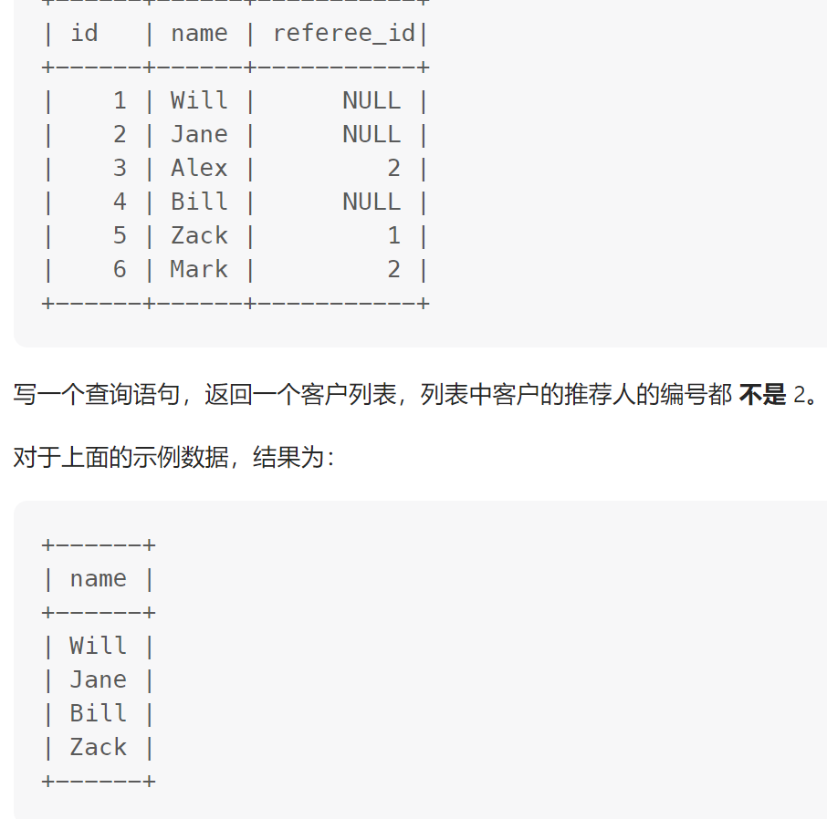

# [197. 上升的温度](https://leetcode.cn/problems/rising-temperature/description/)

编写一个 SQL 查询，来查找与之前（昨天的）日期相比温度更高的所有日期的 `id` 。


写SQL三部曲：

一、抽题干 

+ 来查找与之前（昨天的）日期相比温度更高的所有日期的id(白话文就是获取所有比前一天温度高的记录id)

二、找相关联表 

+ 题干涉及到的表只有单表Weather 

+ 前置知识:  1. DATEDIFF()函数返回两个日期之间的天数。 例如：SELECT DATEDIFF('2022-07-13','2022-07-12') AS DiffDate; 返回1

分析： 1. 我们想要拿记录的温度与前一天进行相对比，那必然需要将前一天的记录放到一行中，不然单纯的select是无法进行比较的；所以想到用笛卡儿积，然后再通过前置知识进去过滤 + 温度条件

三、写SQL 

+ 将1步骤对应条件拼接到步骤2后面即可得到SQL

代码:

```mysql
# Write your MySQL query statement below
SELECT W1.id 
FROM Weather W1,Weather W2 
WHERE DATEDIFF(W1.recordDate, W2.recordDate) = 1 AND W1.Temperature > W2.Temperature ;
```


# [175. 组合两个表](https://leetcode.cn/problems/combine-two-tables/description/)

编写一个SQL查询来报告 `Person` 表中每个人的姓、名、城市和州。如果 `personId` 的地址不在 `Address` 表中，则报告为空  `null` 。


写SQL三部曲：

一、抽题干 

+ 如果 `Person` 表中`personId` 的地址不在 `Address` 表中，则报告为空  `null` 。
+ 查找  firstName,  lastName,   city,   state 

二、找相关联表 

+ 题干涉及到的表有单表`Person`和`Address` 表

+ 前置知识:   left join ...  on ... 满足两表的其中一个条件的就会找出来, 其中没有的返回 null (以左表作为基准,右边表来一一匹配,匹配不上的,返回左表的记录,右表以NULL填充)

分析： 

三、写SQL 

+ 将1步骤对应条件拼接到步骤2后面即可得到SQL

  

代码:

```mysql
# Write your MySQL query statement below

select firstName,lastName,city,state 
from  Person p
left join Address a
on p.PersonId = a.PersonId;
```


# [181. 超过经理收入的员工](https://leetcode.cn/problems/employees-earning-more-than-their-managers/submissions/370165767/)

查找收入比经理高的员工。


写SQL三部曲：

一、抽题干 

+ 查找收入比经理高的员工。
+ 查找  Employee 

二、找相关联表 

+ 题干涉及到的表有单表`Person`和`Address` 表

+ 前置知识:   inner join ...  on ...   查询两个表中的结果集中的交集

分析： 

三、写SQL 

+ 将1步骤对应条件拼接到步骤2后面即可得到SQL

代码:

```mysql
# Write your MySQL query statement below

select s.name as Employee 
from Employee r
inner join Employee s
on r.id = s.managerId 
where s.salary > r.salary;
```

效率极高的:

```mysql
SELECT e2. NAME AS Employee                        
FROM Employee e1 JOIN Employee e2
WHERE e1.Id = e2.ManagerId AND e2.salary > e1.salary; 
```


[511. 游戏玩法分析 I ](https://leetcode.cn/problems/game-play-analysis-i/description/)

获取每位玩家 **第一次登陆平台的日期**。


写SQL三部曲：

一、抽题干 

+ 获取每位玩家 **第一次登陆平台的日期**。

二、找相关联表 

+ 题干涉及到的表有只有单表`Activity` 表

+ 前置知识:    MIN()  可以为数值字段，字符字段或表达式列作统计，返回最小的值。

分析： 

三、写SQL 

+ 将1步骤对应条件拼接到步骤2后面即可得到SQL

代码:

```mysql
# Write your MySQL query statement below

select player_id, min(event_date) as 'first_login'
from Activity
group by player_id
```


# [586. 订单最多的客户](https://leetcode.cn/problems/customer-placing-the-largest-number-of-orders/description/)

为下了 **最多订单** 的客户查找 `customer_number` 。测试用例生成后， **恰好有一个客户** 比任何其他客户下了更多的订单。


写SQL三部曲：

一、抽题干 

+ **最多订单** 的客户查找 `customer_number` 

二、找相关联表 

+ 题干涉及到的表有只有单表`Orders` 表

+ 前置知识:    ORDER BY COUNT(*) DESC  按照某个数量降序  
  + LIMIT 1;   显示第一条

分析： 

三、写SQL 

+ 将1步骤对应条件拼接到步骤2后面即可得到SQL

代码:

```mysql
# Write your MySQL query statement below

SELECT customer_number
FROM orders
GROUP BY customer_number
ORDER BY COUNT(*) DESC
LIMIT 1;
```


# 182. [查找重复的电子邮箱](https://leetcode.cn/problems/duplicate-emails/)

查找 `Person` 表中所有重复的电子邮箱。


写SQL三部曲：

一、抽题干 

+ 查找 `Person` 表中所有重复的电子邮箱。
+ 查找  Email

二、找相关联表 

+ 题干涉及到的表只有有单表`Person`

+ 前置知识:   GROUP BY  .....  满足条件的分成一组,  然后再组内进行其他操作

分析： 

三、写SQL 

+ 将1步骤对应条件拼接到步骤2后面即可得到SQL

代码:

```mysql
# Write your MySQL query statement below

SELECT Email from Person
GROUP BY Email 
HAVING COUNT(*)>1
```


# [196. 删除重复的电子邮箱](https://leetcode.cn/problems/delete-duplicate-emails/)

**删除** 所有重复的电子邮件，只保留一个id最小的唯一电子邮件。


写SQL三部曲：

一、抽题干 

+ 删除所有重复的电子邮件，但是要保留一个id最小的唯一电子邮件。

二、找相关联表 

+ 题干涉及到的表只有有单表`Person`

+ 前置知识:   DELETE  ...  FROM  .....  

  DELETE t1 FROM t1 LEFT JOIN t2 ON t1.id=t2.id WHERE t2.id IS NULL;

  涉及到t1和t2两张表，DELETE t1表示要删除t1的一些记录，具体删哪些，就看WHERE条件，满足就删；

  这里删的是t1表中，跟t2匹配不上的那些记录。


分析： 

三、写SQL 

+ 将1步骤对应条件拼接到步骤2后面即可得到SQL

代码:

```mysql
DELETE p1 FROM Person p1, Person p2
WHERE p1.Email = p2.Email AND p1.Id > p2.Id
```


# [183. 从不订购的客户](https://leetcode.cn/problems/customers-who-never-order/description/?orderBy=most_votes)

某网站包含两个表，`Customers` 表和 `Orders` 表。编写一个 SQL 查询，找出所有从不订购任何东西的客户。


写SQL三部曲：

一、抽题干 

+ 找出所有从不订购任何东西的客户。
+ 查找 Name as Customers 

二、找相关联表 

+ 题干涉及到的表有表`Person`和`Orders` 表

+ 前置知识:   遇到要查找“不在表里的数据，也就是在表A里的数据，但是不在表B里的数据 就用下图方法
  + 

分析： 

三、写SQL 

+ 将1步骤对应条件拼接到步骤2后面即可得到SQL

代码:

```mysql
# Write your MySQL query statement below

select Name as Customers from Customers c
left join Orders o
on o.CustomerId = c.Id 
where o.CustomerId is null;
```


# [销售员](https://leetcode.cn/problems/sales-person/description/?orderBy=most_votes)

报告没有任何与名为 **“RED”** 的公司相关的订单的所有销售人员的姓名。


==联表可以多个使用==

```mysql
SELECT
    S.name
FROM
    salesperson S
    LEFT JOIN
    orders O ON S.sales_id = O.sales_id
    LEFT JOIN
    company C ON O.com_id = C.com_id
GROUP BY
    S.name
HAVING
    SUM(IF(C.name = 'RED', 1, 0))  = 0  #s
ORDER BY
    S.sales_id
```


# [584. 寻找用户推荐人](https://leetcode.cn/problems/find-customer-referee/description/)

返回一个客户列表，列表中客户的推荐人的编号都 **不是** 2。



写SQL三部曲：

一、抽题干 

+ 返回一个客户列表，列表中客户的推荐人的编号都 **不是** 2。

二、找相关联表 

+ 题干涉及到的表有只有单表`customer` 表

+ 前置知识:    is null 表示为空

分析： 

三、写SQL 

+ 将1步骤对应条件拼接到步骤2后面即可得到SQL

代码:

```mysql
# Write your MySQL query statement below

select name 
from customer
where referee_id != 2 or referee_id is null;
```


# [27. 变更性别](https://leetcode.cn/problems/swap-salary/description/)

交换所有的 `'f'` 和 `'m'` （即，将所有 `'f'` 变为 `'m'` ，反之亦然），仅使用 **单个 update 语句** ，且不产生中间临时表。

注意，你必须仅使用一条 update 语句，且 **不能** 使用 select 语句。


写SQL三部曲：

一、抽题干 

+ 将所有 `'f'` 变为 `'m'` ，反之亦然

二、找相关联表 

+ 题干涉及到的表有只有单表`Salary ` 表

+ 前置知识:     使用 if 判断，当 sex 为 m 的时候更改为 f，否则就更改为 m（f 改为 m）.类似三元表达式

分析： 

三、写SQL 

+ 将1步骤对应条件拼接到步骤2后面即可得到SQL

代码:

```mysql
# Write your MySQL query statement below

update salary set sex=if(sex="m","f","m");
```

